# 第十二章：LiveData：*行动的跃进*


**您的代码经常需要对属性值变化作出反应。**

例如，如果视图模型属性的值发生变化，**片段可能需要响应**通过更新其视图或导航到其他位置。但是，**片段如何知道属性何时被更新**？在这里，我们将向您介绍**LiveData**：一种**告知感兴趣方何时发生变化**的方式。您将了解有关***MutableLiveData***的所有内容，以及如何**使您的片段观察此类属性**。您将发现**LiveData**类型如何帮助维护应用程序的完整性。很快，您将编写比以往更具响应性的应用程序...

# 重新审视猜字游戏应用

在上一章中，我们构建了一个猜字游戏应用，让用户猜测哪些字母包含在一个秘密单词中。当用户猜测所有字母或生命用尽时，游戏结束。

为了防止片段代码变得过于臃肿，并在用户旋转设备屏幕时保持应用程序状态，我们为应用程序的游戏逻辑和数据使用了视图模型。`GameFragment`使用`GameViewModel`处理其逻辑和数据，而`ResultViewModel`则保存了`ResultFragment`所需的游戏结果：


每当显示每个片段或用户进行猜测时，片段从其视图模型获取最新值并将其显示在屏幕上。

虽然这种方法有效，但也存在一些缺点。

# 片段决定何时更新视图

这种方法的缺点在于，每个片段决定何时从视图模型获取最新的属性值并更新其视图。而有时这些值并没有改变。例如，如果用户猜对了，`GameFragment`会更新显示剩余生命和错误猜测的文本，即使这些值并没有改变。

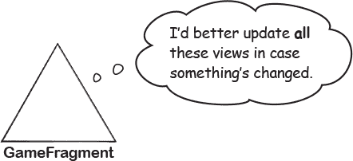

## 让视图模型在数值变更时发出通知

另一种方法是让`GameViewModel`告诉`GameFragment`每个属性何时被更新。如果片段收到这些更改的通知，它将不再需要自行决定何时从视图模型获取最新的属性值并更新其视图。相反，它只需在告知底层属性已更新后更新其视图。


我们将使用 Android 的**LiveData**库在猜字游戏应用中实现这一变更：它是 Android Jetpack 的一部分。LiveData 允许视图模型通知感兴趣的方（如片段和活动），其属性值已被更新。它们可以通过更新视图或调用其他方法来对这些更改作出响应。


您将在本章的其余部分了解如何使用 LiveData。首先，让我们浏览一下更新应用程序的步骤。

# 下面是我们要做的事情


以下是我们将执行的应用程序编写步骤：

1.  **使猜谜游戏应用程序使用 LiveData。**

    我们将更新 `GameViewModel`，使 `livesLeft`、`incorrectGuesses` 和 `secretWordDisplay` 属性使用 LiveData。然后，当这些属性的值更改时，我们将使 `GameFragment` 更新其视图。

    

1.  **保护 GameViewModel 的属性和方法。**

    我们将限制对 `GameViewModel` 属性的访问，以便只有 `GameViewModel` 可以更新它们。我们还将确保 `GameFragment` 只能访问其执行工作所需的方法。

    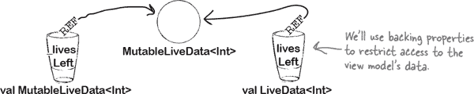

1.  **添加一个 gameOver 属性。**

    我们将使 `GameViewModel` 使用一个新的 `gameOver` 属性来决定每场游戏何时结束。当此属性的值更改时，`GameFragment` 将导航到 `ResultFragment`。

    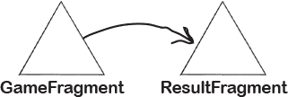

## 向应用的 build.gradle 文件添加 LiveData 依赖项

因为我们将使用 LiveData，所以我们将首先向应用程序的 *build.gradle* 文件添加 LiveData 依赖项。

打开猜谜游戏应用程序的项目（如果尚未打开），打开文件 *GuessingGame/app/build.gradle*，并在 `dependencies` 部分添加以下行（加粗）：

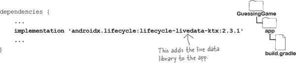

在提示时，同步您的更改。

# GameViewModel 和 GameFragment 需要使用 LiveData

我们希望在猜谜游戏应用程序中使用 LiveData，这样 `GameViewModel` 在其属性值更改时会通知 `GameFragment`。然后，`GameFragment` 将对这些更改做出反应。

我们将分两个阶段来解决这个问题：

1.  **指定 GameFragment 需要了解哪些 GameViewModel 属性更改。**

1.  **告诉 GameFragment 如何响应每个更改。**

现在，我们将专注于 `GameViewModel` 的代码更改。

## 哪些视图模型属性应该使用 LiveData？

`GameViewModel` 包括三个属性——`secretWordDisplay`、`incorrectGuesses` 和 `livesLeft`——`GameFragment` 使用这些属性来更新其视图。我们将指定这三个属性使用 LiveData，以便在它们的值更改时通知 `GameFragment`。

您通过将其类型更改为 `**MutableLiveData<Type>**` 来指定属性使用 LiveData，其中 `Type` 是属性应持有的数据类型。例如，`livesLeft` 属性当前使用以下代码定义为 `Int`：

```
<data>
    <variable
        name="resultViewModel"
        type="com.hfad.guessinggame.ResultViewModel" />
</data>
```

要使属性使用 LiveData，您需要将其类型更改为 `MutableLiveData<Int>`，使其看起来像这样：


这指定了 `livesLeft` 现在是具有初始值 8 的 `MutableLiveData<Int>`。

同样，我们可以使用以下代码定义 `incorrectGuesses` 和 `secretWordDisplay` 属性


在这里，每个属性的类型都设置为 `MutableLiveData<String>`。`incorrectGuesses` 的值设置为 `""`，而 `secretWordDisplay` 的值将在 `GameViewModel` 的 `init` 块中设置。

这就是您如何定义实时数据属性。接下来，我们来看如何更新其值。

# 实时数据对象使用一个 value 属性

当您使用`MutableLiveData`属性时，您使用名为`**value**`的属性来更新它们的值。例如，要使用`deriveSecretWordDisplay()`方法的返回值更新`secretWordDisplay`属性，您不使用以下代码：

```
<string name="lives_left">You have %d lives left</string>
```

就像以前一样。您改用以下代码：

```
<string name="incorrect_guesses">Incorrect guesses: %s</string>
```

以这种方式更改`value`属性很重要，因为这是任何感兴趣的方面（在本例中是`GameFragment`）被通知任何更改的方式。每当`secretWordDisplay`的`value`属性更新时，`GameFragment`都会被通知，以便它可以通过更新其视图来做出响应。

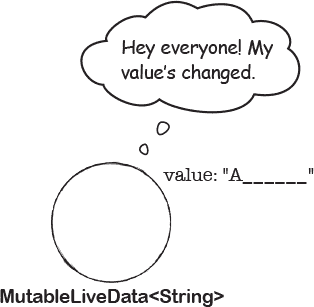

## value 属性可以为 null

当您使用实时数据时，还有一件额外的事情需要注意：`value`的类型是*可空*的。这意味着当您在代码中使用实时数据值时，您需要执行空安全检查，否则您的代码将无法编译。

例如，`livesLeft`属性是使用以下代码定义的：


该属性的类型是`MutableLiveData<Int>`，因此其`value`属性可以接受一个`Int`，或者为`null`。

由于`value`属性可能为`null`，我们不能使用以下代码从其值中减去 1：

```
viewModel = ViewModelProvider(this).get(GameViewModel::class.java)
```

相反，我们需要使用：


它从其值中减去 1，只要它不为`null`。

类似地，以下`isLost()`方法不会编译，因为`liveLeft.value`可能为`null`：

```
binding.gameViewModel = viewModel
```

但是，我们可以将其更改为使用 Kotlin 的 Elvis 运算符，如下所示：

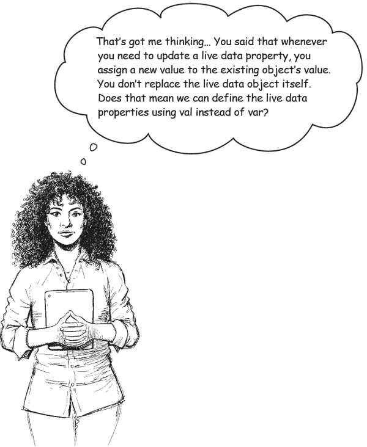

**实时数据属性可以使用 val 来定义。**

正如您已经知道的，您在 Kotlin 中使用`val`和`var`来指定属性是否可以引用新对象。

当我们首次定义每个属性时，我们使用`var`以便可以更新它。例如，我们使用以下方式定义`livesLeft`属性：

```
viewModel.incorrectGuesses.observe(viewLifecycleOwner, Observer { newValue ->
    binding.incorrectGuesses.text = "Incorrect guesses: $newValue"
})
```

它使用一个值为 8 的`Int`对象初始化了`livesLeft`。每当用户猜错时，我们从`livesLeft`中减去 1，这使其引用了一个新的`Int`对象：

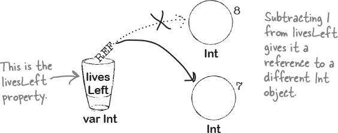

使用实时数据，您更新*现有*对象的`value`属性，而不是用另一个对象替换它，并且感兴趣的方面会被通知到这一更改。由于对象不再被替换，您可以像这样使用`val`而不是`var`来定义属性：


# GameViewModel.kt 的完整代码

现在您知道实时数据是如何工作的，让我们更新`GameViewModel`，使其`livesLeft`、`incorrectGuesses`和`secretWordDisplay`属性都使用实时数据。

这是*GameViewModel.kt*的完整代码；更新代码以包含更改（用粗体标出）：

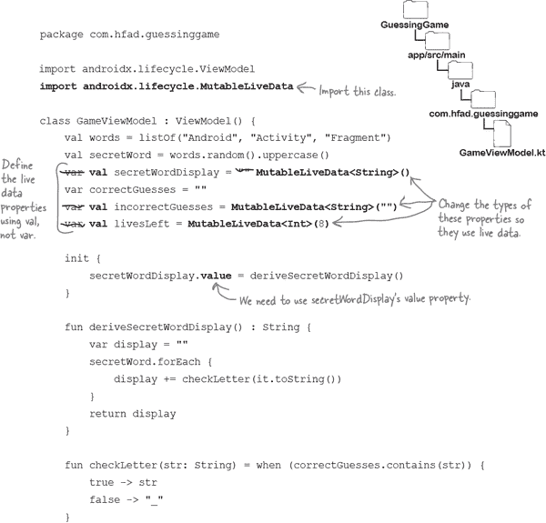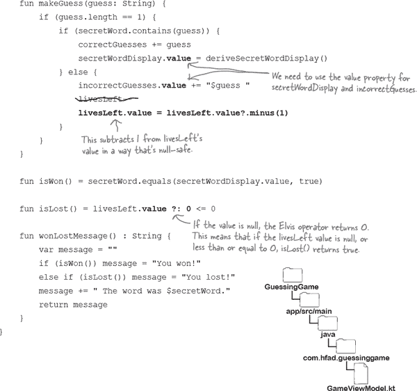

这就是我们需要为 `GameViewModel` 做的一切。接下来，让我们在 `GameFragment` 中响应 `livesLeft`、`incorrectGuesses` 和 `secretWordDisplay` 属性更新时的情况。

# 片段观察视图模型属性并对更改作出反应。

通过调用属性的 `**observe()**` 方法，可以使片段响应视图模型的 `MutableLiveData` 属性中 `value` 的更改。例如，如果将以下代码添加到 `GameFragment` 中，它将观察视图模型的 `livesLeft` 属性，并在其更改时采取行动：


正如您所见，上述代码将 `viewLifecycleOwner` 和 `Observer` 参数传递给 `observe()` 方法。

`viewLifecycleOwner` 引用片段视图的生命周期。它与片段访问其 UI 的时间相关联：从在片段的 `onCreateView()` 方法中创建时，到销毁时调用 `onDestroyView()` 方法。

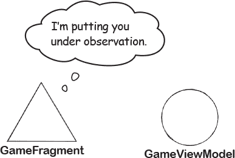

`Observer` 是一个能够接收实时数据的类。它与 `viewLifecycleOwner` 相关联，因此仅在片段可以访问其视图时才活跃，并能接收实时数据通知。如果在片段无法访问其 UI 时实时数据属性的值发生更改，则不会通知观察者，因此片段不会做出响应。这可以防止应用在试图更新不可用视图时崩溃。

###### 注意

它还可以让您的编码生活更轻松，因为您无需自行检查视图是否可用。使用实时数据，这一切都由它处理。

`Observer` 类接受一个 lambda 参数，指定属性的新值应如何使用。例如，在猜词游戏应用中，我们希望 `GameFragment` 每当视图模型的 `livesLeft` 属性更新时更新其 `lives` 文本，我们可以通过以下代码实现：


这就是我们需要知道的一切，以便在视图模型属性值更改时使 `GameFragment` 更新其视图。让我们更新其代码。

# `GameFragment.kt` 的完整代码

这是 `GameFragment` 的更新代码；确保 *GameFragment.kt* 文件包含下面显示的更改（用粗体显示）：

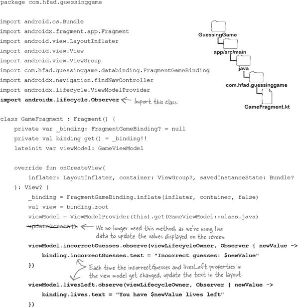

这些是我们需要对 `GameFragment` 进行的所有更改，以便在观察到 `incorrectGuesses`、`livesLeft` 和 `secretWordDisplay` 属性更改时更新其视图。

现在我们已经在猜词游戏应用中实现了实时数据，让我们看看应用运行时会发生什么。

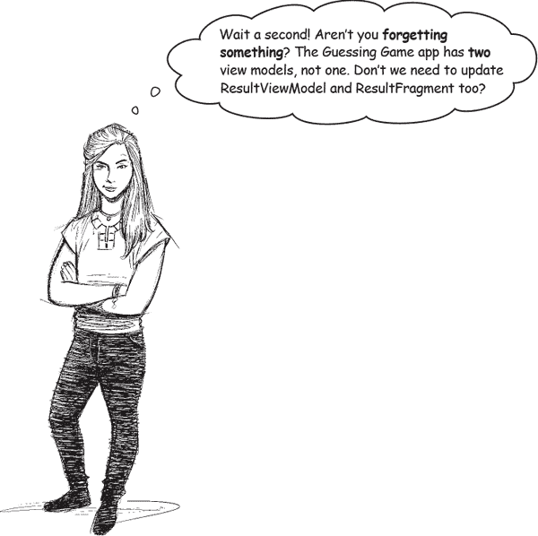

**`ResultViewModel` 不需要使用实时数据，因此我们无需更新它。**

如您可能记得的那样，`ResultViewModel` 有一个属性（名为 `result`），该属性在视图模型创建时设置。代码如下所示：

```
binding.lifecycleOwner = viewLifecycleOwner
```

正如您所见，结果是使用 `val` 定义的，因此一旦初始化，就无法将其更新为另一个值。`ResultFragment` 在 `result` 更改时无需通知，因为 **一旦设置**，`**result**` **就无法更改**。无需使 `ResultFragment` 响应任何更改，因为不会有任何更改。

让我们逐步了解代码运行时发生了什么，然后进行一次应用程序的测试驾驶。

# 应用程序运行时会发生什么

应用程序运行时会发生以下情况：

1.  **GameFragment 请求 `ViewModelProvider` 类获取 `GameViewModel` 的实例。**

    `GameViewModel` 对象被初始化，并设置了其三个 `MutableLiveData` 属性的值 — `livesLeft`、`incorrectGuesses` 和 `secretWordDisplay`。

    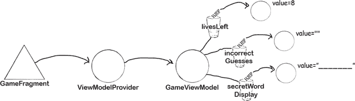

1.  **GameFragment 观察 `GameViewModel` 中的 `livesLeft`、`incorrectGuesses` 和 `secretWordDisplay` 属性。**

    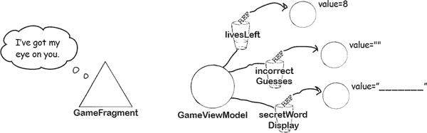

1.  **GameFragment 使用其观察的属性的值更新其视图。**

    

1.  **当用户猜对时，将更新 `secretWordDisplay` 的值，并将新值传递给 `GameFragment`。**

    `GameFragment` 通过更新其在屏幕上显示的 `word` 视图做出响应。

    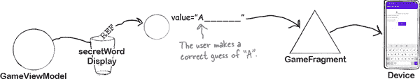

1.  **当用户猜错时，更新 `incorrectGuesses` 和 `livesLeft` 的值，并传递给 `GameFragment`。**

    `GameFragment` 通过更新其视图做出响应。

    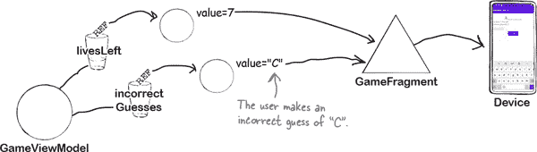

1.  **当 `isWon()` 或 `isLost()` 返回 true 时，`GameFragment` 导航到 `ResultFragment`，并将结果传递给它。**

    `ResultFragment` 显示结果。

    

让我们带着这个应用程序来进行一次测试驾驶。

#  测试驾驶

运行应用程序时，`GameFragment` 如以前一样显示。

当我们猜对时，秘密单词显示会更新。当我们猜错时，生命剩余将更新，并且我们的猜测将添加到错误的猜测显示中。

如果我们猜中所有字母或失去所有生命，应用程序将导航到 `ResultFragment`，显示结果。

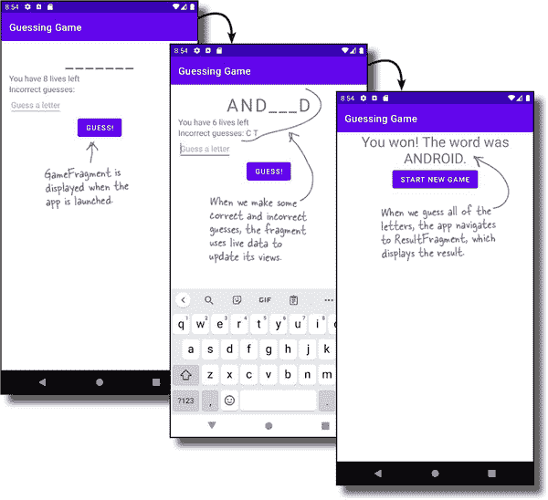

游戏的行为方式与以往相同，但在幕后，它使用实时数据做出响应。

# Fragment 可以更新 `GameViewModel` 的属性。

到目前为止，我们已经更新了 `GameViewModel` 和 `GameFragment` 中的代码，以便它使用实时数据。每当 `GameViewModel` 中的 `MutableLiveData` 属性的值更新时，`GameFragment` 通过更新其视图做出响应。

但代码中存在一个小问题。`GameFragment` 具有对 `GameViewModel` 属性和方法的完全访问权限，因此如果它愿意，它可以不适当地使用它们。没有什么可以阻止 fragment，例如将 `livesLeft` 属性更新为 100，以便用户可以每次玩游戏时都进行许多猜测并赢得游戏。

为了解决这个问题，我们将限制对 `GameViewModel` 属性的直接访问，使得**只有视图模型中的方法可以更新它们**。

> **您可以通过将视图模型的属性标记为私有，并通过另一个属性的 getter 提供只读访问来限制对视图模型属性的直接访问。**

## 保持私密内容私密

为了保护 `GameViewModel` 的属性，我们将每个属性标记为 `private`，以便只有 `GameViewModel` 中的代码可以更新它们的值。然后，我们将暴露每个 `MutableLiveData` 属性的只读版本，供 `GameFragment` 观察。而不是像这样定义 `livesLeft` 属性的代码：

```
android:onClick="@{() -> gameViewModel.finishGame()}"
```

我们将使用以下内容：

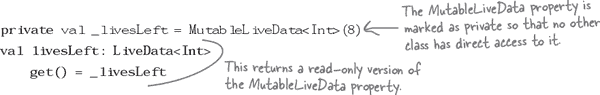

在这里，`_livesLeft` 属性持有对 `MutableLiveData` 对象的引用。 `GameFragment` 无法访问此属性，因为它标记为 `private`。

但是，`GameFragment` 可以通过 `livesLeft` 的 getter 访问此属性的值。 `livesLeft` 的类型是 `**LiveData**`，类似于 `MutableLiveData`，但无法用于更新底层对象的 `value` 属性：`GamesFragment` 可以读取值，但无法更新它。

当您以这种方式组织代码时，私有属性有时称为**支持属性**。它持有一个对象的引用，其他类只能通过另一个属性访问该对象。

让我们更新 `GameViewModel` 的代码。


# `GameViewModel.kt` 的完整代码如下：


我们将更新 `GameViewModel` 的代码，以使用支持属性来限制直接访问其 LiveData 属性。我们还将将 `GameFragment` 不需要使用的属性和方法标记为私有。

*GameViewModel.kt* 的完整代码如下；更新代码以包括我们的更改（用粗体标出）：

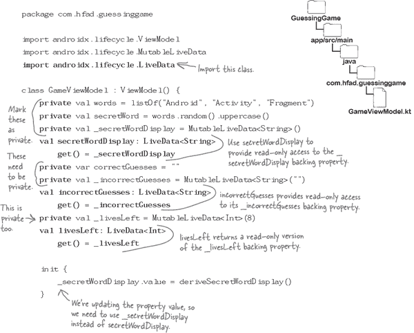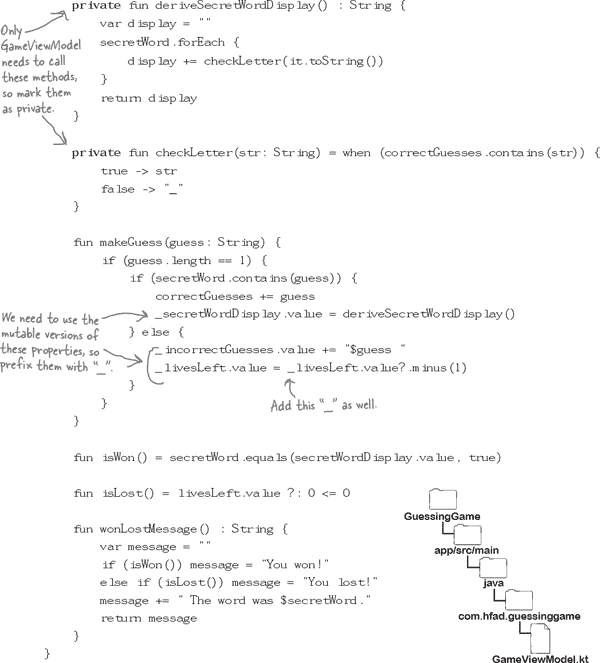

让我们逐步了解代码运行时发生了什么。

# 当应用程序运行时会发生什么

当应用程序运行时会发生以下事情：

1.  **GameFragment 请求 `ViewModelProvider` 类获取 `GameViewModel` 实例。**

    

1.  **GameViewModel 的属性已初始化。**

    `livesLeft`、`incorrectGuesses` 和 `secretWordDisplay` 是指向与其 `MutableLiveData` 支持属性相同底层对象的 `LiveData` 属性。

    

1.  **GameFragment 观察 `livesLeft`、`incorrectGuesses` 和 `secretWordDisplay` 属性。**

    `GameFragment` 无法更新任何这些属性，但在 `GameViewModel` 更新任何支持属性时会作出响应，因为它们引用相同的底层对象。

    

1.  **GameFragment 在 `isWon()` 或 `isLost()` 返回 true 之前继续响应值的更改。**

    `GameFragment` 导航到 `ResultFragment`，并将结果传递给它。 `ResultFragment` 显示结果。

    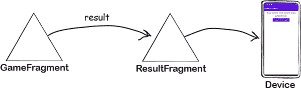

让我们来测试这个应用程序。

#  测试驾驶

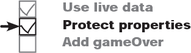

当我们运行应用程序时，它的工作方式与以前相同。但是，这一次我们通过限制 `GameFragment` 对 `GameViewModel` 的 `MutableLiveData` 属性的访问来保护了它们。

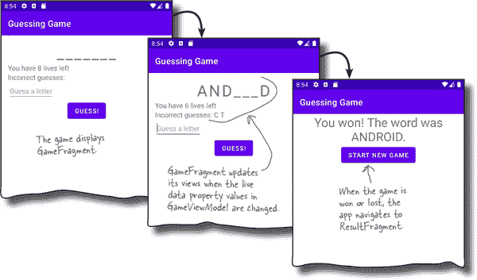

我们几乎完成了更新猜词游戏应用程序的工作。只剩下一件事需要改变…

# GameFragment 仍然包含游戏逻辑


在应用的当前版本中，`GameFragment` 在用户每次猜测后调用 `GameViewModel` 的 `isWon()` 和 `isLost()` 方法来决定游戏是否结束。如果其中任何一个返回 *true*，`GameFragment` 将导航到 `ResultFragment`，并将结果传递给它。

下面是当前的代码：


这种方法的问题在于 `GameFragment` 决定游戏何时结束，而不是 `GameViewModel`。确定游戏何时结束是一项游戏决策，这是 `GameViewModel` 应该负责的，而不是 `GameFragment`。

## 让 `GameViewModel` 决定游戏何时结束

为了解决这个问题，我们将在 `GameViewModel` 中添加一个名为 `_gameOver` 的 `MutableLiveData<Boolean>` 属性，并将其值通过名为 `gameOver` 的 `LiveData` 属性暴露出来。当用户赢得或输掉游戏时，我们将设置此属性为 *true*。在这种情况下，`GameFragment` 将响应并导航到 `ResultFragment`。

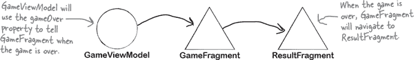

您已经熟悉所需的更改，因此在向您显示代码之前，请尝试以下练习。

# 池塘难题


您的**目标**是向 `GameViewModel` 添加一个名为 `gameOver` 的属性（带有 `_gameOver` 支持属性），以便 `GameFragment` 在其值（一个 `Boolean`）更新时作出响应。该属性应初始化为 *false*。从池中获取代码片段并将其放入代码中的空白行。您不可以多次使用同一代码片段，并且不需要使用所有代码片段。

```
binding.finishGameButton.setOnClickListener() {
    viewModel.finishGame()
}
```


###### 注意

**注意：每个池中的事物只能使用一次！**

# 池塘难题解答


您的**目标**是向 `GameViewModel` 添加一个名为 `gameOver` 的属性（带有 `_gameOver` 支持属性），以便 `GameFragment` 在其值（一个 `Boolean`）更新时作出响应。该属性应初始化为 *false*。从池中获取代码片段并将其放入代码中的空白行。您不可以多次使用同一代码片段，并且不需要使用所有代码片段。

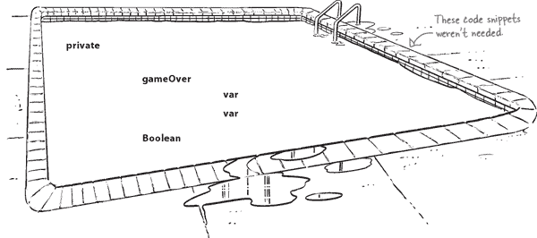

# GameViewModel.kt 的完整代码

我们需要在 `GameViewModel` 中添加一个名为 `gameOver` 的属性，以及一个名为 `_gameOver` 的支持属性。当用户猜对了秘密单词中的所有字母或者耗尽生命时，我们将让 `makeGuess()` 方法将其设置为 *true*。

这是`GameViewModel`的完整代码；更新*GameViewModel.kt*中的代码以包括下面显示的更改（用粗体表示）：


# 使 GameFragment 观察新属性

现在我们已经将`gameOver`属性添加到`GameViewModel`中，我们需要使`GameFragment`响应其更新。我们将使片段观察该属性，因此当其值更改为*true*时，片段将导航到`ResultFragment`。

这是`GameFragment`的代码；更新*GameFragment.kt*中的代码，以包括以下更改（用粗体表示）：


就是这样！让我们来看看运行时会发生什么。

# 应用程序运行时发生了什么

应用程序运行时会发生以下事情：

1.  **GameFragment 请求 ViewModelProvider 类提供 GameViewModel 的实例。**

    

1.  **GameViewModel 的属性已初始化。**

    `_gameOver`和`gameOver`属性指向一个`MutableLiveData<Boolean>`对象，其值设置为*false*。

    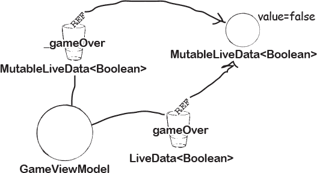

1.  **GameFragment 观察 GameViewModel 的 gameOver 属性。**

    `GameFragment`无法更新`gameOver`属性引用的`MutableLiveData`对象，但可以响应其值变化。

    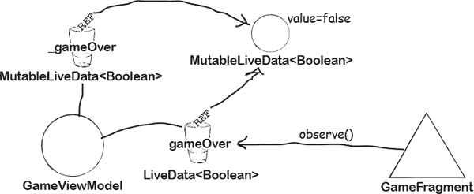

1.  **每次调用 GameViewModel 的 makeGuess()方法时，它都会检查 isWon()或 isLost()是否返回 true。**

    如果其中任何一个*true*，它将其`_gameOver`属性的值设置为*true*。

    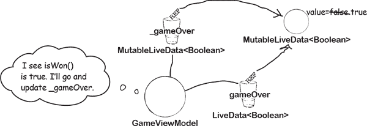

1.  **GameFragment 观察到通过 GameViewModel 的 gameOver 属性，值已更新为 true。**

    新值传递给`GameFragment`。

    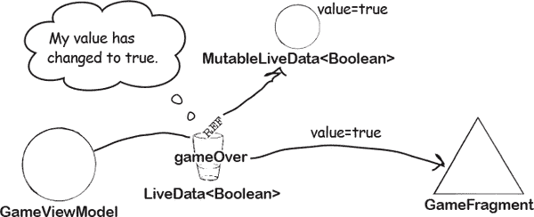

1.  **GameFragment 响应并导航到 ResultFragment，并将结果传递给它。**

    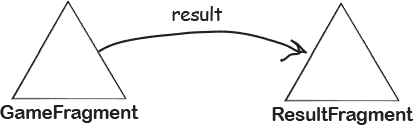

在进行以下练习后，我们将测试驾驶这个应用程序。

# 片段磁铁


有人在冰箱门上为名为`LotteryFragment`的片段编写了代码，但一个怪异的厨房暴风雪把一些代码吹走了。你能把它重新拼起来吗？

片段需要观察`LotteryViewModel`的`winningNumbers`属性，其定义如下：

```
android:onClick="@{() -> gameViewModel.finishGame()}"
```

当`winningNumbers`变化时，`LotteryFragment`需要使用新值更新其`numbers`视图。

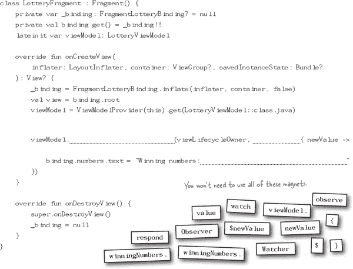

# 片段磁铁解决方案


有人在冰箱门上为名为`LotteryFragment`的片段编写了代码，但一个怪异的厨房暴风雪把一些代码吹走了。你能把它重新拼起来吗？

片段需要观察`LotteryViewModel`的`winningNumbers`属性，其定义如下：

```
"@{() -> gameViewModel.finishGame()}"
```

当`winningNumbers`变化时，`LotteryFragment`需要使用新值更新其`numbers`视图。

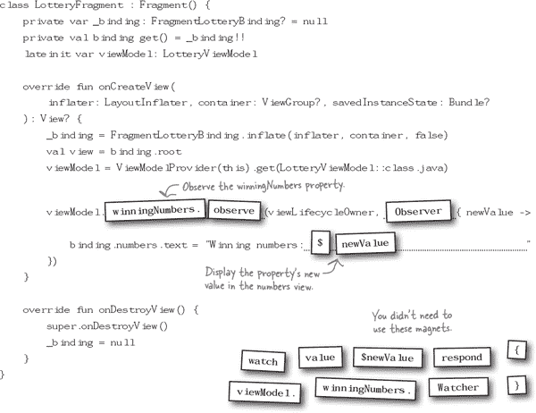

#  测试驾驶


当我们运行应用时，它的工作方式与以往相同。然而，这一次，`GameViewModel`决定游戏何时结束，而不是`GameFragment`。该片段只需观察视图模型的`gameOver`属性，并在其更改为*true*时导航到`ResultFragment`。

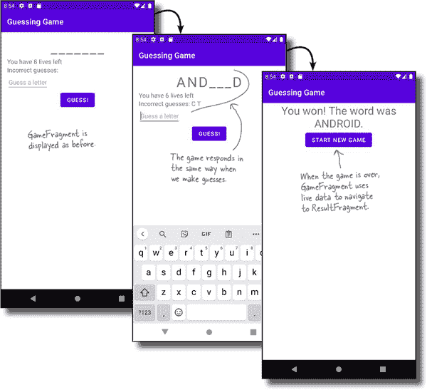

恭喜！您现在已经构建了一个应用程序，使用实时数据在发生更改时进行响应。在下一章中，我们将进一步使用一种称为数据绑定的新技术。

# 您的 Android 工具箱


**您已经掌握了第十二章，现在您的工具箱中添加了实时数据。**


