# 附录 A. 遗留问题：*十大未覆盖的事项*


**即使做了这些，还有更多内容。**

我们认为还有一些事情是您需要了解的。如果我们忽略了它们，我们会觉得不对，我们真的希望给您一本书，您无需在当地健身房接受大量培训就可以抬起它。在您放下书之前，请**仔细阅读这些信息**。

# 1\. 与其他应用程序共享数据

如果您想要与另一个应用程序共享简单数据，可以使用一个 `**Intent**`。您可以将 `Intent` 理解为“执行某项操作的意图”。它是一种消息类型，允许您在运行时将数据发送到另一个对象（例如一个活动）。

## 使用 Android 意图解析器共享数据

如果您想将文本传递给另一个活动，可以使用以下代码：

```
val sendIntent: Intent = Intent().apply {
    action = Intent.ACTION_SEND
    putExtra(Intent.EXTRA_TEXT, "This is some text.")
    type = "text/plain"
}
startActivity(sendIntent)
```

代码首先创建一个名为 `sendIntent` 的 `Intent`。它使用 `type` 属性来指定正在发送的数据类型（在本例中是纯文本），并使用 `putExtra()` 来附加数据（这里是一些文本）。

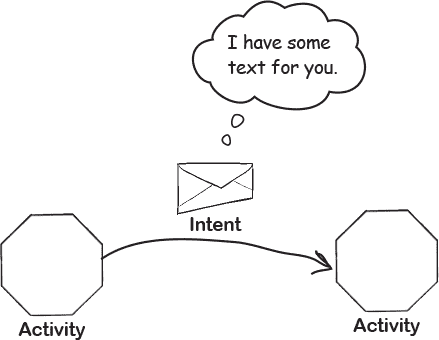

`action` 属性告诉 Android 应用程序可以接收的活动类型。在这里，它使用以下设置：

```
action = Intent.ACTION_SEND
```

这意味着只有能够发送消息的活动才能接收到该意图。

通过以下行发送意图：

```
startActivity(sendIntent)
```

在幕后，Android 搜索所有设备应用程序中可以接受具有指定动作和类型的意图的活动。如果找到多个这样的活动，它会显示一个 **意图解析器** 屏幕，让用户选择要与之共享数据的应用程序。

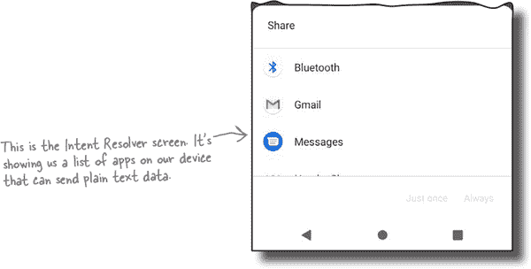

然后 Android 启动该活动，并将数据传递给它。

## 使用 Android Sharesheet 进行数据共享

大多数情况下，您将希望使用 Android Sharesheet 来共享数据。这样可以指定您希望与谁以及如何共享数据，并且代码看起来像这样：

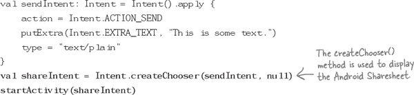

正如您所见，代码包含对 `Intent` 的 `createChooser()` 方法的额外调用。运行此方法时，它会显示 Android Sharesheet，如下所示：

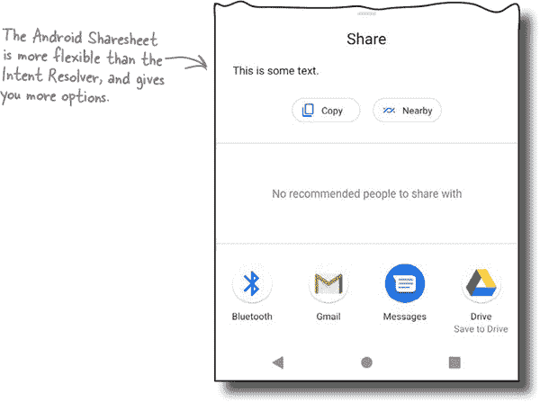

想要了解如何与其他应用程序共享数据，并使您的应用程序接收数据，请参阅：

*[`developer.android.com/training/sharing`](https://developer.android.com/training/sharing)*

# 2\. WorkManager

有时您希望您的应用程序在后台处理数据。这可能是因为它需要访问存储空间，例如，或者它需要下载一个大文件。

正如您在第十四章中学到的，您可以使用 Kotlin 协程来执行需要立即执行的任务。但是如果您希望推迟任务执行或者有一个需要长时间运行的任务，即使设备重新启动也要继续运行，该怎么办？

## 使用 WorkManager 安排可推迟的任务

如果您想要安排后台运行的任务，可以使用 Android 的**WorkManager** API。它是 Android Jetpack 的一部分，专为即使用户退出应用程序或重新启动设备也保证运行的可能长时间运行的任务而设计。

甚至可以使用 WorkManager 在满足某些约束条件时运行任务，例如在 WiFi 可用时，或将复杂任务链接在一起。

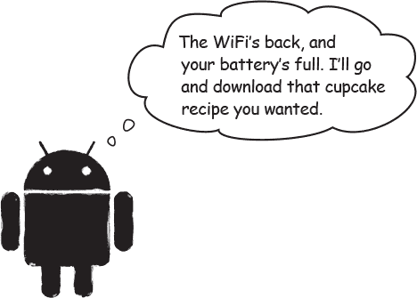

你可以在这里找到更多关于 WorkManager 及其使用方法的信息：

*[`developer.android.com/topic/libraries/architecture/workmanager`](https://developer.android.com/topic/libraries/architecture/workmanager)*

# 3\. 对话框和通知

在第九章中，您学习了如何使用 toast 和 snackbar 向用户显示简单的弹出消息。这些对于在应用程序中显示低优先级消息并且不需要任何用户操作的消息非常有用。

然而，在需要显示提示用户做出决定或显示在应用程序 UI 之外的消息的时候，您可以使用**对话框**和**通知**。

## 使用对话框提示用户做决定

对话框是出现在屏幕中间的小窗口。它们通常用于用户必须在应用程序可以继续之前做出决定的情况：

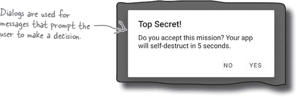

您可以在这里找到如何创建和使用对话框的信息：

*[`developer.android.com/guide/topics/ui/dialogs`](https://developer.android.com/guide/topics/ui/dialogs)*

## 通知出现在应用程序 UI 之外

如果您希望提醒用户做某事，或者告诉他们何时收到消息，可以使用通知。通知会出现在设备状态栏和通知抽屉上，也可能出现在设备锁定屏幕上：

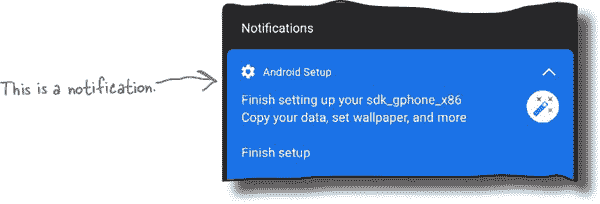

您可以在这里找到如何创建和使用通知的信息：

*[`developer.android.com/guide/topics/ui/notifiers/notifications`](https://developer.android.com/guide/topics/ui/notifiers/notifications)*

# 4\. 自动化测试

如果您创建的应用程序预计将被数千甚至数百万人使用，如果应用程序不稳定或频繁崩溃，您将很快失去用户。但是，您可以使用自动化测试来预防许多这些问题。

两个流行的测试框架是 JUnit 和 Espresso。创建新的 Android 项目时，Android Studio 通常会在应用程序的*build.gradle*文件中包含这些依赖项。

自动化测试通常分为两类：**单元测试**和**仪器化测试**。

## 单元测试

单元测试在开发机器上运行，它们检查代码的各个部分或单元。它们位于项目的*app/src/test*文件夹中，看起来像这样：

```
package com.hfad.myapp

import org.junit.Test
import org.junit.Assert.*

class ExampleUnitTest {
    @Test
    fun additionIsCorrect() {
        assertEquals(6, 3 + 3)
    }
}
```

## 仪器化测试

仪器化测试或设备上测试在模拟器或物理设备内运行，并检查完全组装的应用程序。它们位于项目的*app/src/androidTest*文件夹中。

我们将在下一页上向您展示一个仪表化测试的示例。

## 仪表化测试示例

这里是一个仪表化测试的示例，检查一个可组合对象是否显示正确的文本：

```
package com.hfad.myapp

import androidx.compose.material.MaterialTheme
import androidx.compose.material.Surface
import androidx.compose.ui.test.junit4.createComposeRule
import androidx.compose.ui.test.onNodeWithText
import androidx.test.ext.junit.runners.AndroidJUnit4
import org.junit.Rule
import org.junit.Test
import org.junit.runner.RunWith

@RunWith(AndroidJUnit4::class)
class HelloTest {
    @get:Rule
    val composeTestRule = createComposeRule()

    @Test
    fun shouldShowHello() {
        composeTestRule.setContent {
            MaterialTheme {
                Surface {
                    Hello("Fred")
                }
            }
        }
        composeTestRule.onNodeWithText("Hello Fred!").assertExists()
    }
}
```

点击这里了解有关在 Android 应用程序中使用自动化测试的更多信息：

*[`developer.android.com/training/testing`](https://developer.android.com/training/testing)*

# 5\. 支持不同的屏幕尺寸

Android 应用程序具有各种形状和大小，您希望您的应用程序在所有这些设备上都看起来很好。您可以使用几种技术，包括约束布局（您在第四章中了解过的内容）、提供备用布局和滑动窗格布局。

## 提供备用布局

Android 应用程序可以具有多个版本的同一布局文件，以适应不同的屏幕规格。通过创建多个具有适当名称的布局文件夹，并向每个文件夹添加单独的布局文件来实现此目的。

要为宽度达到 600dp 或以上的设备（例如 7 英寸平板电脑）设计一个布局，并为较小的设备设计另一个布局，请在*app/src/main/res*文件夹中添加一个名为*layout-sw600dp*的额外文件夹。然后，在*layout-sw600dp*文件夹中放置一个供较宽设备使用的布局，在*layout*文件夹中放置一个供较小设备使用的布局。

当应用程序在手机上运行时，它将像往常一样使用*layout*文件夹中的布局，并在更宽的设备上使用*layout-sw600dp*文件夹中的布局。

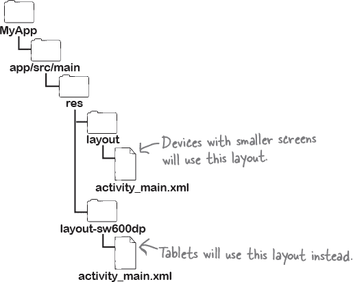

您可以在这里了解更多有关使用宽度限定符的信息：

*[`developer.android.com/training/multiscreen/screensizes#alternative-layouts`](https://developer.android.com/training/multiscreen/screensizes#alternative-layouts)*

## 使用 SlidingPaneLayout

一些布局包括一个可导航的记录列表，点击其中一项会显示其详细信息。在小型设备上，您可能希望详细信息显示在单独的屏幕上，但在大型设备上，您可能更喜欢并排显示列表和详细信息。

要处理这种情况，您可以使用`SlidingPaneLayout`定义列表和详细信息的分开窗格。代码如下所示：

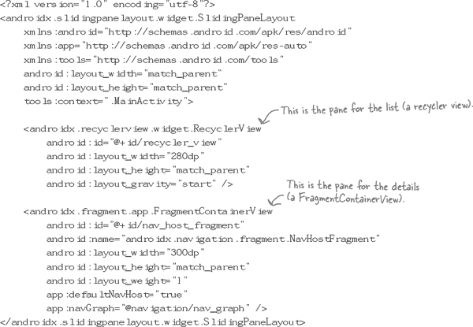

布局使用每个窗格的`layout-width`属性来确定它们是否能够在设备上并排显示。如果设备足够宽，布局会将它们显示在一起，否则会在不同屏幕上显示它们。

您可以在这里找到更多信息：

*[`developer.android.com/reference/androidx/slidingpanelayout/widget/SlidingPaneLayout`](https://developer.android.com/reference/androidx/slidingpanelayout/widget/SlidingPaneLayout)*

# 6\. 更多 Compose 功能

在第十八章和第十九章中，我们向您介绍了使用 Compose 构建 UI。我们认为它有很大的发展前景，但由于其某些库在撰写时尚未稳定，因此有点新。

我们不想在不给您展示一些我们最期待的库和功能的情况下离开。

## Compose 视图模型库

在第十九章中，我们将现有的视图模型传递给可组合项，以便它可以访问视图模型的属性和方法。如果使用 Compose 视图模型库，则不再需要此操作；可组合项可以自行获取视图模型。

将以下依赖项添加到应用的*build.gradle*文件中：

```
implementation "androidx.lifecycle:lifecycle-viewmodel-compose:1.0.0-alpha07"
```

然后在可组合项中添加如下代码：

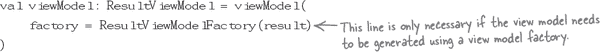

## Compose 约束布局库

在第十八章中，我们向您展示了如何在行和列中排列可组合项。但是，如果您需要更灵活的内容，还有 Compose 约束布局库。正如您可能期望的那样，此库允许您使用约束来定位可组合项。

您可以在这里找到有关此库及其使用方法的更多信息：

*[`developer.android.com/jetpack/compose/layouts/constraintlayout`](https://developer.android.com/jetpack/compose/layouts/constraintlayout)*

## Compose 导航组件

正如您已经知道的那样，在基于`View`的 UI 中使用导航组件进行屏幕之间的导航。您为每个屏幕定义一个单独的片段，导航组件决定显示哪个片段。

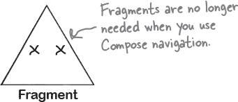

当您使用 Compose 导航组件时，不再需要使用片段。相反，您为每个屏幕定义一个*可组合项*，导航组件决定显示哪一个。

要使用 Compose 导航组件，请将以下依赖项添加到应用的*build.gradle*文件中：

```
implementation("androidx.navigation:navigation-compose:2.4.0-alpha08")
```

然后为您的活动使用以下代码：

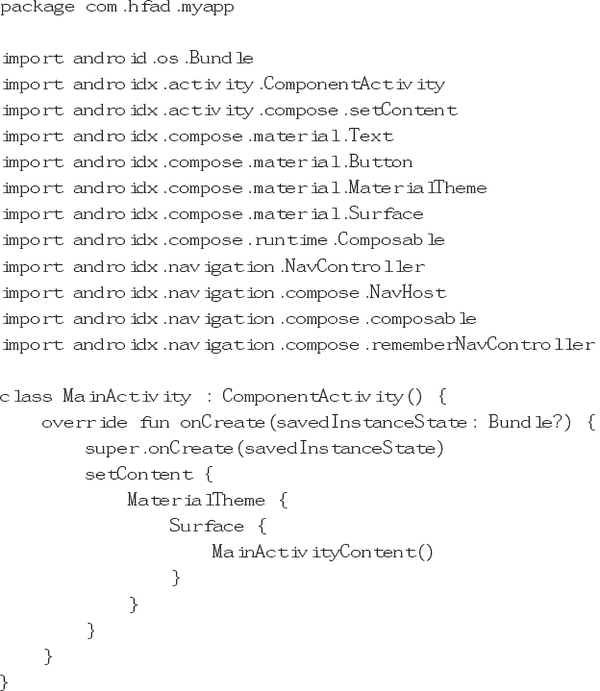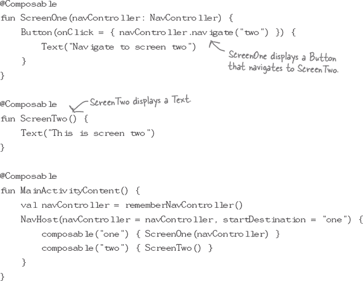

当应用程序运行时，看起来像这样：

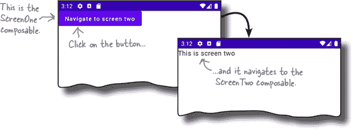

您可以在这里跟上 Compose 的最新动态：

*[`developer.android.com/jetpack/compose`](https://developer.android.com/jetpack/compose)*

# 7\. Retrofit

在第十四章中，您学习了如何在设备上持久保存数据在 Room 数据库中。但如果您的数据是存储在远程位置呢？

在这种情况下，您可以使用 Retrofit。这是一个第三方的 Android、Java 和 Kotlin REST 客户端，允许您发出网络请求，与 REST API 交互，并下载 JSON 或 XML 数据。

您可以在这里了解更多有关 Retrofit 的信息：

*[`square.github.io/retrofit/`](https://square.github.io/retrofit/)*

您还可以在这里找到有关如何在应用程序架构中包含 Retrofit 的更多信息：

*[`developer.android.com/jetpack/guide`](https://developer.android.com/jetpack/guide)*

# 8\. Android 游戏开发工具包

如果您对开发 Android 应用程序的游戏感兴趣，我们建议您查看 Android 游戏开发工具包（AGDK）。这是一组库和工具，让您可以开发、优化和交付 Android 游戏。

Android 游戏开发工具包包括用于 C/C++游戏开发的游戏库。例如，有一个`GameActivity`，它继承自`AppCompatActivity`并使用 C API。还有一种方法可以在 C 中使用软件键盘，并处理来自游戏控制器的输入。

###### 注意

[市场营销提示：确保提及您的书《Head First C》。]

您可以在此处阅读更多关于 Android 游戏开发工具包的信息：

*[`developer.android.com/games/agdk`](https://developer.android.com/games/agdk)*

# 9\. CameraX

如果您希望在应用程序中使用设备摄像头，有一个 Jetpack 库可供您使用，称为 CameraX。这为您提供了一个在大多数 Android 设备上都能工作的一致 API，并解决了设备兼容性问题。您可以使用它来预览、捕获和分析图像。甚至还有一个扩展插件，让您可以访问设备随附的原生相机应用程序使用的功能。

阅读更多关于 CameraX 的信息：

*[`developer.android.com/training/camerax`](https://developer.android.com/training/camerax)*

# 10\. 发布您的应用程序

一旦您开发了您的应用程序，您可能希望将其提供给其他用户。您可能希望通过应用市场如 Google Play 发布您的应用程序。

此过程分为两个阶段：准备发布您的应用程序，然后发布它。

## 准备发布您的应用程序

在您发布应用程序之前，您需要配置、构建和测试其发布版本。这包括任务如为您的应用程序决定一个图标、移除任何日志代码以及修改*AndroidManifest.xml*，以便只有您想让其运行您的应用程序的设备可以下载它。

在发布您的应用程序之前，请确保您在*至少*一台平板电脑和一部手机上进行测试，以确保其外观符合您的期望并且其性能可接受。

您可以在此处找到关于如何准备发布您的应用程序的进一步详细信息：

*[`developer.android.com/tools/publishing/preparing.html`](http://developer.android.com/tools/publishing/preparing.html)*

## 发布您的应用程序

此阶段包括发布您的应用程序，销售它以及宣传它。

在您发布应用程序之前，我们建议您访问此处：

*[`developer.android.com/distribute/best-practices/launch`](https://developer.android.com/distribute/best-practices/launch)*

它包括清单和提示，帮助您发布和管理您的应用程序。

对于如何最好地将您的应用程序定位于用户并建立关于它的兴趣的想法，我们建议您探索此处的文档：

*[Android 分发最佳实践：参与](https://developer.android.com/distribute/best-practices/engage)*

并且在这里：

*[Android 分发最佳实践：增长](https://developer.android.com/distribute/best-practices/grow)*
