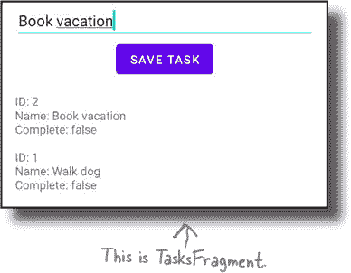
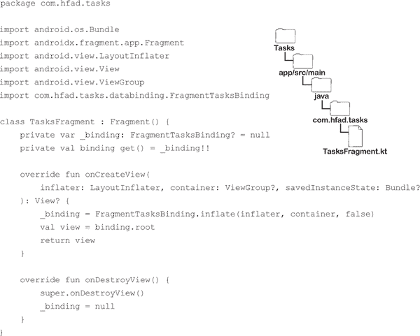
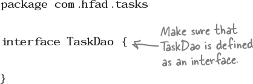
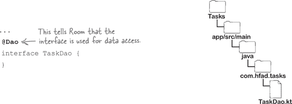
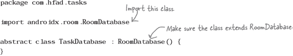
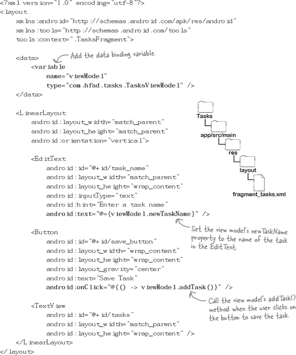
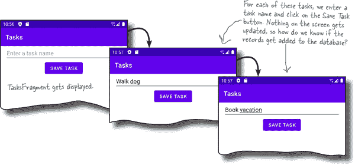
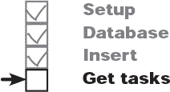

# 第十四章：Room 数据库：*带视图的 Room*


**大多数应用程序需要持久化的数据。**

但是，如果你不采取措施将这些数据存储在某个地方，**它将永远丢失**，一旦关闭应用程序。通常，你可以通过***将数据存储在数据库中***来在 Android 应用程序中保护数据安全，因此在本章中，我们将向你介绍**Room 持久化库**。你将学习如何使用注解类和接口来**构建数据库**、**创建表**和**定义数据访问方法**。你将了解如何使用协程在后台运行数据库代码。在此过程中，你将学习如何通过一点帮助从***Transformations.map()***来**立即转换你的实时数据**，每当它发生变化时。

# 大多数应用程序需要存储数据。

到目前为止，你编写的几乎所有应用程序都使用了少量静态数据来进行功能操作。例如，在第十一章到第十三章中构建的猜谜游戏应用程序，通过在其视图模型中保存一个字符串数组，游戏可以随机选择一个字符串让你来猜测。

然而，在现实世界中，大多数应用程序需要的不仅仅是静态数据；它们需要能够保存可以更改的数据，以防用户关闭应用程序时数据丢失。例如，音乐应用可能需要存储播放列表，游戏可能需要记录用户的进度，以便用户可以回到上次离开的地方。

## 应用程序可以使用数据库来持久化数据。

在大多数情况下，持久化用户数据的最佳方法是使用数据库。因此，在本章中，你将通过构建一个 Tasks 应用程序来学习如何使用数据库。该应用程序允许用户将任务添加到数据库，并显示已输入的所有任务列表。

以下是应用程序的外观：


在我们开始构建应用程序之前，让我们先了解其结构。

# 应用程序的结构

应用程序将包含一个名为`MainActivity`的单个活动，该活动将用于显示名为`TasksFragment`的片段。

`TasksFragment`是应用程序的主屏幕。它的布局文件（*fragment_tasks.xml*）将包括一个编辑文本和一个按钮，用户可以在其中输入任务名称并将其插入到数据库中。它还将包括一个文本视图，用于显示已输入到数据库中的所有任务：


我们还将向应用程序添加一个视图模型（名为`TasksViewModel`），该模型将被`TasksFragment`用于业务逻辑。它将包括片段用来与应用程序数据库交互的属性和方法。我们还将启用数据绑定，以便`TasksFragment`的布局可以直接访问视图模型。

这些组件将如何互动：


要创建数据库，我们将使用一个名为***Room***的 Android 库。那么，Room 是什么？

# Room 是建立在 SQLite 之上的数据库库。


大多数 Android 数据库在后台使用 SQLite。SQLite 轻量级、稳定、快速，并且针对单用户进行了优化，这些特性使其成为 Android 应用程序的良好选择。然而，编写用于创建、管理和与 SQLite 数据库交互的代码可能会有些棘手。

为了简化操作，Android Jetpack 包含一个名为 ***Room*** 的持久化库，它建立在 SQLite 之上。使用 Room，您可以获得使用 SQLite 的所有优点，但使用更简单的代码。例如，它提供了方便的注释，让您可以快速地编写数据库代码，减少了重复性和错误。

> ****MVVM** 是一种用于结构化应用程序的架构设计模式。它代表 Model-View-ViewModel。**

## Room 应用程序通常使用 MVVM 结构。

使用 Room 的应用程序（包括 Tasks 应用程序）通常使用一种称为 ***MVVM*** 的架构设计模式。该结构如下所示：


这个结构类似于我们用于构建“猜谜游戏”应用程序的结构，不同之处在于多了一个用于数据库的 Model 层。这意味着活动和片段的 UI 代码与保存在视图模型中的业务逻辑分离清晰，视图模型与支持数据库的任何代码也是分离的。

在构建 Tasks 应用程序过程中，您将学习更多关于如何使用 MVVM 结构的信息。

# 我们将要做的事情如下：

这些是构建 Tasks 应用程序的步骤：

1.  **设置基本应用。**

    我们将创建应用程序，更新其 *build.gradle* 文件以使用所需的库，并创建基本的活动、片段和布局代码。

    

1.  **编写数据库代码。**

    在这一步中，我们将添加代码以创建带有表的数据库，并提供与表数据交互所需的数据访问方法。

    

1.  **插入任务记录。**

    我们将创建一个视图模型，并更新应用程序的片段，以便可以使用应用程序来插入记录。

    

1.  **显示任务记录列表。**

    最后，我们将更新视图模型和片段代码，使应用程序显示数据库中保存的所有任务记录的列表。

    

## 创建 Tasks 项目

我们将使用一个新项目来开发 Tasks 应用程序，因此请按照与之前章节相同的步骤创建项目。选择“空活动”选项，输入名称“Tasks”和包名“com.hfad.tasks”，接受默认保存位置。确保语言设置为 Kotlin，最低 SDK 版本为 API 21，以便在大多数 Android 设备上运行。

接下来，我们将更新项目的 *build.gradle* 文件，以包括所有需要的功能和依赖项。

# 在项目的 build.gradle 文件中添加一个变量...


在本章中，我们将使用两个 Room 库，因此我们将在项目的 *build.gradle* 文件中添加一个新变量，以指定我们将使用的版本，并保持一致性。为此，请打开文件 *Tasks/build.gradle*，并将以下行（用**加粗**标记的）添加到 `buildscript` 部分：


## …并且也要更新应用的 build.gradle 文件

在应用的 *build.gradle* 文件中，我们需要启用数据绑定，并添加 view model、live data 和 Room 库的依赖项。

打开文件 *Tasks/app/build.gradle*，并将以下行（用**加粗**标记的）添加到适当的部分：


然后点击“立即同步”选项，将您所做的更改与项目的其余部分同步。

# 创建 TasksFragment

该应用程序将包含一个名为 `TasksFragment` 的单个片段，我们将使用它来显示数据库中所有任务的列表，并插入新任务。

要创建 `TasksFragment`，请在 *app/src/main/java* 文件夹中突出显示 *com.hfad.tasks* 包，然后转到 文件→新建→Fragment→Fragment（空白）。将 fragment 命名为`TasksFragment`，命名其布局为“fragment_tasks”，并确保语言设置为 Kotlin。



## 更新 TasksFragment.kt

一旦您将 `TasksFragment` 添加到项目中，请确保 *TasksFragment.kt* 与此处显示的代码匹配：



# 更新 fragment_tasks.xml

我们还需要更新 `TasksFragment` 的布局，以便使用数据绑定，并包含视图以允许我们输入新任务并显示现有任务的列表。

打开文件 *fragment_tasks.xml*，并更新它，以便其与此处显示的代码匹配：


# 在 MainActivity 的布局中显示 TasksFragment…

要使用 `TasksFragment`，我们需要将它添加到 `MainActivity` 的布局中的 `FragmentContainerView` 中。

更新文件 *activity_main.xml*，使其与此处显示的代码匹配：


## …并检查 MainActivity.kt 代码

更新布局后，打开 *MainActivity.kt* 并确保其代码如下所示：


现在我们已经更新了 fragment 和 activity 代码，让我们开始处理 Room 数据库。

# Room 数据库的创建方式


Room 使用一组带注解的类和接口来为您的应用程序创建和配置 SQLite 数据库。它需要三个主要的东西：

## 1\. 数据库类

这定义了数据库，包括其名称和版本号。用于获取数据库实例。


## 2\. 表的数据类

数据库中的所有数据都存储在表中。您可以使用数据类定义每个表，其中包括注解来指定表的名称和列。

###### 注意

Kotlin 数据类允许您创建主要用于保存数据的对象。


## 3\. 数据访问的接口

您可以使用接口与每个表进行交互，接口指定应用程序需要的数据访问方法。例如，如果需要插入记录，则可以在接口中添加一个`insert()`方法；如果需要获取所有记录，则可以添加一个`getAll()`方法。


Room 使用这三个元素生成应用程序需要创建 SQLite 数据库、其表格和任何数据访问方法的所有代码。

接下来的几页中，我们将展示如何通过定义 Tasks 应用的数据库来编写这三个组件的代码。我们将从定义其表格开始。

# 我们将在表格中存储任务数据

正如前文所述，数据库中的所有数据都存储在一个或多个表中。每个表由行和列组成，每行是一条记录，每列保存一个数据片段，如数字或文本。

每种数据类型都需创建单独的表。例如，日历应用可能有一个用于记录事件的表，而天气应用可能包含一个用于位置的表。

我们希望在 Tasks 应用中存储任务记录，因此我们将创建一个名为“task_table”的表。表格将如下所示：


## 使用带注解的数据类定义表格

如果想要数据库包含某个表格，需为每个表格定义一个数据类。数据类需要包含表的每个列的属性，并使用注解告诉 Room 如何配置表格。


为了演示其工作原理，我们将定义一个名为`Task`的数据类，在 Tasks 应用的数据库中创建表。

## 创建 `Task` 数据类

我们将从创建数据类开始。在*app/src/main/java*文件夹中的*com.hfad.tasks*包中突出显示，然后转到 File→New→Kotlin Class/File。将文件命名为“Task”并选择 Class 选项。

创建文件后，请更新其代码，使其看起来像这样：


# 使用 `@Entity` 指定表名

现在我们已经创建了`Task`数据类，接下来需要添加注解来告诉 Room 如何配置表格。我们将从表名开始。

通过在数据类中添加`@Entity`注解并指定表名来命名表格。我们希望在 Tasks 应用中为表格命名为“task_table”，相应的代码如下所示：


## 使用 `@PrimaryKey` 指定主键

接下来，我们将指定表的主键。这用于唯一标识单个记录，不能包含任何重复值。

在 Tasks 应用中，我们将使用`taskId`属性作为`task_table`的主键，并使表格自动生成其值以保证其唯一性。这通过类似以下方式的`@PrimaryKey`注解完成：


## 使用 `@ColumnInfo` 指定列名

我们最后要做的是为 `taskName` 和 `taskDone` 属性指定列名。这可以通过如下方式使用 `**@ColumnInfo**` 注解完成：


注意，只有在希望列名与属性名不同的情况下才需要使用 `@ColumnInfo` 注解。如果省略注解，Room 将使用属性名作为列名。

这是我们完成`Task`数据类所需了解的一切。我们将在下一页上展示完整的代码。

# `Task.kt` 的完整代码

这是 `Task` 数据类的完整代码；更新 *Task.kt* 的代码，以包括所示的更改（用粗体标记）：


Room 使用此文件创建名为 `task_table` 的表，其中包含一个自动生成的名为 `taskId` 的主键，以及名为 `task_name` 和 `task_done` 的两列。表的样子如下所示：


当我们在几页后编写数据库类时，您将了解到 Room 如何将此表添加到数据库中。首先，我们将定义一些数据库访问方法，以便应用程序可以插入、读取、更新和删除表的数据。

# 使用接口指定数据操作

通过创建带有注解的接口来指定应用程序访问表格数据的方式。此接口定义了一个 DAO——或*数据访问对象*——其中包括应用程序需要的插入、读取、更新和删除数据的所有方法。

要了解其工作原理，我们将创建一个名为 `TaskDao` 的新接口，Tasks 应用程序将使用它与 `task_table` 的数据进行交互。

## 创建 `TaskDao` 接口

我们将从创建接口开始。在 *app/src/main/java* 文件夹中突出显示 *com.hfad.tasks* 包，然后转到 文件→新建→Kotlin 类/文件。将文件命名为 “TaskDao”，选择接口选项。


创建文件后，请确保其代码如下所示：



## 使用 `@Dao` 标记接口以标记数据访问

接下来，我们需要告诉 Room，`TaskDao` 接口定义了数据访问方法。这可以通过像这样使用 `**@Dao**` 注解来完成：



一旦您使用 `@Dao` 注释了接口，您可以添加应用程序用于与数据交互的带注释方法。例如，如果要应用程序插入记录，您需要向接口添加一个方法；如果要获取记录，您也需要添加此方法。

好消息是，Room 提供了四个注解——`@Insert`、`@Update`、`@Delete` 和 `@Query`——使添加这些方法变得轻而易举。我们通过向 `TaskDao` 添加一些数据访问方法来了解它们的用法。

# 使用 `@Insert` 插入记录

我们首先定义的第一个数据访问方法是一个`insert()`方法，该应用程序将使用它将任务插入到`task_table`中。该方法将有一个参数——一个`Task`对象，表示我们要插入的任务。我们还会用`**@Insert**`注解标记该方法，告诉 Room 该方法用于插入记录。

以下是`insert()`方法的完整代码：


当 Room 看到`@Insert`注解时，它会自动生成应用程序需要将记录插入表中的所有代码，因此您无需自己编写。例如，对于上面的`insert()`方法，它生成将`Task`对象的数据插入到`task_table`中所需的所有代码，如下所示：


任何标记有`@Insert`的方法都可以接受一个或多个实体对象作为参数——对象的类型标记为`@Entity`。`@Insert`方法也可以接受实体对象的集合。例如，下面的方法将插入包含在`List<Task>`参数中的所有任务：


## 使用 @Update 更新记录

Room 还可以生成更新表中一个或多个现有记录所需的所有代码。这通过向 DAO 接口添加一个标记有`**@Update**`的方法来实现。例如，下面的`update()`方法生成更新现有任务记录所需的所有代码：


当调用此方法时，它会更新具有匹配`taskId`的记录，使其数据与`Task`对象的属性值匹配。

# 使用 @Delete 删除记录

还有一个`**@Delete**`注解，用于标记需要从表中删除特定记录的任何方法。例如，要删除单个任务记录，可以使用以下定义的方法：


Room 为此方法生成的代码将删除具有匹配`taskId`的记录：


## 用 @Query 处理其他所有情况

其他任何数据访问方法都标记有`@Query`。此注解允许您定义一个 SQL 语句（使用`SELECT`、`INSERT`、`UPDATE`或`DELETE`），在调用方法时将运行该语句。

###### 注意

我们不打算在本书中教授如何使用 SQL，但如果您想了解更多信息，建议阅读 Lynn Beighley 的《Head First SQL》。

例如，在 Tasks 应用程序中，我们可以使用以下代码定义一个名为`get()`的方法，以返回具有匹配`taskId`的 LiveData `Task`：


我们还可以定义一个`getAll()`方法，它将返回一个 LiveData `List`，其中包含表中保存的所有记录：


由于这些方法返回 LiveData 对象，应用程序可以使用它们在数据发生更改时收到通知。我们稍后在本章中将使用此功能来保持在`TasksFragment`中显示的任务记录列表的最新状态。

现在你已经了解了完成 `TaskDao` 代码所需的所有内容。我们将在下一页展示完整代码。

# TaskDao.kt 的完整代码


这是 `TaskDao` 接口的完整代码；更新 *TaskDao.kt* 的代码，使其包含所示的更改（加粗部分）：


我们已经编写了 `Task` 数据类（定义了一个表）和 `TaskDao` 接口（指定了数据访问方法）的代码。接下来，我们将学习如何定义实际的数据库。

# 创建一个名为 TaskDatabase 的抽象类

通过创建一个抽象类来定义应用程序的数据库。抽象类指定了数据库名称和版本号，以及定义表和数据访问方法的任何类或接口。

在 Tasks 应用程序中，我们将使用名为 `TaskDatabase` 的抽象类来定义数据库。在 *app/src/main/java* 文件夹中突出显示 *com.hfad.tasks* 包，然后转到 文件→新建→Kotlin 类/文件。将文件命名为 `TaskDatabase` 并选择“类”选项。

`TaskDatabase` 类需要扩展 `RoomDatabase`，因此更新 *TaskDatabase.kt* 的代码，使其看起来像这样：



## 使用 @Database 对类进行注解

接下来，我们需要使用 `**@Database**` 标记该类，告诉 Room 这定义了一个数据库。以下是如何编写此代码的示例：


正如你所见，`**@Database**` 注解包括三个属性：`**entities**`、`**version**` 和 `**exportSchema**`。

`entities` 指定了任何标有 `@Entity` 的类，这些类定义了要添加到数据库中的表。对于 Tasks 应用程序，这是 `Task` 数据类。

`version` 是一个 `Int`，指定数据库版本。在这种情况下，这是数据库的第一个版本，因此为 1。

最后，`exportSchema` 告诉 Room 是否将数据库架构导出到文件夹中，以记录其版本历史。在这里，我们将其设置为 *false*。

# 为任何 DAO 接口添加属性

接下来，我们需要指定任何数据访问接口（标记为`@Dao`）。为此，需要为每个接口添加一个属性。

例如，在 Tasks 应用程序中，我们已定义了一个名为 `TaskDao` 的单个 DAO 接口，因此需要向 `TaskDatabase` 代码添加一个新的 `taskDao` 属性，如下所示：


## 创建并返回数据库的实例

我们需要的最后一件事是一个 `getInstance()` 方法，用于创建数据库并返回其实例。代码如下所示：


这就是我们对 `TaskDatabase` 类所需的一切。我们将在下一页展示完整代码。

# TaskDatabase.kt 的完整代码

这是 `TaskDatabase` 抽象类的完整代码；更新 *TaskDatabase.kt* 的代码，使其包含所示的更改（加粗部分）：


我们已经编写了 Tasks 应用程序所需的所有数据库代码。在构建应用程序的其余部分之前，请尝试以下练习。

# MVVM 再探讨


在本章的早些时候，我们说过要使用 MVVM（或模型-视图-视图模型）架构模式来构建 Tasks 应用程序。以下是此类结构的提醒：


## 我们已经完成了所有的模型代码…

到目前为止，我们通过创建实体、DAO 和数据库定义文件（`Task`、`TaskDao` 和 `TaskDatabase`）编写了应用程序所需的所有数据库代码。编写所有数据库代码意味着我们已经完成了应用程序架构的模型部分。

## …所以让我们继续进行 ViewModel

我们接下来要做的是 ViewModel 部分。为此，我们将创建一个名为 `TasksViewModel` 的视图模型，它将包含 `TasksFragment` 的业务逻辑。视图模型将包括使用 `TaskDao` 插入记录到数据库的方法。

###### 注意

我们还希望显示数据库中保存的任务列表，但现在我们将专注于插入记录。

让我们继续创建 `TasksViewModel`。

# 创建 `TasksViewModel`

要创建 `TasksViewModel`，请在 *app/src/main/java* 文件夹中突出显示 *com.hfad.tasks* 包，然后转到 文件→新建→Kotlin 类/文件。将文件命名为 `TasksViewModel`，选择类选项。

我们将更新视图模型代码，以便 `TasksFragment` 可以使用它来插入新的任务记录。为此，代码需要三件事：

1.  **对 TaskDao 对象的引用**

    `TasksViewModel` 将使用此对象与数据库交互，因此我们将在其构造函数中将其传递给视图模型。

1.  **一个字符串属性，保存新任务的名称**

    当用户输入新任务名称时，`TasksFragment` 将更新该属性的值。

1.  **一个 `addTask()` 方法，`TasksFragment` 将调用该方法**

    该方法将创建一个新的 `Task` 对象，设置其名称，并通过调用 `TaskDao` 的 `insert()` 方法将其插入到数据库中。

这三件事的基本视图模型代码看起来像这样；更新 *TasksViewModel.kt* 的代码，使其与下面的代码匹配：


然而，在 `TasksFragment` 能够调用 `addTask()` 方法之前，我们还需要做一些修改。

# 数据库操作可能运行得很慢…

Androidville 中的某些任务，例如将记录插入到数据库中，可能非常耗时。因此，Room 持久性库坚持要求 ***任何数据访问操作都必须在后台线程上执行***，以免阻塞 Android 的主线程并影响 UI。

###### 注意

从技术上讲，有一个设置可以用来覆盖这一点，但最好还是在后台线程上运行诸如此类的任务，以免阻塞应用程序的其余部分。

当我们使用 Kotlin 开发 Android 应用程序时，我们将使用 ***协程（coroutines）*** 来确保所有 `TaskDao` 的数据访问方法在后台运行。

## 我们将使用协程来在后台运行数据访问代码

正如您可能已经了解的那样，协程类似于轻量级线程，可以让您异步运行多个代码片段。使用协程意味着您可以启动后台作业（例如向数据库插入记录），而无需其余代码等待其完成。这使得用户体验更加流畅，不会像在感恩节时试图观看 YouTube 那样。

修改您的数据访问代码以使用协程非常简单。您只需做以下两个更改：

> **协程是一段可挂起的代码，可以在后台运行。**

1.  **将 DAO 的每个数据访问方法标记为 suspend。**

    这将每个方法转换为可以在后台运行并且可以挂起的协程，例如：

    

1.  **在后台启动 DAO 的协程。**

    例如，要从 `TasksViewModel` 调用 `TaskDao` 的 `insert()` 方法，您可以使用以下代码：

    

***这些更改适用于除了返回 LiveData 的方法外的所有数据访问方法。*** Room 已经为返回 LiveData 对象的方法使用后台线程，这意味着您无需对代码做任何额外的更改。

让我们更新 `TaskDao` 和 `TasksViewModel` 的代码，使它们使用协程。

# 1\. 将 TaskDao 的方法标记为 suspend

我们需要做的第一件事是将所有不使用 LiveData 的 `TaskDao` 数据访问方法标记为 `suspend`。这意味着我们需要将这些更改应用于除了 `get()` 和 `getAll()` 外的所有方法。

这里是 *TaskDao.kt* 的完整代码；更新代码以包含这里显示的更改（用粗体显示）：


> **将方法标记为 suspend 可以将每个方法转换为可挂起的协程。**

这是我们需要将 `TaskDao` 的方法转换为可以在后台运行的协程所需的所有代码。

# 2\. 在后台启动 insert() 方法

接下来，我们需要更新 `TasksViewModel` 的 `addTask()` 方法，以便它作为协程启动 `TaskDao` 的 `insert()` 方法。以下是更新 *TasksViewModel.kt* 的代码（用粗体显示）：


这一更改意味着每次调用 `addTask()` 方法时，它将使用 `TaskDao` 的 `insert()` 方法（一个协程）在后台插入记录。

现在，我们已经编写了任务应用程序视图模型所需的所有代码。接下来，我们将在 `TasksFragment` 中添加一个 `TasksViewModel` 对象，以便它可以访问视图模型的属性和方法，并允许用户插入任务记录。

# TasksViewModel 需要一个视图模型工厂

正如您在 第十一章 中学到的，通过请求视图模型提供程序提供一个视图模型，您可以将视图模型添加到片段代码中。如果存在，则视图模型提供程序将返回片段当前的视图模型对象；如果不存在，则创建一个新的视图模型对象。

如果视图模型包含无参数构造函数，则视图模型提供程序可以无需额外帮助创建其实例。但是，如果构造函数具有参数，则它需要视图模型工厂的帮助。

在 Tasks 应用程序中，我们需要视图模型提供程序来获取 `TasksViewModel` 对象。由于 `TasksViewModel` 的构造函数需要一个 `TaskDao` 参数，因此我们必须首先定义一个 `TasksViewModelFactory` 类。


## 创建 `TasksViewModelFactory`。

要创建工厂，请在 *app/src/main/java* 文件夹中突出显示 *com.hfad.tasks* 包，然后转到 文件→新建→Kotlin Class/File。将文件命名为 “TasksViewModelFactory” 并选择“Class”选项。

`TasksViewModelFactory` 代码几乎与您在 第十一章 中编写的视图模型工厂代码相同，因此请更新 *TasksViewModelFactory.kt*，使其看起来像这样：


现在我们已经编写了视图模型工厂，让我们使用它来向 `TasksFragment` 添加一个 `TasksViewModel` 对象。

# `TasksViewModelFactory` 需要一个 `TaskDao`。

要向 `TasksFragment` 添加 `TasksViewModel`，我们需要创建一个 `TasksViewModelFactory` 对象，并将其传递给视图模型提供程序。然后提供程序将使用工厂来创建视图模型。

但是存在一个问题：`TasksViewModelFactory` 的构造函数需要一个 `TaskDao` 参数，因此我们需要在创建 `TasksViewModelFactory` 对象之前获取一个 `TaskDao` 对象。然而，`TaskDao` 是一个接口，而不是具体的类，那么我们如何获取 `TaskDao` 对象呢？

## `TaskDatabase` 代码具有 `TaskDao` 属性。

当我们编写 `TaskDatabase` 的代码时，我们包括了两个关键内容：一个名为 `taskDao` 的 `TaskDao` 属性和一个 `getInstance()` 方法以返回数据库的实例。这里是那段代码的提醒：


要在 `TasksFragment` 代码中获取对 `TaskDao` 对象的引用，因此我们可以调用 `TaskDatabase` 的 `getInstance()` 方法，并访问其 `taskDao` 属性。这样做的代码如下所示：


上述代码获取当前应用的引用，如果数据库不存在则构建数据库，并返回其实例。然后将其 `TaskDao` 对象赋给名为 `dao` 的本地变量。

现在我们知道如何获取对 `TaskDao` 对象的引用后，我们可以更新 `TasksFragment` 代码以创建 `TasksViewModelFactory` 对象，然后使用它来获取 `TasksViewModel`。让我们看看代码是什么样子的。

# `TasksFragment.kt` 的更新代码。

下面显示了更新后的 `TasksViewModel` 代码。您可以看到，它现在包括获取 `TaskDao` 对象和创建 `TasksViewModelFactory` 的代码。然后，代码将工厂传递给视图模型提供程序，后者使用它来获取 `TasksViewModel` 的实例。

更新 *TasksFragment.kt* 中的代码，以包含这些更改（用粗体标出）：


# TasksFragment 可以使用数据绑定

现在我们已经向 `TasksFragment` 添加了一个 `TasksViewModel` 对象，我们可以使片段使用其属性和方法来将记录插入到数据库中。我们将使用数据绑定来实现这一点，这将使布局直接访问视图模型的属性和方法。

要设置数据绑定，我们首先需要将数据绑定变量添加到片段的布局中，因此我们将向 *fragment_tasks.xml* 的 `<data>` 部分添加以下代码（用粗体标出）：


然后，我们将通过向 `TasksFragment` 的 `onCreateView()` 方法添加下面显示的行（用粗体标出）来将片段的 `viewModel` 属性分配给数据绑定变量：


我们将在后面的几页上为两个文件显示完整的代码。首先，让我们更新 *fragment_tasks.xml*，以便使用其 `viewModel` 变量将记录插入到数据库中。

# 我们将使用数据绑定来插入记录

要将新任务记录插入到数据库中，我们需要做两件事：将 `TasksViewModel` 的 `newTaskName` 属性设置为新任务的名称，并调用其 `addTask()` 方法。我们可以在 `TasksFragment` 的布局中使用数据绑定来完成这两件事情。

## 设置 TasksViewModel 的 newTaskName 属性

要设置视图模型的 `newTaskName` 属性，我们将其绑定到片段布局中的 `task_name` 编辑文本。要执行此操作的代码如下：


请注意，我们使用了 `**@=**` 将属性绑定到编辑文本上，而不是 `@`。`@=` 意味着编辑文本可以更新其绑定的属性：在这种情况下是 `newTaskName`。

## 调用 TasksViewModel 的 addTask() 方法

要插入任务，我们将使用数据绑定使布局的保存任务按钮在点击时调用视图模型的 `addTask()` 方法。您已经熟悉如何做到这一点，所以这里是代码：


这些是我们需要对 *fragment_tasks.xml* 进行的所有代码更改，以便将记录插入到数据库中。让我们看看完整的代码是什么样的。

# 完整的 fragment_tasks.xml 代码

这是 `TasksFragment` 布局的完整代码；确保 *fragment_tasks.xml* 中的代码包含以下更改（用粗体标出）：



# 完整的 TasksFragment.kt 代码


在运行应用程序之前，我们还需要确保 `TasksFragment` 包含设置布局的数据绑定变量所需的所有代码。以下是完整的代码；更新 *TasksFragment.kt*（如果尚未这样做）以包含以下更改（用粗体标出）：


让我们来看看代码运行时会发生什么。

# 代码运行时会发生什么

应用程序运行时会发生以下事情：

1.  **TasksFragment 调用 TaskDatabase.getInstance()，如果数据库不存在则构建数据库。**

    它将数据库命名为 `tasks_database`，并使用 `Task` 数据类创建名为 `task_table` 的表。然后返回数据库的实例。

    

1.  **TasksFragment 获取数据库实例的 TaskDao 对象，并使用它创建一个 TasksViewModelFactory。**

    视图模型提供程序使用新创建的 `TasksViewModelFactory` 对象来创建 `TasksViewModel`。

    

1.  **TasksFragment 将布局的 viewModel 数据绑定变量设置为 TasksViewModel 对象。**

    

1.  **用户在布局的编辑文本视图中输入任务名称。**

    布局使用数据绑定将视图模型的 `newTaskName` 属性设置为此值。

    

1.  **用户单击“保存任务”按钮。**

    这使用数据绑定调用 `TaskViewModel` 对象的 `addTask()` 方法。

    

1.  **addTask() 方法创建一个新的 Task 对象，并将其 taskName 属性设置为 newTaskName 的值。**

    

1.  **addTask() 方法调用 TaskDao 的 insert() 方法。**

    这将 `Task` 对象的数据插入到数据库表中。表会为 `taskId` 主键自动生成一个值。

    

让我们带着这个应用程序去测试驾驶。

#  测试驾驶

当我们运行应用程序时，`TasksFragment` 显示在 `MainActivity` 中。当我们尝试输入两个新任务时，单击“保存任务”按钮时似乎没有任何反应。



单击按钮已将新任务记录添加到数据库，但我们还不能看到它们。要在应用程序中查看这些记录，我们需要进一步进行更改。

一群穿着整齐的组件正在玩一个派对游戏，“我是谁？”他们会给你一个线索——你根据他们说的话猜测他们是谁。假设他们总是诚实地告诉自己的事情。填写右边的空白来识别出参与者。另外，对于每个参与者，请写下组件是否属于应用程序架构的 Model、View 或 ViewModel 层。


**今晚的参与者：**


|   | **名称** | **Model、View 或 ViewModel？** |
| --- | --- | --- |
| 我负责应用程序的屏幕外观。 | ______________ | ______________ |
| 我在应用程序关闭后持久化数据。 | ______________ | ______________ |
| 我有一个生命周期，但我不能单独存在。 | ______________ | ______________ |
| 我用于业务逻辑。 | ______________ | ______________ |
| Room 使用我来创建表格。 | ______________ | ______________ |
| 我有一个生命周期，我是一种上下文类型。 | ______________ | ______________ |
| 我帮助您与数据库中的数据进行交互。 | ______________ | ______________ |

 **答案在“中。**

# TasksFragment 需要显示记录


您现在已经学会了如何构建一个将记录插入到 Room 数据库中的应用程序。接下来，我们将更新应用程序，以便`TasksFragment`显示已插入的所有记录的列表。

这是新版本的`TasksFragment`将会是什么样子：


为此，我们将使用`TaskDao`的`getAll()`方法从数据库中获取所有任务记录。然后，我们将通过将它们格式化为单个`String`来在`TasksFragment`的文本视图中显示它们。

让我们开始吧。

# 使用 getAll()从数据库中获取所有任务

我们将首先向`TasksViewModel`添加一个名为`tasks`的属性，它将保存数据库中所有任务的列表。我们将通过将其设置为`TaskDao`的`getAll()`方法来将任务添加到属性中，就像这样：


正如你可能记得的，我们在*TaskDao.kt*中使用以下代码定义了`getAll()`方法：


如你所见，该方法返回一个`LiveData<List<Task>>`对象：一个包含`Task`对象的实时数据列表。这意味着`TasksViewModel`的`tasks`属性也具有`LiveData<List<Task>>`类型：


由于`tasks`属性使用实时数据，它始终包含用户的最新更改。例如，如果向`task_table`添加了一个新任务，`tasks`属性的值会自动更新以包含新记录。

这种方式使用实时数据对 Tasks 应用程序来说是个好消息，因为我们可以使用它来在`TasksFragment`中显示一个始终保持最新的任务列表。然而，在我们能够做到这一点之前，还有一件事情我们需要了解。

# 一个`LiveData<List<Task>>`是一个更复杂的类型



当我们向您介绍数据绑定时，我们向您展示了如何将视图绑定到`String`或数字，包括实时数据值。我们之所以能够做到这一点，是因为`String`和数字是可以轻松在文本视图中显示的简单对象。

然而，这一次情况有所不同。`tasks`属性的类型是`LiveData<List<Task>>`，比如说`LiveData<String>`要复杂得多。因此，我们不能简单地将布局的文本视图直接绑定到`tasks`属性，因为文本视图不知道如何显示它。

那么解决方案是什么呢？


## 使用 Transformations.map()来转换实时数据对象

在我们可以使用数据绑定来显示用户的任务之前，我们首先需要将`LiveData<List<Task>>`转换为一些更简单的东西，以便文本视图知道如何显示。为此，我们将创建一个名为`tasksString`的新属性，它将保存`tasks`属性的`LiveData<String>`版本。

我们将使用 `**Transformations.map()**` 方法来创建 `LiveData<String>`。该方法接受一个 `LiveData` 参数和一个指定 LiveData 对象应如何转换的 lambda 表达式。然后返回一个新的 `LiveData` 对象。

例如，要将 `tasks` 属性转换为 `LiveData<String>`，我们可以使用以下代码：

> **Transformations.map() 观察一个 LiveData 对象，并将其转换为另一种类型的 LiveData 对象。**

```
val tasksString = Transformations.map(tasks) {
    tasks -> formatTasks(tasks)
}
```

其中 `formatTasks()` 是一个方法（我们需要编写），用于将 `tasks` 属性的任务列表格式化为 `String`。然后 `Transformations.map()` 方法将这个 `String` 包装在一个 `LiveData` 对象中，以便返回 `LiveData<String>`。

`Transformations.map()` 方法观察传递给它的 `LiveData` 对象，并在每次接收到更改通知时执行 lambda 表达式。这意味着在上述代码中，`tasksString` 将***自动包含用户输入的任何新任务记录***。

在接下来的几页中，我们将向 `TasksViewModel` 中添加 `tasksString` 属性，然后使用数据绑定将其值显示在 `TasksFragment` 的布局中。这种方法意味着我们可以在一个始终保持更新的文本视图中显示用户的所有任务。


# 让我们更新 `TasksViewModel` 代码

我们将首先更新 `TasksViewModel` 代码，以便包含新的 `tasks` 和 `tasksString` 属性。我们还将添加两个方法 — `formatTasks()` 和 `formatTask()` — 来帮助我们将 `LiveData<List<Task>>` 转换为 `LiveData<String>`。

这是 `TasksViewModel` 的完整代码，因此请更新 *TasksViewModel.kt*，以包含下面的更改（用粗体标出）：


# 我们将把 tasksString 属性绑定到布局的文本视图上

接下来，我们将使用数据绑定将 `TasksFragment` 布局中的 `tasks` 文本视图绑定到 `TasksViewModel` 中的 `tasksString` 属性。以下是执行此操作的代码；请更新 *fragment_tasks.xml* 以包括这些更改（用粗体标出）：


这是我们需要对 *fragment_tasks.xml* 做的唯一更改，以便它能够显示用户任务的 `String`。然而，在我们进行应用程序测试之前，我们还需要进行一次微调。

## 我们需要使布局响应 LiveData 的更新

正如你已经了解的那样，`tasksString` 属性是一个 `LiveData<String>`，这意味着它会自动包含对数据库中记录的任何更新。例如，如果用户插入了一个新的记录，其数据将添加到 `tasksString` 的值中。

由于我们使用数据绑定来显示 `tasksString` 属性的值在 `tasks` 文本视图中，我们需要确保每当 `tasksString` 属性的值更新时，布局都会收到通知。这样做意味着文本视图将会在插入新记录时显示任何新的记录。

您已经学会如何使布局响应实时数据更新：通过在片段代码中设置布局的生命周期所有者，如下所示：

```
binding.lifecycleOwner = viewLifecycleOwner
```

因此，我们需要更新`TasksFragment`的代码，以便包含这行。我们将在下一页上显示完整的代码，然后讨论应用程序运行时发生的情况。

# 完整的`TasksFragment.kt`代码

这是`TasksFragment`的完整代码；要包含额外的行（加粗部分）：


# 代码运行时发生了什么

应用程序运行时发生以下情况：

1.  **`TasksFragment`创建一个`TasksViewModelFactory`对象，视图模型提供程序用于创建`TasksViewModel`。**

    

1.  **`TasksViewModel`的`tasks`属性设置为`TaskDao`的`getAll()`方法，该方法返回一个`LiveData<List<Task>>`。**

    它保存来自数据库的所有任务记录的实时数据列表。

    

1.  **`TasksViewModel`的`tasksString`属性使用`Transformations.map()`方法将`tasks`属性的值转换为`LiveData<String>`。**

    它以单个`String`格式返回`tasks`属性的记录。

    

1.  **布局的文本视图使用数据绑定来显示`tasksString`的值。**

    

1.  **用户将新任务记录输入到数据库中。**

    使用实时数据，`TasksViewModel`的`tasks`属性自动更新，包括新记录。

    

1.  **`tasksString`属性响应于`tasks`属性的更新。**

    由于使用了实时数据，它会自动将新记录包含在其`String`中。

    

1.  **布局响应于`tasksString`属性的更新。**

    用户刚刚输入的记录包含在文本视图中。

    

#  试驾

当我们运行应用程序时，`TasksFragment`与以前一样显示，但这次它显示了我们之前输入的任务。

当我们输入新任务时，只要点击“保存任务”按钮，它就会立即添加到任务列表中。


恭喜！您现在已经学会如何构建一个使用 MVVM 模式与 Room 数据库交互的应用程序。用户的记录保存到数据库中，这样当应用程序关闭时它们就会持久化，并且应用程序在插入新记录时会立即显示它们。

#  混合消息

下面列出了一些视图模型代码，但`refresh()`方法的代码缺失。您的挑战是将候选代码块（左侧）与`result`属性的最终值匹配，假设将候选代码添加到`refresh()`方法中并调用一次。并非所有的值都会被使用，有些值可能会被多次使用。


#  混合消息解决方案

下面列出了一些视图模型代码，但`refresh()`方法的代码缺失。你的挑战是将每个候选代码块（在左侧）与`refresh()`方法中添加候选代码后`result`属性的最终值进行匹配，并且该方法被调用一次。并非所有值都会被使用，有些值可能会被多次使用。


一群穿着全副武装的组件正在玩一个派对游戏，“我是谁？” 他们会给你一个线索，你根据他们说的话来猜出他们是谁。假设他们总是对自己说实话。在右边的空白处填写以识别出与会者。此外，对于每个与会者，请写下该组件是否属于应用程序架构的 Model、View 或 ViewModel 层。


# 你的 Android 工具箱


**你已经掌握了第十四章，现在你已经将 Room 持久性库添加到你的工具箱中。**


