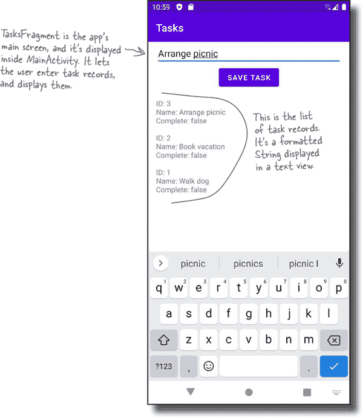
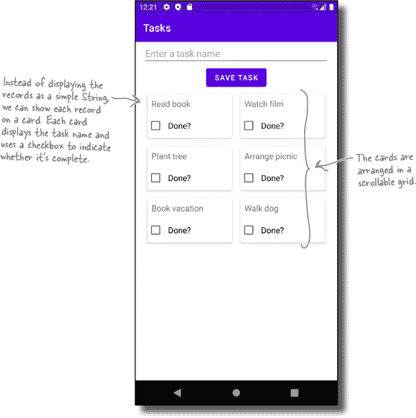
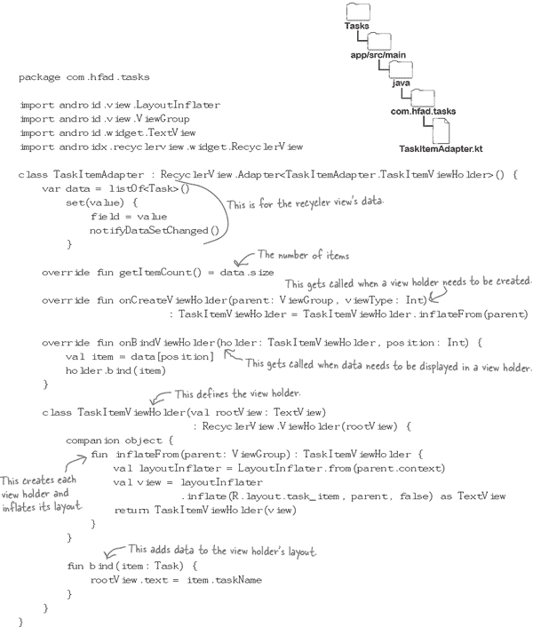
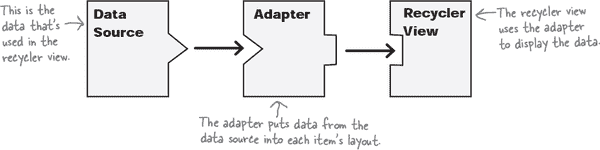

# 第十五章：可循环视图：*减少、重复、回收*


**数据列表是大多数应用的关键部分。**

在本章中，我们将向您展示如何使用**可循环视图**创建一个**超灵活**的**可滚动列表**。您将学习如何为列表创建**灵活的布局**，包括文本视图、复选框等。您将了解如何创建**适配器**，以您选择的任何方式将数据压缩到可循环视图中。您将发现如何使用**卡片视图**为您的数据赋予**3D 材料外观**。最后，我们将向您展示如何使用**布局管理器**仅凭**一两行代码**完全改变列表的外观。让我们开始循环使用...

# 当前任务应用的外观

在上一章中，我们构建了一个任务应用，允许用户将任务记录输入到 Room 数据库中。该应用将记录列表显示为格式化的`String`，并且看起来像这样：



我们决定使用格式化的`String`显示任务记录，因为这是查看已添加到数据库中的记录的相对快速和基本的方法。

但是列表看起来有点单调。那么我们如何改进它呢？

# 我们可以将列表转换为可循环视图

我们可以改变方式显示任务列表，而不是将其显示为格式化的`String`，使其看起来像这样：



正如您所看到的，每个任务记录都使用文本视图和复选框来显示其数据，而不是普通文本。这些项目还按照卡片的方式排列在可滚动的网格中。

这种类型的列表是使用**可循环视图**创建的。那么它是什么？

# 为什么要使用可循环视图？

可循环视图是显示数据列表的更高级和灵活的方法，而不是使用简单的格式化`String`。它为您带来以下好处：


+    **列表项的丰富用户界面。**

    每个项目都显示在布局中，因此您可以使用文本视图、图像视图和复选框来显示其数据。

+    **一种灵活的定位项目的方法。**

    可循环视图配备布局管理器，允许您在垂直或水平列表、网格或不等高度的交错网格中定位视图。

+    **您可以将其用于导航。**

    您可以使项目可点击，以便在单击时导航到另一个片段。

+    **这是显示大数据集的高效方式。**

    可循环视图使用少量视图来呈现大量视图的外观，这些视图超出屏幕范围。当每个项目滚动到屏幕外时，它会重新使用或*回收*其视图，以用于滚动到屏幕上的项目。

## 可循环视图从适配器获取其数据

每个您创建的回收视图都使用适配器来显示其数据。适配器使用数据源（如数据库）的数据，并将其绑定到项目布局中的视图上。然后，回收视图将这些项目作为可滚动列表显示在设备屏幕上。

数据源、适配器和回收视图的关系如下：


我们将向 Tasks 应用程序添加一个回收视图。让我们一起看看我们将采取的步骤。

# 这是我们要做的事情

我们将按照以下步骤向 Tasks 应用程序添加回收视图：

1.  **创建一个回收视图来显示任务名称列表。**

    我们将从创建一个基本的回收视图开始，它只显示每个任务的名称。通过保持第一个版本相对简单，可以更容易地了解回收视图的各个部分如何构建以及它们如何配合。

    

1.  **更新回收视图以显示网格卡片。**

    在我们完成了基本的回收视图之后，我们将对其进行更改，以便以网格卡片的形式显示每个任务的名称和完成情况。

    

## 在应用的 build.gradle 文件中添加回收视图依赖项

在我们开始构建回收视图之前，我们需要将回收视图库的依赖项添加到应用的*build.gradle*文件中。打开 Tasks 应用程序，然后打开文件*Tasks/app/build.gradle*，并将以下行（加粗）添加到`dependencies`部分中：


在提示时，请确保将此更改与应用程序的其余部分同步。

现在我们已经添加了这个依赖项，让我们开始构建回收视图。


# 告诉回收视图如何显示每个项目…


首先，我们要做的是告诉回收视图如何显示每个任务记录。

对于应用的第一个版本，我们希望在回收视图中显示每个任务的名称，使其看起来像这样：


那么我们该怎么做呢？

## …通过定义布局文件

您可以使用布局文件指定回收视图中每个项目的布局方式。当回收视图需要显示每个项目时，它将使用此布局文件。例如，如果布局文件由单个文本视图组成，则回收视图的列表中将显示一个文本视图。

要创建布局文件，请在项目资源管理器中突出显示*Tasks/app/src/main/res/layout*文件夹，然后选择“文件→新建→布局资源文件”。在提示时，输入文件名“task_item”，然后点击“确定”。


对于应用的第一个版本，我们希望在单个文本视图中显示回收视图中每个任务的名称，因此我们将在刚刚创建的布局文件*task_item.xml*中添加一个文本视图。为此，请更新*task_item.xml*的代码，使其与下面的代码匹配：


这就是我们需要告诉回收视图如何布局每个项目的所有代码。接下来，我们将创建回收视图的适配器。

# 适配器向回收视图添加数据。

正如我们之前所说，当您在应用程序中使用回收视图时，需要为其创建一个适配器。

回收视图的适配器有两个主要作用：创建回收视图中可见的每个视图，并在其中显示一个数据片段。对于 Tasks 应用程序，我们需要定义一个适配器，使用*task_item.xml*来创建一堆文本视图（每个显示的任务记录一个），并在每个文本视图中放置一个任务名称。

> **适配器充当数据源和回收视图之间的桥梁。**

我们将在接下来的几页中构建适配器。以下是我们将要执行的步骤。

1.  **指定适配器应处理的数据类型。**

    我们希望适配器使用`Task`数据，因此我们将指定它使用`List<Task>`。

1.  **定义适配器的视图持有者。**

    这控制每个项目布局中的每个视图应如何填充。

1.  **膨胀每个项目的布局。**

    当回收视图需要显示每个项目时，我们将为该项目膨胀*task_item.xml*的一个实例。

1.  **在布局中显示每个项目的数据。**

    我们将通过将每个`Task`的`taskName`属性值添加到布局的文本视图中来执行此操作。

创建适配器文件。

## 创建适配器文件。

我们将为回收视图创建一个名为`TaskItemAdapter`的适配器。为此，请在*app/src/main/java*文件夹中突出显示*com.hfad.tasks*包，然后转到文件→新建→Kotlin Class/File。将文件命名为`TaskItemAdapter`，选择类选项。

创建文件后，更新其代码，使其扩展`RecyclerView.Adapter`类，如下所示：


这将该类转换为可由回收视图使用的适配器。

# 告诉适配器应该处理哪些数据

当您定义回收视图适配器时，您需要告诉它应添加到回收视图中的数据类型。我们将通过向适配器添加一个属性来指定数据类型来完成此操作。

对于任务应用程序，我们希望回收视图显示任务记录的列表，因此我们将向适配器添加一个名为`data`的`List<Task>`属性。我们还将包括一个自定义的 setter，如果属性更新，则调用`notifyDataSetChanged()`；这会告诉回收视图数据已更改，因此它可以重新绘制自己。

这是更新后的`TaskItemAdapter`代码；请更新*TaskItemAdapter.kt*以包括此更改（加粗部分）。


## 重写`getItemCount()`方法

接下来，我们需要重写适配器的`**getItemCount()**`方法。这告诉适配器有多少数据项，以便回收视图知道要显示多少个。

在`TaskItemAdapter`代码中，我们使用名为`data`的`List<Task>`属性作为回收视图的数据项，因此我们可以使用`data.size`来指定有多少项目。

以下是 `getItemCount()` 方法（用粗体标出），您可以将其添加到 *TaskItemAdapter.kt* 中：


现在我们已经指定了适配器处理的数据类型，我们将使用它来填充布局的文本视图。我们将通过定义适配器的 **视图持有者** 来实现这一点。

# 定义适配器的视图持有者

**视图持有者**包含了有关项目布局中视图应如何显示以及其在回收视图中的位置的信息。您可以将其视为项目布局根视图的持有者——指定回收视图应如何显示每个项目的布局。

在任务应用程序中，我们希望回收视图使用布局文件 *task_item.xml* 来显示任务记录。此布局的根视图是 `TextView`，因此我们需要定义一个与文本视图一起工作的视图持有者。


通过向适配器文件添加一个扩展 `RecyclerView.ViewHolder` 的内部类来定义视图持有者。它包括一个指定布局根视图类型（在本例中为 `TextView`）的构造函数。适配器的类定义也需要更新以指定适配器的类名。

以下是更新后的 `TaskItemAdapter` 代码；请更新 *TaskItemAdapter.kt* 以包含以下更改（用粗体标出）：


现在我们已经定义了一个视图持有者，我们需要通过重写适配器的 `onCreateViewHolder()` 方法来指定它使用的布局。

# 覆盖 onCreateViewHolder() 方法

每当回收视图需要新的视图持有者时，适配器的 `**onCreateViewHolder()**` 方法会被调用。当首次构建时，回收视图会重复调用该方法以构建将显示在屏幕上的视图持有者集合。

`onCreateViewHolder()` 方法需要执行两件事：膨胀用于每个项目的布局（在本例中为 *task_item.xml*），并返回一个视图持有者。以下是完成此操作的代码示例，因此请更新 *TaskItemAdapter.kt* 以包含以下更改（用粗体标出）：


正如您所见，我们将代码放在 `TaskItemViewHolder` 中的新 `inflateFrom()` 方法中来膨胀 *task_item.xml*，适配器的 `onCreateViewHolder()` 方法使用以下方式调用它：

```
TaskItemViewHolder.inflateFrom(parent)
```

这种方法将布局的视图持有者布局的责任传递给视图持有者，而不是在适配器代码的主体中膨胀布局。

# 向布局的视图添加数据

我们需要添加到适配器的最后一个细节是如何在视图持有者的布局中显示任务记录。我们将通过重写适配器的 `**onBindViewHolder()**` 方法来实现这一点，每当回收视图需要显示数据时就会调用该方法。它接受两个参数：需要绑定数据的视图持有者和数据在数据集中的位置。


在 Tasks 应用中，我们希望获取适配器的 `data` 属性（一个 `List<Task>`）中特定位置的 `Task` 对象，并在视图持有者的布局中显示其 `taskName`。以下是为 `TaskItemAdapter` 编写此功能的代码，因此请更新 *TaskItemAdapter.kt* 的代码以包括以下显示的更改：


正如您所见，我们在一个新的 `bind()` 方法中设置布局的文本视图文本，我们已将其添加到 `TaskItemViewHolder` 中。每次适配器的 `onBindViewHolder()` 方法运行时，它都会调用此方法。我们之所以采用这种方法，是因为它使视图持有者负责填充其布局，而不是适配器。

这就是我们需要为 `TaskItemAdapter` 及其 `TaskItemViewHolder` 内部类编写的所有代码。让我们查看完整的代码。

# TaskItemAdapter.kt 的完整代码

这是 `TaskItemAdapter` 的完整代码；确保 *TaskItemAdapter.kt* 的代码包括这里显示的所有内容：



# 适配器代码已完成

我们已经完成了所有需要的 `TaskItemAdapter` 代码编写。它执行以下四项任务：

1.  **指定其与 Task 数据的工作方式**

    我们通过定义名为 `data` 的 `List<Task>` 属性来实现这一点。

1.  **使用名为 TaskItemViewHolder 的视图持有者**

    我们将 `TaskItemViewHolder` 添加到 `TaskItemAdapter` 中作为内部类。

1.  **为每个项目填充布局**

    它在其 `onCreateViewHolder()` 方法被调用时执行此操作。

1.  **在布局中显示每个项目的数据**

    它通过其 `onBindViewHolder()` 方法来执行此操作。

正如我们之前所说，适配器充当数据源和 RecyclerView 之间的桥梁。数据源、适配器和 RecyclerView 之间的关系如下所示：


现在我们已完成适配器代码的编写，让我们继续进行此模型的**RecyclerView**部分。

# 我们需要显示 RecyclerView


我们接下来需要在 `TasksFragment`（Tasks 应用的主屏幕）中显示一个 RecyclerView，并使其使用我们刚刚创建的适配器。

这是 RecyclerView 应该如何显示的一个提醒：


## 如何向布局添加 RecyclerView

通过向片段的布局文件添加 `<androidx.recyclerview.widget.RecyclerView>` 元素，您可以显示一个 RecyclerView。代码如下所示：


下面这行：

```
app:layoutManager="androidx.recyclerview.widget.LinearLayoutManager"
```

指定 RecyclerView 使用的布局管理器，它确定 RecyclerView 如何定位其项目。在这里，我们使用线性布局管理器，这意味着 RecyclerView 将以垂直列表形式显示其项目，每行都是全长的。

###### 注意

您将在本章后面了解更多有关布局管理器的信息。

这就是您需要了解的有关向 `TasksFragment` 布局添加 RecyclerView 的所有代码。让我们看看代码是什么样子的。

# fragment_tasks.xml 的完整代码

下面是*fragment_tasks.xml*（`TasksFragment`的布局）的完整代码。正如您所看到的，我们已经用回收视图替换了文本视图，因此请更新*fragment_tasks.xml*的代码以包含这些更改（**加粗部分**）：


这就是我们需要编写的所有代码，以便将回收视图添加到`TasksFragment`的布局中。接下来，我们将告诉回收视图使用我们创建的适配器。

## 告诉回收视图使用适配器。

创建适配器实例，并将其附加到回收视图，使回收视图使用适配器。这是在片段的 Kotlin 代码中完成的。

在我们的情况下，我们希望使回收视图使用`TaskItemAdapter`。这通过向`TasksFragment`的`onCreateView()`方法添加以下代码（**加粗部分**）完成：


我们将在下一页将此代码添加到`TasksFragment`中。

# 更新后的 TasksFragment.kt 代码

这是`TasksFragment`的代码；更新*TasksFragment.kt*以包含所有显示的更改（**加粗部分**）：


接下来是什么？

# 我们已将回收视图添加到 TasksFragment 的布局中

我们现在已经编写了所有必须的代码，用于在`TasksFragment`的布局中显示回收视图，并告诉它使用`TaskItemAdapter`作为其适配器。但是还有一件事情我们需要做：连接适配器到数据源。

正如您之前学到的那样，适配器使用来自数据源（例如数据库）的数据，并将其绑定到项目布局中的视图上。然后，回收视图将这些项目显示在设备屏幕上。

数据源、适配器和回收视图的关系如下所示：



因此，为了在 Tasks 应用程序的回收视图中显示数据，我们需要告诉 TaskItemAdapter 使用哪些任务数据。

## 我们将让 TasksFragment 向 TaskItemAdapter 添加任务数据

我们将告诉`TaskItemAdapter`使用哪些任务数据，方法是让`TasksFragment`更新其`data`属性，其中包含`List<Task>`。`TasksFragment`将从`TasksViewModel`的`tasks`属性中获取此列表：


要做到这一点，我们首先需要让`TasksFragment`能够访问`TasksViewModel`的`tasks`属性。

# 更新 TasksViewModel.kt 代码

您可能还记得，`TasksViewModel`的`tasks`属性目前标记为私有。我们需要移除这个修饰符，以便`TasksFragment`可以获取属性的值。

我们还将删除我们在上一章中添加的代码，以将任务数据转换为格式化的`String`：现在我们使用回收视图来显示`List<Task>`，因此不再需要此代码。

这是更新后的`TasksViewModel`代码；请更新*TasksViewModel.kt*以包含这些更改：


现在`TasksFragment`可以访问`tasks`属性了，让我们让它将属性的`List<Task>`传递给`TaskItemAdapter`。

# TasksFragment 需要更新 TaskItemAdapter 的数据属性

如你所知，`TasksViewModel` 的 `tasks` 属性保存着一个任务列表的 LiveData，它通过以下代码从数据库获取：


由于此属性使用 LiveData，我们可以使 `TasksFragment` 观察它，以便每当其值更改时，片段将收到通知。然后，`TasksFragment` 将能够将列表的最新版本分配给适配器的 `data` 属性，确保 RecyclerView 中显示的数据始终是最新的。


你已经熟悉观察 LiveData 属性的代码，所以这里是我们需要添加到 `TasksFragment` 的代码（加粗部分）：


让我们更新 *TasksFragment.kt* 以包括这个变更。

# TasksFragment.kt 的完整代码

这是 `TasksFragment` 的更新代码；请更新 *TasksFragment.kt* 以包含所示的所有更改（加粗部分）


## 我们已经完成了所有 RecyclerView 代码的编写

花了一些时间，但我们现在已经完成了所有需要在 RecyclerView 中显示任务名称列表的代码。我们通过以下方式实现了这一点：

1.  **创建名为 TaskItemAdapter 的适配器**

    适配器充当 RecyclerView 和其数据源之间的桥梁。在 Tasks 应用程序中，数据源是包含任务记录的 Room 数据库。

1.  **将 TaskItemAdapter 附加到 RecyclerView**

    我们在 `TasksFragment` 的布局中添加了一个 RecyclerView，并在其 Kotlin 代码中告知它使用 `TaskItemAdapter`。

1.  **传递最新的 List<Task> 到 TaskItemAdapter**

    我们通过让 `TasksFragment` 每次更新 `TasksViewModel` 的任务 LiveData 列表时，设置 `TaskItemAdapter` 的 data 属性来完成了这一点。

在我们测试应用程序并查看 RecyclerView 的外观之前，让我们来看看代码运行时会发生什么。

# 代码运行时会发生什么

应用程序运行时会发生以下情况：

1.  **当应用程序启动时，MainActivity 显示 TasksFragment。**

    `TasksFragment` 使用 `TasksViewModel` 作为其视图模型。

    

1.  **TasksFragment 创建了一个 TaskItemAdapter 对象，并将其分配给 RecyclerView 作为其适配器。**

    

1.  **TasksFragment 观察 TasksViewModel 的 tasks 属性。**

    此属性是 `LiveData<List<Task>>`，它保存来自数据库的最新记录列表。

    

1.  **TasksFragment 将 TaskItemAdapter 的 data 属性设置为 List<Task>。**

    

1.  **TaskItemAdapter 的 onCreateViewHolder() 方法会为需要在 RecyclerView 中显示的每个项调用。**

    这为每个项创建了一个 `TaskItemViewHolder`。每个视图持有者的布局由 *task_item.xml* 定义。

    

1.  **TaskItemAdapter 的 onBindViewHolder() 方法会为每个 TaskItemViewHolder 调用。**

    这将数据绑定到每个视图持有者布局中的文本视图。

    

1.  **每当 `TasksViewModel` 的 `tasks` 属性更新时，`TasksFragment` 将更新后的 `List<Task>` 传递给 `TaskItemAdapter`。**

    步骤 5 到 6 被重复执行，以保持可循环视图的更新。

    

让我们进行应用程序的测试驾驶。

#  测试驾驶

当我们运行应用时，`TasksFragment` 在可循环视图中显示每个任务的名称。

当我们输入新任务时，这些任务将添加到可循环视图的列表中。应用程序按计划运行。


您现在已经学会了如何创建一个基本的可循环视图。在我们调整它以不同方式显示任务记录之前，请尝试以下练习。

# 适配器磁铁


Bits and Pizzas 应用程序包括一个 `Pizza` 数据类，如下所示：

```
package com.hfad.bitsandpizzas

data class Pizza(
    var pizzaId: Long = 0L,
    var pizzaName: String = "",
    var pizzaDescription: String = "",
    var pizzaImageId: Int = 0
)
```

应用程序需要包含一个可循环视图，以在以下布局（名为 *pizza_item.xml*）中显示每个 `Pizza` 项的 `pizzaName`：

```
<?xml version="1.0" encoding="utf-8"?>
<TextView

    android:layout_width="match_parent"
    android:layout_height="wrap_content" />
```

看看你是否能完成可循环视图的适配器代码（如下）。

```
package com.hfad.bitsandpizzas

import android.view.LayoutInflater
import android.view.ViewGroup
import android.widget.TextView
import androidx.recyclerview.widget.RecyclerView

class PizzaAdapter : RecyclerView.Adapter<...........................................>() {

    var pizzas = listOf<..............>()
        set(value) {
            field = value
            notifyDataSetChanged()
        }

    override fun getItemCount() =.............................................
    override fun............................(parent: ViewGroup, viewType: Int)
                         : PizzaViewHolder = PizzaViewHolder.inflateFrom(parent)

    override fun onBindViewHolder(.................................. , position: Int) {

        val item = .......... [position]

        holder.bind(item)
    }

    class PizzaViewHolder(val rootView: TextView)

                             : ................................... (rootView) {
        companion object {
            fun inflateFrom(parent: ViewGroup): PizzaViewHolder {
                val layoutInflater = LayoutInflater.from(parent.context)
                val view = layoutInflater
                           .inflate(R.layout.pizza_item, parent, false) .....................................
                return PizzaViewHolder(view)
            }
        }

        fun bind(item: .......... ) {

            rootView.text = .......................................
        }
    }
}
```


# 适配器磁铁解决方案


Bits and Pizzas 应用程序包括一个 `Pizza` 数据类，如下所示：

```
package com.hfad.bitsandpizzas

data class Pizza(
    var pizzaId: Long = 0L,
    var pizzaName: String = "",
    var pizzaDescription: String = "",
    var pizzaImageId: Int = 0
)
```

应用程序需要包含一个可循环视图，以在以下线性布局（名为 *pizza_item.xml*）中显示每个 `Pizza` 项的 `pizzaName` 和 `PizzaDescription` 属性：

```
<?xml version="1.0" encoding="utf-8"?>
<TextView

    android:layout_width="match_parent"
    android:layout_height="wrap_content" />
```

看看你是否能完成可循环视图的适配器代码（如下）。


# 可循环视图非常灵活


到目前为止，在本章中，您已经学习了如何构建一个显示任务名称列表的基本可循环视图。您通过创建一个布局来为列表中的每个项目使用，并定义一个适配器来填充数据，并将可循环视图添加到 `TaskFragment` 的布局中完成了这一点。


**虽然可循环视图可能看起来过于复杂，但它们非常灵活。**

在这个应用中，我们创建了一个可循环视图来显示简单的任务名称列表，但这只是为了让您开始。您还可以使用可循环视图来做其他事情，比如：

+    **通过向项的布局添加图像视图来显示图像列表**

+    **使用不同的布局管理器来以网格形式而不是垂直列表显示项目**

+    **使其响应点击，以便您可以用它进行导航**

为了向您展示可循环视图可以有多么灵活，我们将改变刚刚创建的可循环视图，使其显示关于每个任务的更多信息。

让我们看看新版本的可循环视图将会是什么样子。

# 可循环视图 2.0

我们将更新可循环视图，以便在文本视图中显示每个任务的名称，并在复选框中显示每个任务是否已完成。我们将在网格中显示每个任务记录，看起来像是稍微抬高的卡片。

这是新版本的 RecyclerView 的外观：


我们将通过更改*task_item.xml*（RecyclerView 项目使用的布局）来创建此版本的 RecyclerView，以便使用**卡片视图**。这是一种带有圆角和阴影的框架布局，使其看起来好像悬浮在其背景之上。


## 将卡片视图依赖项添加到**app** build.gradle 文件

要使用卡片视图，我们首先需要向应用程序的*build.gradle*文件中的`dependencies`部分添加其库的依赖项。打开文件*Tasks/app/build.gradle*，并添加以下行（用粗体标出）：


确保将此更改与应用程序的其余部分同步。

# 如何创建卡片视图

我们将在*task_item.xml*中使用一个包含文本视图和复选框的卡片视图。

通过在布局代码中添加`<androidx.cardview.widget.CardView>`元素来创建卡片视图。典型卡片视图的代码如下所示：


正如您所看到的，上述代码包括额外的命名空间：

```
This lets you add attributes that give the card rounded corners and a drop shadow to make it look higher than its background. You add rounded corners using the `app:cardCornerRadius` attribute, and the `app:cardElevation` attribute sets its elevation and adds drop shadows:

###### Note

There’s also an app:cardBackgroundColor attribute that changes the card’s background color.


Once you’ve defined the card view, you add any views to it that you want it to include. In the Tasks app, we want to add a text view and a checkbox to the card view to display the name of each task and whether it’s been completed. Let’s see what the code for this looks like.

```

# *task_item.xml*的完整代码

这是*task_item.xml*的更新代码；更新此文件的代码，使其包含以下更改（用粗体标出）：


接下来，我们需要更新适配器的视图持有者，以使其适用于新的布局，并填充卡片的视图。

# 适配器的视图持有者需要与新的布局代码配合工作。

当我们定义`TaskItemAdapter`（RecyclerView 的适配器）时，我们包含了一个`TaskItemViewHolder`内部类。我们用它来填充与 RecyclerView 中每个条目相关联的布局（一个文本视图），并将其填充为任务的名称。

这是我们用于原始内部类的代码的提醒：


现在我们已经更改了*task_item.xml*，我们需要更新`TaskItemViewHolder`，以使其适用于新的布局。为此，我们需要进行三项更改：

1.  **更新视图持有者的构造函数，以便使用`CardView`而不是`TextView`。**

1.  **更改`inflateFrom()`方法，以便将每个条目的布局作为 CardView 进行填充。**

1.  **更新`bind()`方法，以便用条目的`taskName`和`taskDone`属性值填充布局的文本视图和复选框。**

你已经熟悉了需要进行这些更改的代码，因此我们将在下一页上为您展示更新后的`TaskItemAdapter`和其`TaskItemViewHolder`内部类的代码。

# `TaskItemAdapter.kt`的完整代码

这是更新后的`TaskItemAdapter`代码，适用于新的布局代码；更新*TaskItemAdapter.kt*的代码，使其包含以下更改（用粗体标出）：


# 到目前为止，RecyclerView 的外观如下所示：

如果我们在更新了 *task_item.xml* 和 *TaskItemAdapter.kt* 的代码后运行应用程序，我们会看到 RecyclerView 以垂直列表的卡片视图形式显示任务：


RecyclerView 之所以以这种方式排列卡片，是因为我们在 *fragment_tasks.xml* 中指定它必须使用类似这样的线性布局管理器：


默认情况下，这个布局管理器以垂直列表形式排列项目，每行都是整行。但是，你可以选择额外的选项，或者使用不同类型的布局管理器来改变项目显示的方式。

让我们看看一些可能的选项。

# 布局管理器库

以下是您可能希望在 RecyclerView 中安排项目的其他方式，以及如何创建每种方式。

## 在水平行中显示项目

默认情况下，线性布局管理器以垂直列表形式显示项目。但是，您可以将方向更改为水平，以便改为水平行显示项目：


```
<androidx.recyclerview.widget.RecyclerView ...
    app:layoutManager="androidx.recyclerview.widget.LinearLayoutManager"
    android:orientation="horizontal" />
```

## 使用 GridLayoutManager 在网格中显示项目

如果您希望以网格形式排列项目，请尝试使用 `GridLayoutManager`。使用 `app:spanCount` 来指定网格应该有多少列：

```
<androidx.recyclerview.widget.RecyclerView ...
    app:layoutManager="androidx.recyclerview.widget.GridLayoutManager"
    app:spanCount="2" />
```


## 在交错网格中排列项目

如果你的项目大小不均，可以使用 `StaggeredGridLayoutManager`，如下所示：

```
<androidx.recyclerview.widget.RecyclerView ...
    app:layoutManager="androidx.recyclerview.widget.StaggeredGridLayoutManager"
    app:spanCount="2" />
```


让我们将其中一种样式应用到 Tasks 应用程序的 RecyclerView 中，并查看应用程序运行时会发生什么。

# 更新 fragment_tasks.xml 以在网格中排列项目

我们将更新 RecyclerView，使其以两列的网格形式排列项目。此更改的更新布局代码如下所示；请更新 *fragment_tasks.xml* 以包含这些更改（用粗体标记）：


# 代码运行时会发生什么

应用程序运行时会发生以下事情：

1.  **TasksFragment 创建了一个 TaskItemAdapter 对象，并将其分配给 RecyclerView 作为其适配器。**

    

1.  **TasksFragment 将 TaskItemAdapter 的数据属性设置为 List<Task>。**

    `TasksFragment` 通过观察 `TasksViewModel` 的 `tasks` 属性来获取这个 `List<Task>`。

    

1.  **TaskItemAdapter 的 onCreateViewHolder() 方法将为需要在 RecyclerView 中显示的每个项目调用。**

    这为每个项目创建一个 `TaskItemViewHolder`。每个视图持有者都会膨胀为一个布局（由 *task_item.xml* 定义）。

    

1.  **TaskItemAdapter 的 onBindViewHolder() 方法将为每个 TaskItemViewHolder 调用。**

    这将数据绑定到每个视图持有者布局中的视图。

    

1.  **RecyclerView 使用其布局管理器来排列其项目。**

    因为 RecyclerView 使用了 `GridLayoutManager`，并且 `spanCount` 设置为 2，它会以两列的网格形式排列项目。

    

1.  **每当 `TasksViewModel` 的 `tasks` 属性更新时，`TasksFragment` 将更新后的 `List<Task>` 传递给 `TaskItemAdapter`。**

    步骤 3 到 5 被重复执行，以确保回收视图保持最新状态。

    

让我们来测试一下这个应用程序。

#  测试驾驶

当我们运行应用程序时，`TasksFragment`的回收视图会显示一个网格，每个卡片显示一个任务名称以及任务是否已完成。

当我们输入新任务时，只要点击“保存任务”按钮，这些任务就会立即添加到回收视图中。


恭喜！你现在学会了如何通过布局管理器控制回收视图的外观，并在可滚动的卡片网格中显示数据。

在下一章中，我们将继续基于这些知识来进一步改进回收视图。

# 池谜题


你的**目标**是更新下面的布局代码，以便包括一个回收视图，以三列交错网格形式显示其项目。从池中获取代码片段并放入代码的空行中。每个片段只能使用一次，且不需要使用所有片段。

```
<?xml version="1.0" encoding="utf-8"?>
<LinearLayout

    android:layout_width="match_parent"
    android:layout_height="match_parent"
    android:orientation="vertical">

    <..................................................
        android:id="@+id/recycler"
        android:layout_width="match_parent"
        android:layout_height="match_parent"
        ...............................................................................
        ................../>
</LinearLayout>
```


###### 注意

**注意：池中的每个内容只能使用一次！**

 **在 “Pool Puzzle Solution” 中找到答案。**

# 池谜题解决方案


你的**目标**是更新下面的布局代码，以便包括一个回收视图，以三列交错网格形式显示其项目。从池中获取代码片段并放入代码的空行中。每个片段只能使用一次，且不需要使用所有片段。


# 你的安卓工具箱


**你已经掌握了第十四章，现在还增加了回收视图到你的工具箱中。**


