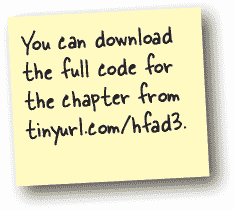

# 第十六章：Diffutil 和数据绑定：*快车道上的生活*


**您的应用程序需要尽可能平稳和高效地运行。**

但如果不小心，大型或复杂的数据集可能会导致回收视图出现故障。在本章中，我们将向您介绍***DiffUtil***：这是一个实用类，**为您的回收视图增加额外的智能**。您将了解如何使用它来**进行高效的更新**您的回收视图。您还将发现***ListAdapters*如何让使用*DiffUtil*变得轻而易举**。在此过程中，您将学习如何通过在您的回收视图代码中实现**数据绑定**，彻底摆脱**findViewById()**。

# 回收视图正确显示任务数据…

在前一章中，我们向任务应用程序添加了一个回收视图，以完全符合我们想要的方式显示其数据。每个任务显示在单独的卡片中，每个卡片显示任务名称及其是否已完成。然后将这些卡片按照两列的网格布局如下显示：


## …但在更新数据时，回收视图会跳动

每次添加新任务时，回收视图会重新绘制，以包括新记录并保持更新。然而，在这个过程中，回收视图会跳动，显示效果不太平滑。

每次需要更新回收视图时，*它的整个列表都会重新绘制*。没有流畅的过渡来显示发生了什么变化，如果列表非常长，用户可能会失去自己的位置。对于大型数据集，这也是低效的，并可能导致性能问题。

在解决这些问题之前，让我们快速回顾一下任务应用程序的结构。

# 重新审视的任务应用程序

正如您肯定记得的那样，任务应用程序允许用户输入任务记录，这些记录存储在 Room 数据库中。它包括一个回收视图，显示已输入的所有记录。

应用程序的主屏幕由名为`TasksFragment`的片段定义，该片段使用名为`TasksViewModel`的视图模型。其布局—*fragment_tasks.xml*—包括一个回收视图，显示任务的网格。回收视图使用名为`TaskItemAdapter`的适配器，其项目使用*task_item.xml*布局文件排列。

以下是应用程序的各个部分是如何配合的：


我们需要修复`TasksFragment`的回收视图，使其在添加新记录时不再跳动。为了做到这一点，让我们重新审视回收视图如何设置其数据。

# 回收视图如何获取其数据

每次需要更新回收视图的数据时，都会发生以下事情：

1.  **当数据库添加记录时，TasksFragment 会收到通知。**

    发生这种情况是因为它观察`TasksViewModel`的`tasks`属性：一个`LiveData<List<Task>>`，它从数据库获取其数据。

    

1.  **TasksFragment 设置 TaskItemAdapter 的 data 属性，该属性保存回收视图的数据。**

    它将其设置为从`tasks`属性获取的新`List<Task>`（包括最新的记录更改）。

    

1.  **TaskItemAdapter 告知回收视图数据已更改。**

    当回收视图响应时，它会重新绘制和重新绑定列表中的每个项目。

    

# `data`属性的 setter 调用了`notifyDataSetChanged()`

回收视图由于 setter 而重新绘制和重新绑定其整个列表，我们将其添加到了`TaskItemAdapter`的`data`属性中。以下是代码的提醒：


每次需要更新`data`属性时都会调用其 setter。如您所见，它将`data`属性设置为新值，然后调用`notifyDataSetChanged()`。此方法告知包括回收视图在内的任何观察者数据集已更改，因此回收视图会重新绘制以包括最新更改。

## `notifyDataSetChanged()`重新绘制整个列表

然而，使用`notifyDataSetChanged()`存在问题。每次调用它时，都会告诉回收视图`data`属性在某种方式上过时，*但未指明如何过时*。由于回收视图不知道发生了什么变化，它会响应性地**重新绑定和重新绘制列表中的每个项目**。

当回收视图以此方式重新绑定和重新绘制其项目时，会丢失用户在列表中的位置跟踪。如果列表包含超过几条记录，这可能导致列表跳动。

对于大数据集也不高效。如果回收视图包含许多项目，重新绑定和重新绘制每个项目都是大量不必要的工作，可能会导致性能问题。

> **每次调用 notifyDataSetChanged()时，回收视图都会重新绑定和重新绘制其整个列表。这对于大数据集尤其低效。**

# 告知回收视图需要做出的变更

调用`notifyDataSetChanged()`的更有效替代方法是告知回收视图列表中哪些项目已更改，以便仅更新这些项目。例如，如果向数据库添加了新任务记录，回收视图只需添加该项目，而不是重新绑定和重新绘制整个列表。

手动计算这些差异可能会很棘手且需要大量代码。不过好消息是，回收视图库包含一个名为`**DiffUtil**`的实用类，它会为您处理所有这些繁重的工作。

## DiffUtil 用于计算列表之间的差异

`DiffUtil`类专门用于查找两个列表之间的差异，从而避免手动处理这些差异。

每次适配器接收到列表的新版本时，其回收视图会使用`DiffUtil`将其与旧版本进行比较。它找出哪些项目已添加、删除或更新，然后以最有效的方式告诉回收视图需要进行哪些变更：

###### 注意

准确地说，它利用 Eugene W. Myers 的巧妙差异算法计算变更是什么。


由于回收视图不再需要重绘和重新绑定其整个列表，使用 DiffUtil 是更新回收视图数据的一种更高效的方式。这还意味着用户不会在列表中丢失她的位置，回收视图甚至可以提供平滑的过渡动画，以清楚地显示发生了哪些变化。


# 这是我们将要做的事情

在本章中，我们将改进 Tasks 应用程序的回收视图，使其使用 DiffUtil 并使用数据绑定填充其视图。这些更改将使回收视图更加高效，并且还将改善用户的使用体验。

这是我们将采取的步骤：

1.  **使回收视图使用 DiffUtil。**

    我们将创建一个名为`TaskDiffItemCallback`的新类，该类使用 DiffUtil 来比较列表中的项。然后，我们将更新`TaskItemAdapter`的代码，使其使用这个新类。这些更改将使回收视图更加高效，并为用户在使用时提供更流畅的体验。

    

1.  **在回收视图的布局中实现数据绑定。**

    在`TaskItemAdapter`代码中，我们将删除对`findViewById()`的调用，并使用数据绑定填充每个项的视图。

    

我们将首先使回收视图使用`DiffUtil`。


# 我们需要实现`DiffUtil.ItemCallback`。


为了在 Tasks 应用的回收视图中使用 DiffUtil，我们需要创建一个新类（我们将其命名为`TaskDiffItemCallback`），该类实现了`**DiffUtil.ItemCallback**`抽象类。该类用于计算列表中两个非空项之间的差异，将有助于提高回收视图的效率。

当你实现`DiffUtil.ItemCallback`时，首先需要指定它处理的对象类型。使用泛型来完成，如下所示：


您还需要重写两个方法：`areItemsTheSame()`和`areContentsTheSame()`。

`**areItemsTheSame()**`用于检查传递给它的两个对象是否指的是同一个*项目*。我们将使用以下方法实现它：


因此，如果两个对象都具有相同的`taskId`，那么它们指的是同一个项目，该方法返回*true*。

`**areContentsTheSame()**`用于检查两个对象是否具有相同的*内容*，仅在`areItemsTheSame()`为*true*时调用。由于`Task`是一个数据类，我们可以使用以下方法实现此方法：


## 创建 TaskDiffItemCallback.kt

要创建新类，请在*app/src/main/java*文件夹中突出显示*com.hfad.tasks*包，然后转到“文件”→“新建”→“Kotlin 类/文件”。将文件命名为“TaskDiffItemCallback”，选择“类”选项。

创建文件后，请更新其代码，使其看起来像这样：


# ListAdapter 接受 DiffUtil.ItemCallback 参数

现在我们已定义了`TaskDiffItemCallback`，我们需要在适配器代码中使用它。为此，我们将更新`TaskItemAdapter`，使其扩展**ListAdapter**类而不是`RecyclerView.Adapter`。

`ListAdapter`是一种设计用于处理列表的`RecyclerView.Adapter`类型。它提供自己的后备列表，因此您不必定义自己的列表，并且在其构造函数中接受`DiffUtil.ItemCallback`。

我们将指定`TaskItemAdapter`是`ListAdapter`的一种类型，它提供自己的`List<Task>`，并且我们将向其传递一个`TaskDiffItemCallback`的实例。以下是执行此操作的代码：

> **ListAdapter 是一种 RecyclerView.Adapter 的类型，它提供自己的后备列表。它与 DiffUtil 非常配合。**


## 我们可以简化 TaskItemAdapter 的其余代码

一旦`TaskItemAdapter`已更改为扩展`ListAdapter`，我们可以删除其`List<Task> data`属性以及其 setter。因为`ListAdapter`具有自己的后备列表，所以不再需要此属性。

我们还可以删除`TaskItemAdapter`的`getItemCount()`方法。当适配器扩展`RecyclerView.Adapter`时，这是必需的，但`ListAdapter`提供了自己的实现，因此不再需要。

最后，我们需要更新适配器的`onBindViewHolder()`方法，使其不再使用：

```
val item = data[position]
```

要获取`data`属性中特定位置的项目，它使用：

```
val item = getItem(position)
```

这获取适配器后备列表中指定位置的项目。

我们将在下一页上向您展示所有这些代码。

# 更新后的`TaskItemAdapter.kt`的代码

这是更新后的`TaskItemAdapter`代码；请更新*TaskItemAdapter.kt*中的代码，以包含此处显示的所有更改：


# 填充 ListAdapter 的列表…

我们最后需要做的是将一组`Task`记录传递给`TaskItemAdapter`的后备列表。

以前，我们通过使`TasksFragment`观察`TasksViewModel`的`tasks`属性来完成此操作。每次属性更改时，片段都会将`TaskItemAdapter`的`data`属性更新为`tasks`属性的新值。

这是我们用来做这件事的代码的提醒：


现在适配器使用后备列表而不是`data`属性，因此我们需要使用稍微不同的方法。


## …使用 submitList()

要将任务列表传递给`TaskItemAdapter`的后备列表，我们将使用一个名为`submitList()`的方法。此方法用于使用新的`List`对象更新`ListAdapter`的后备列表，因此非常适合这种情况。

这是我们需要添加到`TasksFragment`（粗体部分）的新代码，我们将在下一页上添加：


当适配器接收到新列表时，它使用`TaskDiffItemCallback`类将其与旧版本进行比较。 然后，它通过更新差异而不是替换整个列表来更新回收视图。 这种方法更有效率，可以带来更流畅的用户体验。

让我们看看更新后的`TasksFragment`代码是什么样子的。

# TasksFragment.kt 的更新代码

这是更新的`TasksFragment`代码；请在*TasksFragment.kt*中包括这里显示的所有更改（用粗体表示）：


让我们来看看应用程序运行时发生了什么。

# 代码运行时发生了什么

应用程序运行时发生以下事情：

1.  **应用程序启动时，MainActivity 显示 TasksFragment。**

    `TasksFragment`使用`TasksViewModel`作为其视图模型。

    

1.  **TasksFragment 创建一个 TaskItemAdapter 对象，并将其分配给回收视图作为其适配器。**

    

1.  **TasksFragment 观察 TasksViewModel 的 tasks 属性。**

    这个属性是一个`LiveData<List<Task>>`，包含来自数据库的最新记录列表。

    

1.  **每当 tasks 属性获得新值时，TasksFragment 将其 List<Task>提交给 TaskItemAdapter。**

    

1.  **TaskItemAdapter 使用 TaskDiffItemCallback 来比较其旧数据和新数据。**

    它使用`TaskDiffItemCallback`的`areItemsTheSame()`和`areContentsTheSame()`方法来找出发生了什么变化。

    

1.  **TaskItemAdapter 告诉回收视图发生了什么变化。**

    回收视图重新绑定并重绘必要的项目。

    

#  测试驾驶

当我们运行应用程序时，`TasksFragment`像以前一样在回收视图中显示卡片的网格。

当我们输入一个新任务名称并点击按钮时，新的任务卡片将添加到回收视图中，现有的卡片将移动以适应它。


回收视图之所以表现出这种方式，是因为我们使用`DiffUtil`来提交变更给它，而不是替换整个列表。

# 成为 ListAdapter


**回收视图的 ListAdapter 类具有 Drinks 的后备列表。 它使用右侧显示的 Drink 类。 你的任务是扮演像 ListAdapter 一样，并说如果给定一个新列表时，下面的 ItemCallback 类是否能正确地检测到任何变化。 为什么？ 为什么不？**


 **在“成为 ListAdapter 的解决方案”中的答案。**

# 回收视图可以使用数据绑定


我们改进 Tasks 应用程序的回收视图的另一种方式是使其使用数据绑定。

正如您可能记得的那样，`TaskItemAdapter` 的 `TaskItemViewHolder` 内部类使用 `findViewById()` 来获取 RecyclerView 中每个项的视图引用。然后，视图持有者的 `bind()` 方法使用这些引用向每个视图添加数据。

这是这段代码的一个提醒：


如果我们更改 RecyclerView 以使用数据绑定，我们可以移除对 `findViewById()` 的调用，并使每个视图获取自己的数据。

## 我们将如何实现数据绑定

我们将使 RecyclerView 类似于 Fragment 中实现数据绑定的方式来使用数据绑定。我们将按以下步骤进行：

1.  **向 task_item.xml 添加一个数据绑定变量。**

    我们将在布局的根部添加一个 `<layout>` 元素，并创建一个名为 `task` 的数据绑定变量，其类型为 `Task`。这将生成一个名为 `TaskItemBinding` 的绑定类。

1.  **在 TaskItemAdapter 中设置数据绑定变量。**

    我们将使用 `TaskItemBinding` 来膨胀每个项目的布局，并将其数据绑定变量设置为该项的 `Task` 对象。

1.  **使用数据绑定变量来设置视图数据。**

    最后，我们将更新 *task_item.xml*，使每个视图从布局的 `Task` 对象中获取其数据。


让我们开始定义数据绑定变量。

# 向 task_item.xml 添加一个数据绑定变量

我们将从在 *task_item.xml* 的根元素添加一个 `<layout>` 元素开始，并指定一个数据绑定变量。然而，我们不会将其用于将视图绑定到视图模型，而是会指定其类型为 `Task`。

这是实现此操作的代码：更新 *task_item.xml* 以包含这些更改（用粗体标记）：


将 *task_item.xml* 的根元素设为 `<layout>` 会告诉 Android 您希望使用数据绑定，因此它会生成一个名为 `TaskItemBinding` 的新绑定类。我们将使用这个类来膨胀上述布局，并将其 `task` 数据绑定变量设置为一个 `Task` 对象。

# 布局在适配器的视图持有者代码中膨胀

当我们首次创建 RecyclerView 时，我们在 `TaskItemAdapter` 的 `TaskItemViewHolder` 内部类中膨胀了布局文件 *task_item.xml*。现在我们需要修改此代码，以便与绑定类 `TaskItemBinding` 一起使用。在我们开始之前，这里是当前代码的一个提醒。


# 使用绑定类来膨胀布局

我们将要对 `TaskItemViewHolder` 进行的第一个更改是使用 `TaskItemBinding` 类来膨胀 *task_item.xml*。我们将在视图持有者的 `inflateFrom()` 方法中这样做：


请注意，现在我们将 `binding` 变量（`TaskItemBinding` 对象）传递给 `TaskItemViewHolder` 的构造函数。这意味着我们还需要更新 `TaskItemViewHolder` 的类定义，使其看起来像这样：


## 将布局的数据绑定变量设置为 Task

现在我们已经使用`TaskItemBinding`类来填充*task_item.xml*，我们可以使用它来设置`task`数据绑定变量。为此，我们将更改`TaskItemViewHolder`的`bind()`方法，使其将`task`设置为当前`Task`项目的 recycler view，如下所示：


我们已经删除了设置布局的`task_name`和`task_done`视图的行，因为使用数据绑定，这些不再需要。这意味着我们还可以从视图持有者中删除`taskName`和`taskDone`属性。


我们将在下一页上展示`TaskItemAdapter`的完整代码（包括其`TaskItemViewHolder`内部类）。

# TaskItemAdapter.kt 的完整代码

这是更新后的`TaskItemAdapter`代码；确保*TaskItemAdapter.kt*中的代码包含这里显示的所有更改（用**粗体**标出）：


## 使用数据绑定来设置布局的视图

现在我们已经将*task_item.xml*的`task`数据绑定变量设置为视图持有者的`Task`项目，我们可以使用数据绑定来填充布局的视图。


您已经熟悉执行此操作的代码。例如，要将`task_name`视图的文本设置为任务的名称，我们可以使用：


要设置`task_done`复选框，我们可以使用：


我们将在下一页上展示完整代码。

# task_item.xml 的完整代码

这是*task_item.xml*的更新代码；更新此文件的代码，以包含这里显示的所有更改（用**粗体**标出）：


让我们看看代码运行时会发生什么，并进行测试。

# 代码运行时会发生什么

当应用程序运行时，会发生以下事情：

1.  **task_item.xml 定义了一个名为 task 的 Task 数据绑定变量。**

    由于*task_item.xml*在其根部有一个`<layout>`元素，因此为此布局生成了一个名为`TaskItemBinding`的绑定类。

    

1.  **TasksFragment 创建了一个 TaskItemAdapter 对象，并将其分配给 recycler view 作为其适配器。**

    

1.  **TasksFragment 向 TaskItemAdapter 提交了一个 List<Task>。**

    `List<Task>`包含来自数据库的最新记录列表。

    

1.  **TaskItemAdapter 的 onCreateViewHolder()方法用于为 recycler view 中需要显示的每个项目调用。**

    `onCreateViewHolder()`调用`TaskItemViewHolder.inflateFrom()`，它创建一个`TaskItemBinding`对象。它填充对象的布局，并使用它来创建一个`TaskItemViewHolder`。

    

1.  **TaskItemAdapter 的 onBindViewHolder()方法用于为每个 TaskItemViewHolder 调用。**

    这调用了`TaskItemViewHolder`的`bind()`方法，该方法使用`TaskItemBinding`对象将布局的`task`变量设置为项目的`Task`。

    

1.  **task_item.xml 中的数据绑定代码使用 task 属性来设置每个项目的视图。**

    `task_name`视图的`text`属性设置为`task.taskName`，`task_done`视图的`checked`属性设置为`task.taskDone`。

    

#  测试驱动

当我们运行应用时，`TasksFragment`在回收视图中显示一个卡片网格。它的行为与以前相同，但这次我们使用数据绑定。


恭喜！你现在学会了如何在回收视图中实现数据绑定，以及如何利用`DiffUtil`。

在下一章中，我们将进一步利用这些知识使回收视图导航到单个记录。

# 适配器磁铁


Bits and Pizzas 应用程序包括一个使用名为*pizza_item.xml*的布局的回收视图用于其项目。布局定义了一个数据绑定变量（命名为`pizza`），如下所示：

```
<layout...>
    <data>
        <variable
            name="pizza"
            type="com.hfad.bitsandpizzas.Pizza" />
    </data>
    ...
</layout>
```

回收视图使用一个名为`PizzaAdapter`的适配器，如下所示。看看你能否完成这个适配器的代码，以便设置布局的`pizza`数据绑定变量。

```
package com.hfad.bitsandpizzas

import android.view.LayoutInflater
import android.view.ViewGroup
import androidx.recyclerview.widget.ListAdapter
import androidx.recyclerview.widget.RecyclerView

import com.hfad.bitsandpizzas.databinding. ...........................................

class PizzaAdapter
    : ListAdapter<Pizza, PizzaAdapter.PizzaViewHolder>(PizzaDiffItemCallback) {

    override fun onCreateViewHolder(parent: ViewGroup, viewType: Int)
                         : PizzaViewHolder = PizzaViewHolder.inflateFrom(parent)

    override fun onBindViewHolder(holder: PizzaViewHolder, position: Int) {
        val item = getItem(position)
        holder.bind(item)
    }
    class PizzaViewHolder(val binding:...............................)
                                         : RecyclerView.ViewHolder(binding.root) {

        companion object {
            fun inflateFrom(parent: ViewGroup): PizzaViewHolder {
                val layoutInflater = LayoutInflater.from(parent.context)

                val binding = ..................................

                              .inflate(.................................., parent, false)

                return PizzaViewHolder(binding)
            }
        }

        fun bind(item: Pizza) {

        ..................................= ..................................
        }
    }
}
```


# 适配器磁铁解决方案


Bits and Pizzas 应用程序包括一个使用名为*pizza_item.xml*的布局的回收视图用于其项目。布局定义了一个数据绑定变量（命名为`pizza`），如下所示：

```
<layout...>
    <data>
        <variable
            name="pizza"
            type="com.hfad.bitsandpizzas.Pizza" />
    </data>
    ...
</layout>
```

回收视图使用一个名为`PizzaAdapter`的适配器，如下所示。看看你能否完成这个适配器的代码，以便设置布局的`pizza`数据绑定变量。


# 成为 `ListAdapter` 解决方案


**回收视图的`ListAdapter`类有一个名为 Drinks 的后备列表。它使用右侧显示的 Drink 类。你的任务是像`ListAdapter`一样操作，并说出当给定一个新列表时，下面的 ItemCallback 类是否能正确检测到任何更改。为什么？为什么不？**


# 你的 Android 工具箱


**你已经掌握了第十六章，现在你已经将 DiffUtil 和回收视图数据绑定添加到了你的工具箱中。**


