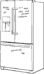
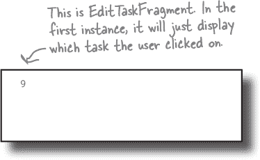
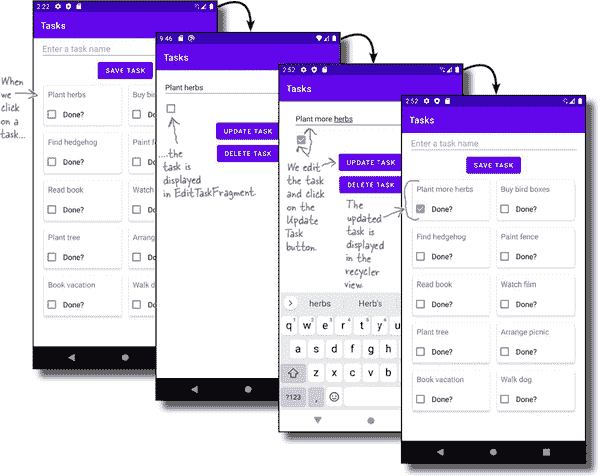

# 第十七章：回收视图导航：*挑选一张卡片*


**一些应用依赖于用户从列表中选择项目。**

并且在本章中，您将学习**如何使回收视图成为应用设计的核心部分**，通过**使它们的项目可点击**。您将了解如何通过使应用程序在每次用户点击记录时导航到新屏幕来**实现回收视图导航**。您将了解如何向用户显示关于其选择记录的额外信息，并在数据库中更新它。到本章结束时，您将拥有将您的出色想法转变为梦想应用程序所需的所有工具...

# 回收视图可用于导航

在前两章中，您学习了如何构建一个显示可滚动数据列表的回收视图，并使用`DiffUtil`使其更高效。但这并不是全部故事的结束。

回收视图是许多 Android 应用程序的重要组成部分，因为除了显示数据列表外，您还可以使用它们浏览应用程序。当用户在回收视图中点击项目时，您可以使应用程序导航到一个新的片段，显示该记录的更多详细信息。

看看这是如何工作的，我们将改变任务应用，这样当用户点击其回收视图中的一个任务时，它将导航到一个新的片段。这个片段将显示所选择的记录，并允许用户更新或删除它：


# 当前任务应用的结构

在看看我们需要如何改变任务应用之前，让我们回顾一下它当前的结构。

应用程序由一个活动（`MainActivity`）组成，显示一个名为`TasksFragment`的片段。这个片段是应用程序的主屏幕，其布局包括一个回收视图，显示任务的网格。回收视图使用一个名为`TaskItemAdapter`的适配器，其项目使用布局文件进行排列。

`TasksFragment`使用一个名为`TasksViewModel`的视图模型。视图模型负责片段的业务逻辑，并使用名为`TaskDao`的接口从 Room 数据库获取数据。

这些组件如何配合：


# 我们将使回收视图导航到一个新的片段

我们将更新任务应用程序，这样当用户点击回收视图中的任务时，它将显示一个名为`EditTaskFragment`的片段。下面是新片段的样子：


正如您所见，`EditTaskFragment`包括一个编辑文本和一个复选框，让用户编辑任务。编辑文本显示任务的名称，复选框显示任务是否已完成。

片段还包括一个更新任务按钮，点击后更新数据库中的记录，和一个删除任务按钮，点击后删除记录。当点击其中任何一个按钮时，应用程序导航回`TasksFragment`，在其可回收视图中显示更新后的任务列表：


# 我们打算做什么

我们将按以下三个阶段构建应用的新版本：

1.  **使可回收视图中的项目响应点击。**

    我们将更新应用程序，以便在点击可回收视图中的任务时，显示其 ID 的提示。

    

1.  **点击项目时导航到 EditTaskFragment。**

    我们将创建`EditTaskFragment`，并使用导航组件在用户点击任务记录时导航到它。我们将在新的片段中显示任务的 ID。

    

1.  **在 EditTaskFragment 中显示任务记录，并允许用户更新或删除记录。**

    我们将为`EditTaskFragment`创建一个视图模型，该视图模型将使用`TaskDao`接口与数据库交互。

    


我们将从使可回收视图响应点击开始。

# 使每个项目可点击


我们将首先对 Tasks 应用进行的更改是，在可回收视图中的项目被点击时显示一个提示。

我们可以通过为每个项目的根视图添加`OnClickListener`使每个项目响应点击。为此，我们将在每个项目的数据添加到其布局后立即调用每个项目的`setOnClickListener()`方法。

最佳位置以添加每个`OnClickListener`是在`TaskItemViewHolder`的`bind()`方法中，因为这是布局的数据绑定变量设置为`Task`项目的地方。您可能还记得，`bind()`方法由`TaskItemAdapter`的`onBindViewHolder()`方法调用，后者每次需要显示项目数据时都会触发。

以下是向每个项目布局的根视图添加`OnClickListener`的代码；我们将在稍后几页中的*TaskItemAdapter.kt*中添加这些代码：


现在您知道如何为每个项目添加`OnClickListener`后，让我们在点击项目时显示一个提示。

# 我们应该在哪里创建提示框？

每当点击项目时显示提示，我们**可以**简单地将以下代码（加粗）添加到视图持有者的`setOnClickListener()`方法中：


然而，这种方法意味着我们会将描述应用行为的代码放入视图持有者代码中。此代码负责将数据绑定到每个项目的布局，因此这不是我们放置这种代码的合适位置。

将提示代码添加到视图持有者将使视图持有者代码不太灵活。这意味着每次用户点击项目时，只能显示一个提示，并且不能在其他地方重复使用。

那么替代方案是什么？

## 我们将让 TasksFragment 通过 lambda 传递 toast 代码。

另一种方法是在 `TasksFragment` 中定义每个项需要执行的代码，并通过 lambda 将其传递给 `TaskItemViewHolder`—通过 `TaskItemAdapter`。这样做意味着*fragment*控制项被点击时发生的事情，而不是视图持有者。

在我们查看代码之前，让我们看一下它将如何工作。

# 代码如何运行

这是我们将要编写的代码将会做的事情：

1.  **TasksFragment 将会在 TaskItemAdapter 的构造函数中传递一个 lambda。**

    Lambda 包含显示 toast 的代码。

    

1.  **当调用 TaskItemAdapter 的 onBindViewHolder() 方法时，它调用 TaskItemViewHolder 的 bind() 方法，并将 lambda 传递给它。**

    

1.  **TaskItemViewHolder 将 lambda 添加到每个项的 OnClickListener 中。**

    当用户点击每个项（一个 `CardView`）时，它执行 lambda 并显示 toast。

    

这样代码就会运行。

要实现这一点，我们需要更新 `TasksFragment`、`TaskItemAdapter` 和 `TaskItemViewHolder` 的代码。我们将从更新 `TaskItemAdapter` 和 `TaskItemViewHolder` 的代码开始，以便适配器能够接受 lambda，并将其传递给视图持有者。

我们将在下一页展示这段代码。

# TaskItemAdapter.kt 的完整代码

这是 `TaskItemAdapter` 和 `TaskItemViewHolder` 的代码；请更新 *TaskItemAdapter.kt*，确保包含这里显示的所有更改（用粗体表示）：


# 我们将在 TaskItemAdapter 中传递一个 lambda

现在 `TaskItemAdapter` 在其构造函数中包含了一个 lambda 参数，我们需要在创建它的 `TasksFragment` 代码中传递一个 lambda。

正如您可能还记得的那样，`TasksFragment` 在其 `onCreateView()` 方法中创建了一个 `TaskItemAdapter` 对象，并将其分配给 RecyclerView，如下所示：


因为我们希望每次在 RecyclerView 中的项被点击时显示 toast，我们可以更新这段代码，以便将以下 lambda 传递给 `TaskItemAdapter` 的构造函数：


适配器将 lambda 传递给 `TaskItemViewHolder` 的 `bind()` 方法，后者在分配给每个项根视图的 `OnClickListener` 代码中使用 lambda。当用户点击 RecyclerView 中的项时，lambda 就会执行。

现在你已经学会了如何使 RecyclerView 中的项在被点击时显示 toast。让我们看看 `TasksFragment` 的完整代码是什么样的。


# TasksFragment.kt 的完整代码。


这是更新后的 `TasksFragment` 代码；确保 *TasksFragment.kt* 中的代码包括这里显示的所有更改（用粗体表示）：


让我们看看代码运行时会发生什么。

# 代码运行时会发生什么。

应用程序运行时发生以下事情：

1.  **`TasksFragment`创建一个`TaskItemAdapter`对象，并将其分配给 RecyclerView 作为其适配器。**

    片段将一个 lambda（名为`clickListener`）传递给适配器，告诉它在执行时显示一个提示。

    

1.  **`TasksFragment`向`TaskItemAdapter`提交一个`List<Task>`。**

    `List<Task>`包含来自数据库的最新记录列表。

    

1.  **对每个需要显示在 RecyclerView 中的项目，`TaskItemAdapter`的`onCreateViewHolder()`方法都会被调用。**

    这创建了一组`TaskItemViewHolder`。

    

1.  **对每个`TaskItemViewHolder`调用`TaskItemAdapter`的`onBindViewHolder()`方法。**

    这调用了`TaskItemViewHolder`的`bind()`方法，将被点击的项目和`clickListener` lambda 传递给它。

    

1.  **`TaskItemViewHolder`的`bind()`方法将一个 OnClickListener 添加到每个视图持有者布局的根视图上。**

    在这个示例中，根视图是一个`CardView`。

    

1.  **当用户点击 RecyclerView 中的项目时，OnClickListener 注册了点击事件。**

    执行`clickListener` lambda，显示一个提示。

    

让我们带着这个应用程序来试驾一下。

#  测试驾驶

当我们运行应用程序时，`TasksFragment`如前所述在 RecyclerView 中显示一组卡片。如果我们点击其中一个任务，应用程序会显示其 ID 的提示。


现在你已经学会了如何使 RecyclerView 的项目响应点击事件。我们将使用这些知识使应用程序在点击项目时导航到一个新的片段。

在我们这样做之前，试试以下练习。

# 适配器磁铁



Bits and Pizzas 应用程序包含一个使用名为*pizza_item.xml*的布局来显示`Pizza`对象的 RecyclerView。`Pizza`数据类如下所示：

```
package com.hfad.bitsandpizzas

data class Pizza(
    var pizzaId: Long = 0L,
    var pizzaName: String = "",
    var pizzaDescription: String = "",
    var pizzaImageId: Int = 0
)
```

RecyclerView 使用一个名为`PizzaAdapter`的适配器，如下所示。看看你能否完成这个适配器的代码，以便当其项目之一被点击时，执行一个传递给适配器构造函数的 lambda。

提示：lambda 应该接受一个`pizzaId`参数，并返回`Unit`。

```
package com.hfad.bitsandpizzas

import android.view.LayoutInflater
import android.view.ViewGroup
import androidx.recyclerview.widget.ListAdapter
import androidx.recyclerview.widget.RecyclerView
import com.hfad.bitsandpizzas.databinding.PizzaItemBinding

class PizzaAdapter(val clickListener:..................................................)

    : ListAdapter<Pizza, PizzaAdapter.PizzaViewHolder>(PizzaDiffItemCallback) {

    override fun onCreateViewHolder(parent: ViewGroup, viewType: Int)
                         : PizzaViewHolder = PizzaViewHolder.inflateFrom(parent)

    override fun onBindViewHolder(holder: PizzaViewHolder, position: Int) {
        val item = getItem(position)

        holder.bind(item,........................)
    }
    class PizzaViewHolder(val binding: PizzaItemBinding)
                                         : RecyclerView.ViewHolder(binding.root) {

        companion object {
            fun inflateFrom(parent: ViewGroup): PizzaViewHolder {
                val layoutInflater = LayoutInflater.from(parent.context)

                val binding = PizzaItemBinding.inflate(layoutInflater, parent, false)
                return PizzaViewHolder(binding)
            }
        }

        fun bind(item: Pizza,

                ................................................................) {

            binding.pizza = item

            binding.root..............................

              ........................................

            .......................
        }
    }
}
```


# 适配器磁铁解决方案


Bits and Pizzas 应用程序包含一个使用名为*pizza_item.xml*的布局来显示`Pizza`对象的 RecyclerView。`Pizza`数据类如下所示：

```
package com.hfad.bitsandpizzas

data class Pizza(
    var pizzaId: Long = 0L,
    var pizzaName: String = "",
    var pizzaDescription: String = "",
    var pizzaImageId: Int = 0
)
```

RecyclerView 使用一个名为`PizzaAdapter`的适配器，如下所示。看看你能否完成这个适配器的代码，以便当其项目之一被点击时，执行一个传递给适配器构造函数的 lambda。

提示：lambda 应该接受一个`pizzaId`参数，并返回`Unit`。


# 我们希望使用 RecyclerView 导航到一个新的片段


到目前为止，您已经学会了如何使 RecyclerView 中的项目响应点击事件。例如，当用户点击 Tasks 应用程序的 RecyclerView 中的任务时，它会显示一个 Toast。

接下来，我们将更改此行为，以便用户单击项目时，应用程序导航到一个新的片段（我们将创建），并显示任务的 ID。下面是应用程序的新版本的样子：


要使其工作，我们将使用导航组件导航到新的片段，并使用安全参数插件传递任务的 ID。这意味着我们需要更新项目和应用的*build.gradle*文件以包含这些组件。

# 更新项目的 build.gradle 文件……

我们将首先更新项目的*build.gradle*文件，以便指定我们要使用的导航组件版本，并为 Safe Args 插件添加一个类路径。

要做到这一点，打开文件*Tasks/build.gradle*，并在相关部分添加以下行（用**粗体**标出）：


## ……然后更新应用的 build.gradle 文件

我们还需要将 Safe Args 插件添加到应用的*build.gradle*文件中，并添加导航组件的依赖项。

打开文件*Tasks/app/build.gradle*，并在适当的部分添加以下行（用**粗体**标出）。


完成这些更改后，点击“立即同步”选项，将所做的更改与项目的其余部分同步。

现在我们已经启用了导航组件和 Safe Args 插件，让我们创建新的片段，使应用程序能够导航到该片段。

# 创建 EditTaskFragment……

我们将创建一个名为`EditTaskFragment`的新片段，当用户点击 RecyclerView 中的项目时，应用程序将导航到该片段。

要做到这一点，请在*app/src/main/java*文件夹中的*com.hfad.tasks*包中突出显示，然后选择文件→新建→Fragment→Fragment（空白）。将片段命名为“EditTaskFragment”，命名其布局为“fragment_edit_task”，并确保语言设置为 Kotlin。



我们将更新`EditTaskFragment`的代码及其布局，这在接下来的几页中。在此之前，让我们创建一个导航图，告诉应用程序如何在其片段之间导航。

## …并创建导航图

我们将在项目中添加一个导航图，就像我们为其他创建的应用程序一样。

在项目资源管理器中选择*Tasks/app/src/main/res*文件夹，然后选择文件→新建→Android 资源文件。当提示时，输入文件名“nav_graph”，选择资源类型“Navigation”，然后点击 OK 按钮。这将创建一个名为*nav_graph.xml*的导航图。


导航图需要描述用户如何在`TasksFragment`和`EditTaskFragment`之间导航。以下是导航需要工作的方式：

1.  **应用程序显示 TasksFragment。**

    这是用户需要看到的第一个片段，因此它需要成为导航图的起始目的地。

    

1.  **当用户在 TasksFragment 的回收视图中点击项目时，应用程序将导航到 EditTaskFragment。**

    `TasksFragment` 将向 `EditTaskFragment` 传递一个包含点击项目的任务 ID 的`Long`参数。

1.  **当用户在 EditTaskFragment 中点击按钮（稍后在本章中添加到该片段），应用程序将导航回 TasksFragment。**

    

我们将在下一页展示此操作的完整代码。

# 更新导航图

这里是导航图的完整代码；请更新*nav_graph.xml*，以包含这里显示的更改（用粗体标出）：


接下来，让我们将导航图链接到`MainActivity`，以便在导航到各个片段时显示它。

# 在 MainActivity 的布局中添加 NavHostFragment

要将我们刚刚创建的导航图链接到`MainActivity`，我们需要向其布局添加导航宿主，并告诉它使用*nav_graph.xml*作为其导航图。这将允许`MainActivity`在用户通过应用程序导航时显示正确的片段。


我们将以与前几章相同的方式向布局中添加导航宿主：通过将`NavHostFragment`添加到*activity_main.xml*的`FragmentContainerView`。更新*activity_main.xml*，使其包含下面的更改（用粗体标出）：


这就是我们需要更改`MainActivity`布局的所有代码。接下来，让我们在用户点击其回收视图中的项目时，使`TasksFragment`导航到`EditTaskFragment`。

# 使`TasksFragment`导航到`EditTaskFragment`

每次用户点击`TasksFragment`回收视图中的项目时，我们希望应用程序导航到`EditTaskFragment`，并向其传递被点击的`Task`的 ID。


一种做法是更新`TasksFragment`传递给其`TaskItemAdapter`的 lambda，使其包含所有必要的导航代码，如下所示：


如您所见，这里使用了`TasksFragmentDirections`类（由 Safe Args 插件生成），将项目的任务 ID 传递给`EditTaskFragment`，并导航到该片段。

然而，这种方法意味着我们正在向片段代码中添加业务逻辑——决定`TasksFragment`何时导航到`EditTaskFragment`，而不是将其添加到`TasksViewModel`中。正如您在第十三章中学到的，视图模型代码应该做出这种决定，而不是片段。

为了解决这个问题，我们将使用类似于 第十三章 中猜数字游戏应用的方法。我们将向 `TasksViewModel` 添加一个新的 LiveData 属性，用于存储用户点击任务时的任务 ID。当此属性的值发生变化时，`TasksFragment` 将响应并导航到 `EditTaskFragment`，并将任务 ID 传递给它。


# 为 `TasksViewModel` 添加一个新属性

我们将首先向 `TasksViewModel` 添加一个新的 LiveData 属性，指定 `TasksFragment` 需要传递给 `EditTaskFragment` 的任务 ID。我们将命名这个属性为 `navigateToTask`，并使用以下代码定义它（我们将在 *TasksViewModel.kt* 的下一页中添加这段代码）：


正如您所看到的，`navigateToTask` 属性使用一个标记为**私有**的可变后备属性，这意味着只有 `TasksViewModel` 可以设置它。这样可以防止其他类对属性进行不必要的更新。

## 添加方法来更新新属性

每当用户在 RecyclerView 中点击任务时，我们希望 `TasksFragment` 导航到 `EditTaskFragment`，并将任务的 ID 传递给它。

为了实现这一点，我们将在 `TasksViewModel` 中添加两个方法——`onTaskClicked()` 和 `onTaskNavigated()`——用于设置 `navigateToTask` 的后备属性的值。`onTaskClicked()` 将把属性设置为任务的 ID，而 `onTaskNavigated()` 将把它设置为 `null`。


这里是两个方法的代码：


这些是我们需要对 `TasksViewModel` 进行的所有更改。我们将在下一页上展示完整的代码。

# `TasksViewModel.kt` 的完整代码

这里是更新后的 `TasksViewModel` 代码；确保 *TasksViewModel.kt* 中的代码包含这里显示的所有更改（用**粗体**标记）：


现在我们已经更新了 `TasksViewModel`，让我们看看需要对 `TasksFragment` 代码进行哪些更改。

# 使 `TasksFragment` 导航到 `EditTaskFragment`

我们需要更新 `TasksFragment` 的代码，以便当用户点击任务时，它导航到 `EditTaskFragment`，并将任务的 ID 传递给它。

为了实现这一点，当用户点击任务时，我们将调用 `TasksViewModel` 的 `onTaskClicked()` 方法，并在其 `navigateToTask` 属性更新为新的任务 ID 时导航到 `EditTaskFragment`。

## 当用户点击任务时调用 `onTaskClicked()` 方法

要调用 `onTaskClicked()` 方法，我们将将下面的 lambda（用**粗体**标记）传递给 `TaskItemAdapter` 的构造函数：


每当用户点击任务时，lambda 将被执行：它将调用 `TasksViewModel` 的 `onTaskClicked()` 方法，将 `navigateToTask` 属性设置为任务的 ID。


## 当 `navigateToTask` 更新时导航到 `EditTaskFragment`

要使`TasksFragment`导航到`EditTaskFragment`，我们将使其观察`TaskViewModel`的`navigateToTask`属性。当该属性设置为`Long`类型的任务 ID 时，片段将导航到`EditTaskFragment`，并将 ID 传递给它。然后，我们通过调用视图模型的`onTaskNavigated()`方法将`navigateToTask`属性设置回 null。

这里是执行此操作的代码：


让我们更新`TasksFragment`的代码。

# `TasksFragment.kt`的完整代码如下


这里是更新后的`TasksFragment`代码；确保代码包含所有这里显示的更改（用粗体标出）：


我们现在已经更新了`TasksViewModel`和`TasksFragment`的代码，以便当用户在`recyclerView`中点击任务时，`TasksFragment`导航到`EditTaskFragment`并将任务的 ID 传递给它。

我们需要做的下一件事是在`EditTaskFragment`的布局中显示任务 ID。现在让我们来做这件事。

# 使`EditTaskFragment`显示任务 ID

我们将使`EditTaskFragment`通过更新片段的布局和 Kotlin 代码显示任务 ID。我们将在布局中添加一个文本视图，然后使用 Kotlin 代码检索任务的 ID 并将其添加到文本视图中。

我们将从在片段的布局中添加文本视图开始；更新*fragment_edit_task.xml*以使其与此处显示的代码匹配：


## 我们还需要更新`EditTaskFragment.kt`。

现在我们已经在`EditTaskFragment`的布局中添加了一个文本视图，我们需要设置其文本为任务 ID。为了做到这一点，我们将以下代码添加到片段的`onCreateView()`方法中：


正如你所看到的，这里使用了`EditTaskFragmentArgs`类（由 Safe Args 插件生成）来获取传递给`EditTaskFragment`的`taskId`参数的值。然后，它使用这个值来设置文本视图的文本。

让我们看看`EditTaskFragment`的完整代码是什么样子的。


# `EditTaskFragment.kt`的完整代码如下

这里是`EditTaskFragment`的完整代码；请将*EditTaskFragment.kt*中的代码替换为此处显示的代码：


让我们来看看代码运行时发生了什么。

# 代码运行时发生了什么

当应用程序运行时，会发生以下事情：

1.  **`TasksFragment`创建了一个`TaskItemAdapter`对象，并将其分配给了`recyclerView`作为其适配器。**

    片段将一个`clickListener` lambda 传递给适配器，在执行时告诉它调用`TasksViewModel`的`onTaskClicked()`方法。

    

1.  **`TasksFragment`向`TaskItemAdapter`提交了一个`List<Task>`。**

    `List<Task>`包含来自数据库的最新记录列表。

    

1.  **`TaskItemAdapter`创建了一组`TaskItemViewHolder`，并为每个视图持有者的根视图设置了一个`OnClickListener`。**

    在这个例子中，根视图是一个`CardView`。

    

1.  **当用户在 RecyclerView 中点击任务时，OnClickListener 注册点击事件，并执行 lambda 表达式。**

    它调用 `TasksViewModel` 的 `onTaskClicked()` 方法，该方法将其 `_navigateToTask` 属性设置为被点击任务的 ID。

    

1.  **TasksFragment 得知 TasksViewModel 的 `navigateToTask` 属性已更新，该属性使用 _navigateToTask 作为其后备属性。**

    导航到 `EditTaskFragment`，传递 `navigateToTask` 属性的值。

    

1.  **EditTaskFragment 获取传递给它的 taskId 的值，并在其布局中显示它。**

    

让我们来测试一下这个应用程序。

#  测试驾驶

当我们运行应用程序时，`TasksFragment` 如以前一样在 RecyclerView 中显示卡片网格。

当我们点击其中一个任务时，应用程序导航到 `EditTaskFragment`，该片段显示任务的 ID。


您现在学会了如何使用 RecyclerView 导航到新的片段，并告诉它点击了哪个项目。

接下来，我们将更新 Tasks 应用程序，以便当用户点击项目时，`EditTaskFragment` 显示任务的完整详情，并允许她在数据库中更新或删除记录。

# 我们希望使用 EditTaskFragment 更新任务记录


我们现在已经更新了 Tasks 应用程序，以便当用户在 RecyclerView 中点击任务时，它导航到 `EditTaskFragment`，该片段显示任务的 ID。

但我们*真正*想要的是，`EditTaskFragment` 显示完整的任务记录，并允许用户在数据库中更新或删除它。

为此，我们将更新 `EditTaskFragment`，使其如下所示：


片段的新版本将如下工作：

1.  **当用户在 RecyclerView 中点击任务时，EditTaskFragment 显示其详细信息。**

    它从数据库获取任务记录，并显示任务名称及其完成状态。

1.  **当用户更新任务的详细信息并点击“更新任务”按钮时，更改将被保存。**

    它会更新数据库中的记录，并导航回到 `TasksFragment`。

1.  **当用户点击“删除任务”按钮时，任务将被删除。**

    它从数据库中删除任务记录，并导航到 `TasksFragment`。

对于这些操作中的每一个，片段需要与应用程序的 Room 数据库进行交互，这意味着它需要使用我们在 第十四章 中定义的 `TaskDao` 接口。在我们更新应用程序之前，让我们快速回顾一下 `TaskDao` 的功能。

# 使用 TaskDao 与数据库记录交互

正如您在 第十四章 中学到的，可以使用 DAO 接口与 Room 数据库中的记录交互。例如，Tasks 应用程序包括一个名为 `TaskDao` 的 DAO，允许我们与任务记录进行交互。

这是`TaskDao`代码的提醒：


如您所见，接口包括从数据库获取一个或多个记录的方法，以及在后台线程中插入、更新和删除记录的可暂停协程。

## 我们将创建一个视图模型来访问`TaskDao`的方法

我们需要使用`TaskDao`的方法，让`EditTaskFragment`从数据库获取任务记录，更新其详细信息或删除它。我们不会把这些代码添加到`EditTaskFragment`中，而是会创建一个新的视图模型（命名为`EditTaskViewModel`），它将处理片段的业务逻辑和数据。`EditTaskViewModel`将访问`TaskDao`的方法，并将结果传递给`EditTaskFragment`。

让我们去创建`EditTaskViewModel`。


# 创建 EditTaskViewModel

要创建`EditTaskViewModel`，请在*app/src/main/java*文件夹中突出显示*com.hfad.tasks*包，然后转到 File→New→Kotlin Class/File。将文件命名为`EditTaskViewModel`，选择 Class 选项。

## 视图模型需要获取一个任务记录…

`EditTaskViewModel`首先需要做的是从应用程序的数据库获取一个任务记录，以便可以在`EditTaskFragment`的布局中显示它。为此，我们将在其构造函数中传递两件事给视图模型：一个任务 ID 来告诉它获取哪个任务，以及一个`TaskDao`对象，它将用于与数据库交互。


我们还将在视图模型中添加一个`LiveData<Task>`属性（命名为`task`），我们将使用`TaskDao`的`get()`方法设置它。这将把属性设置为用户想要查看的任务记录。

以下是完成此操作的代码；我们将在后面的几页上展示完整的`EditTaskViewModel`代码：


## …并包括更新和删除任务的方法

我们还将在`EditTaskViewModel`中添加`updateTask()`和`deleteTask()`方法，`EditTaskFragment`将使用它们来更新或删除任务记录。这些方法将像这样调用`TaskDao`的`update()`和`delete()`协程：


在我们将此代码添加到`EditTaskViewModel`之前，让我们看看视图模型代码还需要做什么。

# `EditTaskViewModel`会告诉`EditTaskFragment`何时导航

`EditTaskViewModel`最后需要做的一件事是告诉`EditTaskFragment`何时应该导航回到`TasksFragment`。为此，我们将在视图模型中添加一个新的`LiveData<Boolean>`属性（命名为`navigateToList`），以及一个名为`_navigateToList`的支持属性。`EditTaskFragment`将观察`navigateToList`，因此当其值变为*true*时，它将导航到`TasksFragment`。

我们将在视图模型的`updateTask()`和`deleteTask()`方法中将`_navigateToList`设置为*true*。这意味着一旦任务记录已更新或删除，应用程序将导航到`TasksFragment`。


这些方法的更新代码如下：


我们还将向 `EditTaskViewModel` 添加一个名为 `onNavigatedToList()` 的新方法，该方法将 `_navigateToList` 设置回 *false*。

这是此方法的代码：


我们将在下一页上展示 `EditTaskViewModel` 的完整代码。

# EditTaskViewModel.kt 的完整代码

这是完整的 `EditTaskViewModel` 代码；确保 *EditTaskViewModel.kt* 中的代码包含这里显示的所有更改（用粗体表示）：


这就是我们需要的整个 `EditTaskViewModel` 的代码。接下来是什么？

# EditTaskViewModel 需要一个视图模型工厂


接下来要做的是定义一个名为 `EditTaskViewModelFactory` 的视图模型工厂，`EditTaskFragment` 将使用它来创建 `EditTaskViewModel` 的实例。正如你在第十一章中学到的，对于所有像 `EditTaskViewModel` 这样没有无参数构造函数的视图模型，都需要一个视图模型工厂。


## 创建 EditTaskViewModelFactory

要创建工厂，请在 *app/src/main/java* 文件夹中的 *com.hfad.tasks* 包中突出显示，然后转到 文件→新建→Kotlin Class/File。将文件命名为“EditTaskViewModelFactory”，选择“类”选项。

创建完文件后，更新 *EditTaskViewModelFactory.kt* 中的代码，使其看起来像这样：


现在我们已经编写了 `EditTaskViewModel` 及其工厂的代码，让我们更新 `EditTaskFragment` 和其布局的代码。我们将从布局开始。

# fragment_edit_task.xml 需要显示任务

我们将更新 *fragment_edit_task.xml*，以包含编辑文本和复选框，这些将用于显示 `Task` 数据。我们将使用数据绑定将这些视图绑定到 `EditTaskViewModel` 的 `task` 中的 `taskName` 和 `taskDone` 属性。

我们还将向布局添加两个按钮，这些按钮将调用 `EditTaskViewModel` 的 `deleteTask()` 和 `updateTask()` 方法，并允许用户更新或删除任务记录。

这是布局的更新代码；更新 *fragment_edit_task.xml* 的代码，以包含这些更改（用粗体表示）：


## 我们也需要更新 EditTaskFragment.kt

我们需要对 Tasks 应用程序进行的最后更改是更新 `EditTaskFragment` 的 Kotlin 代码。代码需要执行三个操作：

1.  **设置布局的 viewModel 数据绑定变量。**

    我们将其设置为 `EditTaskViewModel` 的一个实例，该实例将由片段创建。

1.  **设置布局的生命周期所有者。**

    这样可以使布局能够与实时数据属性进行交互。

1.  **观察视图模型的 navigateToList 属性。**

    当这个条件变为 *true* 时，片段将导航到 `TasksFragment`，并调用 `EditTaskViewModel` 的 `onNavigatedToList()` 方法。

由于你已经熟悉如何完成所有这些代码，我们将在下一页上展示 `EditTaskFragment` 的更新代码。

# EditTaskFragment.kt 的完整代码

这是完整的`EditTaskFragment`代码：确保*EditTaskFragment.kt*文件中的代码包含此处显示的所有更改（加粗部分）。


这就是我们需要让`EditTaskFragment`在其布局中显示一个`Task`并允许用户更新或删除它的所有内容。让我们来看看代码在运行时做了什么。

# 代码运行时会发生什么

应用程序运行时会发生以下事情：

1.   **当用户点击任务时，TasksFragment 导航到 EditTaskFragment，并传递任务 ID。**

    

1.   **EditTaskFragment 获取其 EditTaskViewModel 对象的引用。**

    

1.   **EditTaskViewModel 调用 TaskDao 对象的 get()方法，传递任务 ID。**

    

1.   **TaskDao 的 get()方法返回一个 LiveData<Task>，赋给 EditTaskViewModel 的 task 属性。**

    

1.   **当用户点击更新任务按钮时，它调用 EditTaskViewModel 的 updateTask()方法。**

    此方法使用`TaskDao`的`update()`方法来更新数据库中的记录。

    

1.   **当用户点击删除任务按钮时，它调用 EditTaskViewModel 的 deleteTask()方法。**

    此方法使用`TaskDao`的`delete()`方法来删除记录。

    

1.   **应用程序导航到 TasksFragment。**

    对任务记录进行的任何更改都会在循环视图中反映出来。

    

让我们来测试一下这个应用程序。

#  测试驾驶

当我们运行应用程序时，`TasksFragment`像以前一样在循环视图中显示一组卡片。

当我们点击其中一个任务时，应用程序导航到`EditTaskFragment`，显示任务的记录。

当我们对任务进行更改并点击更新任务按钮时，更改将保存到数据库，并在`TasksFragment`的循环视图中显示。



当我们尝试更新任务时会发生什么？删除任务时呢？

当我们点击一个任务时，应用程序导航到`EditTaskFragment`，并像以前一样显示任务记录。

当我们点击删除任务按钮时，记录会从数据库中删除。当应用程序导航到`TasksFragment`时，该记录将不再出现在循环视图中。


恭喜！现在你已经学会了如何构建一个应用程序，使用循环视图导航到记录，然后可以更新或删除它们。这种技术为你在应用程序中组织数据提供了一种强大而灵活的方式。

# 你的安卓工具箱


**你已经掌握了第十七章，现在你已经将循环视图导航添加到你的工具箱中。**


