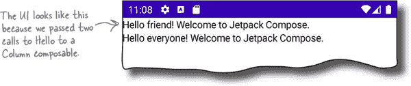
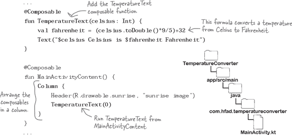
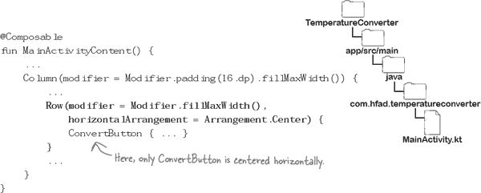
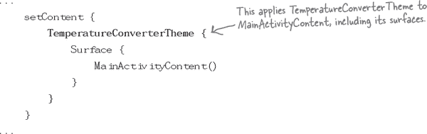

# 第十八章：Jetpack Compose: *自我组合*


**到目前为止，你构建的所有 UI 都使用了视图和布局文件。**

但是，使用**Jetpack Compose**，**这并不是唯一的选择**。在本章中，我们将前往**Composeville**，了解如何使用 Compose 组件（称为**composables**）构建 UI。你将学习如何使用内置的 composables，如**Text**、**Image**、**TextField**和**Button**。你将探索如何将它们排列在**Rows**和**Columns**中，并使用**主题**进行样式化。你将编写并预览自己的**composable 函数**。甚至，你将了解如何使用***MutableState***对象来管理 composable 的状态。翻页，让我们开始 Compose 吧…

# UI 组件不必是 Views

到目前为止，在这本书中，你已经学会了如何使用布局文件和视图来构建时髦且交互式的 UI。但是尽管我们专注于这种方法，这并不是你唯一的选择。

另一个选择是使用**Jetpack Compose**构建你的 UI。Compose 是 Android Jetpack 的一部分；它是一个完整的工具包，包含了库、工具和 API，旨在帮助你使用纯 Kotlin 代码构建原生 UI。

令人兴奋的消息是，使用**Jetpack Compose**可以在现有的 Android 知识基础上构建应用。例如，你可以在 Compose 中使用视图模型和 LiveData，甚至将 Compose 组件添加到现有的 UI 中。

###### 注意

在下一章中，你将进一步了解这一点。

## 我们将构建一个 Compose 应用

在本章中，我们将通过构建一个新的温度转换器应用来向你介绍 Compose，该应用可以将摄氏度转换为华氏度。这是应用程序的预览：


正如你所见，这个应用使用了几个看起来很熟悉的组件。主要区别在于它是使用 Compose 编写的。

在我们开始构建应用之前，试试看能否通过尝试以下练习来理解 Compose 代码的作用。

# 这是我们将要做的事情

现在你已经初步了解了一些 Compose 代码并了解了它的作用，让我们看看本章中我们将要做什么。

1.  **创建一个在列中显示两个文本项的应用。**

    你将创建一个新项目，使用 Compose 显示一些硬编码文本。然后将代码转换为 composable 函数，并学习如何预览它。

    

1.  **使应用程序能够将摄氏度转换为华氏度。**

    在此步骤中，你将构建一个 UI，允许你输入摄氏度温度。当你点击按钮时，它会将温度转换为华氏度。

    

1.  **修改应用的外观。**

    最后，你将学习如何居中组件，使用填充并应用主题。

    

让我们开始创建这个应用的新项目。

# 创建一个新的 Compose 项目


我们将创建一个新的 Android Studio 项目，该项目将使用 Compose 进行 UI 设计。现在通过选择**空 Compose 活动**选项创建此项目：


选择此选项会向您的项目添加一堆 Compose 库和代码。如果您想要使用 Compose UI 从头开始构建 Android 应用程序，这是最好的项目类型。

一旦选择了“空 Compose 活动”选项，请点击“下一步”按钮配置项目。

# 配置项目

下一个屏幕应该对您来说很熟悉，因为它包含您在本书中用来配置项目的相同选项。

输入名称为“温度转换器”，包名称为“com.hfad.temperatureconverter”，并接受默认保存位置。

注意，语言设置为 Kotlin，不能更改。Compose 应用*只能*使用 Kotlin 创建，因此无法选择其他语言。

选择 API 21 作为最低 SDK，以便应用程序在大多数 Android 设备上运行。这是这种类型项目可用的最旧 SDK，因为 Compose 仅与 API 21 及以上版本兼容。

一旦选择了这些选项，点击“完成”按钮。

> **Compose UI 只能使用 Kotlin 创建。**


# Compose 项目没有布局文件

当您使用“空 Compose 活动”选项创建项目时，Android Studio 会为您创建文件夹结构，并填充新项目所需的所有文件。文件夹结构如下所示：


许多文件和文件夹应该对您来说很熟悉，因为它们与不使用 Compose 的项目生成的相同。例如，它包括一个名为*MainActivity.kt*的活动文件，以及一个名为*strings.xml*的`String`资源文件。

最大的区别在于**Android Studio 不会为您生成任何布局文件**。这是因为 Compose 项目使用活动代码来定义屏幕的外观，而不是布局。

# Compose 活动代码的外观

当您使用 Compose 时，活动代码负责应用程序的行为*和*外观。因此，它看起来与您习惯的活动代码略有不同。

让我们看看基本的 Compose 活动代码是什么样的。在*app/src/main/java*文件夹中打开包*com.hfad.temperatureconverter*，并打开文件*MainActivity.kt*（如果尚未打开）。然后**用这里显示的代码替换**Android Studio 生成的代码：


## Compose 活动扩展 ComponentActivity

正如你所见，上述活动不是扩展`AppCompatActivity`，而是使用`**ComponentActivity**`。 `androidx.activity.ComponentActivity`是`Activity`的子类，用于定义一个基本活动，该活动使用 Compose 来进行 UI 设计，而不是使用布局文件。

就像您看到的所有其他活动一样，该活动重写了 `onCreate()` 方法。但是，与调用 `setContentView()` 来填充活动的布局不同，它使用了 `**setContent()**`。这是一个扩展函数，用于向活动的 UI 添加 Compose 组件—称为**可组合**—以便它们在活动创建时运行。

让我们看看通过使用 Compose 向活动的 UI 添加一些文本是如何工作的。

# 使用 Text 可组合显示文本

我们将通过向 `setContent()` 调用添加一个 `**Text**` 可组合来使 `MainActivity` 显示一些文本。您可以将 `Text` 视为文本视图的 Compose 等效项。只需指定要显示的文本，活动就会显示它。

下面是向 `MainActivity` 添加一些文本的代码；更新 *MainActivity.kt* 中的代码以包含以下更改（用粗体标出）：


当此代码运行时，会在屏幕顶部显示文本，如下所示：


现在您已经学会了如何使用 Compose 显示一些硬编码文本，让我们通过将 `Text` 添加到**可组合函数**中使其更加灵活。

# 在可组合函数中使用可组合

可组合函数是使用一个或多个可组合函数来定义 UI 的函数。

为了看到这是如何工作的，我们将定义一个名为 `Hello` 的可组合函数，它接受一个 `String` 参数作为用户的姓名。当函数运行—或被**组合**—时，它将将 `String` 添加到一个 `Text` 可组合中，该可组合在 UI 中显示文本。

新的 `Hello` 函数的代码如下：


如您所见，该函数带有 `**@Composable**` 注释。此注释对于*所有*可组合函数都是必需的。如果省略注释，代码将无法编译。

## 从 setContent() 调用 Hello 可组合

使用 `@Composable` 标记函数不仅指定它使用可组合；**它使函数本身成为一个可组合**，您可以像任何其他类型的可组合一样在代码中使用它。

在我们正在构建的应用程序中，我们希望在 `MainActivity` 的 UI 中显示 `Hello` 文本。我们可以通过像这样从 `setContent()` 调用 `Hello` 来实现：


当此代码运行时，会显示如下文本：


# 大多数 UI 都有多个可组合

到目前为止，您已经看到如何运行单个可组合，但大多数情况下，您将希望在 UI 中使用多个可组合，或多次调用相同的可组合。例如，如果您希望应用程序说两次 hello，您可以像这样两次运行 `Hello` 可组合函数，使用不同的参数：

```
Hello("friend")
Hello("everyone")
```

当您的 UI 包含多个可组合时，您需要指定它们应该如何排列。如果不这样做，Compose 将像这样将可组合堆叠在一起：


那么如何排列可组合？

## 您可以使用 Row 或 Column 排列可组合。

大多数情况下，您可能希望将可组合项排列为行或列，Compose 包括`**Row**`和`**Column**`可组合项，让您可以这样做。例如，要将两个`Hello`可组合项排列在列中，您只需将它们添加到`Column`可组合项中，如下所示：

```
Column {
    Hello("friend")
    Hello("everyone")
}
```

当代码运行时，可组合项按以下方式排列在列中：



让我们更新`MainActivity`，以便它生成这个用户界面。

# *MainActivity.kt*的完整代码

我们将向*MainActivity.kt*添加`Hello`可组合函数，运行它两次，并将结果排列在列中。

这是文件的完整代码；更新*MainActivity.kt*以包含以下更改（加粗部分）：


让我们试驾这个应用程序，看看它的外观。

#  测试驾驶

当我们运行应用程序时，将显示`MainActivity`。它包括排列在单列中的两个`Hello`可组合项。


恭喜！您现在已经学会了使用 Compose 创建`MainActivity`的用户界面，而不是将视图添加到布局文件中。

# 您可以预览可组合函数

使用可组合函数的另一个功能是，您可以在 Android Studio 中预览它们，而无需将应用加载到设备上。只要可组合函数没有任何参数，您就可以预览任何可组合函数，并且甚至可以使用此技术来预览整个**组合**—由可组合项构成的用户界面。

> **组合是由可组合项构成的用户界面。**

通过使用`**@Preview**`对其进行注释，您可以预览可组合函数。例如，以下代码指定了一个名为`PreviewMainActivity`的可组合函数，允许您预览排列在列中的两个`Hello`可组合项：


## 在*MainActivity.kt*中添加 MainActivityPreview

要了解预览的工作原理，请将`MainActivityPreview`可组合函数添加到*MainActivity.kt*中。更新文件，使其包含此处显示的更改：


我们将向您展示如何在下一页上查看预览。

# 使用设计或拆分选项预览可组合项

通过选择活动文件的拆分或设计视图，您可以预览标有`@Preview`的任何可组合函数。选择拆分选项让您同时看到代码和预览，选择设计选项则仅显示预览。

当我们选择拆分选项时，`MainActivityPreview`的外观如下所示：


如果您更改正在预览的可组合函数，需要刷新预览才能看到其效果。只需单击预览顶部菜单中的“构建刷新”按钮，即可看到更改的效果。

现在您已经学会了如何预览可组合函数，请尝试以下练习。

> **您可以预览任何没有参数的可组合函数。**

# 池子难题


您的**任务**是从池中提取代码片段，并将其放入下面代码中的空白行中。您不能多次使用同一个片段，也不需要使用所有片段。您的**目标**是创建两个可组合函数：一个名为 `TeamHello`，接受一个姓名列表并向每个人打招呼；另一个名为 `HelloPreview`，预览 `TeamHello` 并将其文本排列在一列中。


```
..............
fun TeamHello(names: List<String>) {
    for (name in names) {
        ..............("Hello $name!")
    }
}

..............(showBackground = true)
..............
fun HelloPreview() {
    ..............{
        TeamHello(listOf("Virginia", "Zan", "Katie"))
    }
}
```


###### 注意

**注意：每个池子中的东西只能使用一次！**

# 池子谜题解决方案


您的**任务**是从池中提取代码片段，并将其放入下面代码中的空白行中。您不能多次使用同一个片段，也不需要使用所有片段。您的**目标**是创建两个可组合函数：一个名为 `TeamHello`，接受一个姓名列表并向每个人打招呼；另一个名为 `HelloPreview`，预览 `TeamHello` 并将其文本排列在一列中。


# 让我们开始让应用程序转换温度


到目前为止，您已经使用 Compose 显示文本，编写了一些可组合函数，并学习了如何预览它们。但这还不是全部。

在本章的其余部分中，我们将通过将刚刚构建的应用程序改为一个将温度从摄氏度转换为华氏度的应用程序，来深入了解 Compose。它不再只是打招呼，而是在用户在按钮上点击时，询问用户摄氏度温度并进行转换。

这是应用程序的外观；如您所见，它包括一个图像、一个允许您输入数据的文本字段、一个按钮和一些文本：


您还在等什么？让我们开始组合吧。

# 添加一个 MainActivityContent 可组合函数

我们将首先向 *MainActivity.kt* 添加一个名为 `MainActivityContent` 的新可组合函数，该函数将用作活动的主要内容。我们将添加所有 `MainActivity` UI 所需的可组合函数到这个函数中，并从 `setContent()` 和 `PreviewMainActivity` 中调用它。这种方法意味着当我们运行应用程序时，将显示活动的组合，同时也会在预览中显示。

我们还将从代码中删除 `Hello` 可组合函数，因为这不再需要。

这是更新后的 *MainActivity.kt* 代码；请更新文件以包含这些更改（用**粗体**标出）：


# 显示标题图像…

我们将首先向 `MainActivityContent` 添加的组件是出现在屏幕顶部的图像。

首先确保您的项目包含文件夹 *app/src/main/res/drawable*（如果不存在，您需要创建它）。然后从 *tinyurl.com/hfad3* 下载 *sunrise.webp* 文件，并将其添加到 *drawable* 文件夹中。


## …与一个 Image 可组合

使用`**Image**`组合在 Compose 中显示图像。基本代码如下：


`Image`组合需要两个参数：`painter`和`contentDescription`。

`painter`参数指定应该显示的图像。这里，它使用`painterResource(R.drawable.sunrise)`来显示*sunrise.webp*可绘制资源。

`contentDescription`参数是用于辅助功能的图像描述。

你可以使用许多其他可选参数来控制图像的外观和显示方式。例如，以下代码将图像高度设置为 180dp，使其填充可用宽度，并缩放图像：


现在你已经看到如何使用 Compose 添加图像，让我们在`MainActivity`中添加一个。

# 在 MainActivity.kt 中添加一个图像


我们将通过在*MainActivity.kt*中定义一个新的组合函数（名为`Header`）来向`MainActivity`添加一个图像。我们将从`MainActivityContent`组合函数中运行这个函数，以便将图像添加到 UI 和预览中。

这是*MainActivity.kt*的更新代码；更新这个文件以包含下面的更改（用粗体标出）：


这就是我们需要在组合中显示图像的所有内容，让我们继续下一个组件。

# 让我们显示温度文本


接下来我们将包括一个组合函数（名为`TemperatureText`），它将摄氏温度转换为华氏温度，并显示结果。我们将从`MainActivityContent`中调用这个函数，以便它包含在 UI 和预览中。

你已经熟悉如何做到这一点了，所以更新*MainActivity.kt*以包含下面的更改（用粗体标出）：



让我们来测试一下这个应用程序。

#  测试驾驶

当我们运行（或预览）应用程序时，它会在列中显示一个`Image`和`Text`。`Text`正确显示了 0°摄氏度对应的华氏度值。

现在我们已经确保`TemperatureText`函数可以使用一个硬编码的温度，让我们在用户点击按钮时将其更新为一个新的温度。


# 使用 Button 组合添加一个按钮

使用`**Button**`组合添加一个按钮到 Compose。`Button`的代码如下：


当使用`Button`组合时，需要指定两件事：其点击行为和按钮上应该显示什么。

使用`Button`的`onClick`参数来指定其点击行为。这个参数接受一个 lambda，每次用户点击按钮时都会运行。

通过一个单独的 lambda 来指定`Button`上应该显示什么。当代码运行时，它会将组合添加到`Button`中。例如，上面的代码将一个`Text`组合传递给`Button`，因此它创建了一个带有文本的按钮。

## 让我们编写一个 ConvertButton 组合函数

我们将在温度转换应用程序中添加一个`Button`组合，当点击时，将更改`TemperatureText`转换为华氏度的温度。为此，我们将编写一个新的组合函数（名为`ConvertButton`），用于显示一个`Button`。我们还会指定它接受一个 lambda 参数，该函数将用于`Button`的点击行为。

这是`ConvertButton`组合函数的代码，我们将在稍后的几页中将其添加到*M*ainActivity.kt*：


现在我们已经编写了`ConvertButton`函数，让我们将其添加到`MainActivityContent`中，以便将`Button`组合添加到 UI 中。

# 我们需要传递一个 lambda 给 ConvertButton


要从`MainActivityContent`中运行`ConvertButton`，我们需要传递一个 lambda，指定点击时应该发生什么。代码应该如下所示：

```
@Composable
fun MainActivityContent() {
   ...
    ConvertButton {
        //Code that runs when the button is clicked
    }
    ...
}
```

当点击`ConvertButton`时，我们希望它更新`TemperatureText`显示的文本。如果`TemperatureText`是*视图*，我们可以使用如下代码更新其文本：

```
binding.textView.text = "This is the new text"
```

尽管此方法适用于视图，但对于*组合*则不适用。对于组合，您需要采用不同的方法。


**组合和视图的工作方式不同。**

虽然视图和组合允许您显示类似的组件（例如文本和按钮），但它们的实现方式不同。组合不是`View`的一种类型，而`View`也不是组合的一种类型，因此要与组合交互，您需要以稍有不同的方式进行操作。

要了解这是如何工作的，请让我们在合成期间逐步了解 UI 的组成过程。

# 我们需要更改`TemperatureText`参数的值

正如您刚刚看到的那样，当它们依赖的值更新时，组合会重新组合。这意味着，如果我们希望`TemperatureText`在用户点击`ConvertButton`按钮时显示不同的文本，我们传递给`ConvertButton`的 lambda 需要更新`TemperatureText`参数的值。

为此，我们将在`MainActivityContent`中添加一个新的`celsius`变量，并将其值传递给`TemperatureText`。当用户点击`ConvertButton`组合时，我们将其更新为`celsius`的值，以便重新组合`TemperatureText`。

> **当其任何输入值发生更改时，组合将重新组合。**

## 使用`remember`将`celsius`存储在内存中

我们将通过将以下代码添加到`MainActivityContent`来定义`celsius`变量：


这将创建一个类型为`**MutableState**`的对象，将其值设置为`0`，并将其存储在内存中。您可以将`celsius`看作是类似实时数据对象的工作方式。每次设置为新值时，使用它的任何组合都会收到通知并重新组合。

使用`**remember**`将对象存储在内存中。`remember`在首次组合调用它的组合内容（在本例中为`MainActivityContent`）时存储对象，并在从 UI 中移除组合内容时将其删除。这可能发生在用户旋转设备时，活动（包括其 UI）被销毁和重新创建。

就像`MutableLiveData`对象一样，您通过更新其`**value**`属性来设置`MutableState`对象的值。例如，要在用户点击`ConvertButton`组合时将`celsius`的值设置为 20，您可以使用以下代码：


```
ConvertButton { celsius.value = 20 }
```

为了使`TemperatureText`响应此值的更改，其参数需要设置为`celsius.value`，如下所示：

```
TemperatureText(celsius.value)
```

每次更新`celsius.value`时，`TemperatureText`都会重新组合以新值，这会改变显示的文本。

我们将在接下来的几页中展示完整的代码。

# MainActivity.kt 的完整代码

到目前为止，*MainActivity.kt* 的完整代码如下；请更新文件以包含以下更改（用粗体标记）：


让我们来看看代码运行时会发生什么，并且让应用程序试运行一下。

# 应用程序运行时会发生什么

当应用程序运行时会发生以下事情：

1.  **MainActivity 启动，并运行其 onCreate()方法。**

    它调用`setContent()`，运行`MainActivityContent`组合函数。

    

1.  **MainActivityContent 创建一个名为 celsius 的 MutableState<Int>变量，将其值设为 0，并将其存储在内存中。**

    

1.  **MainActivityContent 运行 Header、ConvertButton 和 TemperatureText 组合函数。**

    它将`celsius`的值传递给`TemperatureText`组合函数，该函数将其转换为华氏度。

    

1.  **Header、ConvertButton 和 TemperatureText 组合函数向 UI 添加了一个图像、一个按钮和一些文本。**

    

1.  **用户在 UI 中点击 ConvertButton 组合。**

    这将`celsius`的值设置为 20。

    

1.  **TemperatureText 重新组合。**

    它将`celsius`的新值转换为华氏度，并显示结果。

    

让我们来试运行应用程序。

#  试驾

运行应用程序时，会显示`MainActivity`。它包括一个图像、一个按钮和一些文本，显示了 0°摄氏度对应的华氏度值。

当我们点击 Convert 按钮时，文本会更新，显示 20°摄氏度对应的华氏度值。


我们需要做的下一件事是让用户输入自己的温度。我们将在下一页的练习后进行此操作。

# 组合磁铁


有人使用冰箱磁铁创建了一个名为`ChangeHello`的新组合函数。该函数显示一些文本，上面写着“Hello friend”，还有一个按钮，当点击时，将文本更改为“Hello everyone”。

不幸的是，一只流浪猫跑进了厨房，弄掉了一些磁铁。你能把它们重新组合起来吗？


# 组合磁铁解决方案


有人使用冰箱磁铁创建了一个名为`ChangeHello`的新组合函数。该函数显示一些文本，上面写着“Hello friend”，还有一个按钮，当点击时，将文本更改为“Hello everyone”。

不幸的是，一只流浪猫跑进了厨房，弄掉了一些磁铁。你能把它们重新组合起来吗？


# 让用户输入温度


到目前为止，您已经构建了一个将硬编码的摄氏温度转换为华氏温度的版本的温度转换器应用程序。当用户点击按钮时，它会更改正在转换的温度为另一个值。

我们*真正*想做的是让用户转换自己的温度，所以下一步是向 UI 添加一个文本字段。用户将把摄氏温度输入到文本字段中，当她点击按钮时，应用程序将其转换为华氏度并显示结果：

## 我们将使用一个`TextField`组合。

我们将使用`TextField`组合将文本字段添加到 UI 中。您可以将这种组合类型视为`EditText`的 Compose 等效物。

您可以使用以下代码添加一个`TextField`：


`value`属性用于`TextField`的值，在本例中，它使用一个名为`text`的`MutableState`变量将此值存储在内存中。

`onValueChange`属性使用一个 lambda 表达式来在用户输入文本时更新`text`变量的值。

`label`属性提供了`TextField`的标签。当`TextField`为空时，它显示在文本区域中，并在用户输入文本时移开。

现在您已经看到文本字段代码的样子了，让我们将其添加到应用程序中。


# 向组合函数添加一个 TextField

我们将通过创建一个名为`EnterTemperature`的新组合函数将`TextField`添加到 UI 中，并从`MainActivityContent`中调用它。

这是`EnterTemperature`函数的代码：


如您所见，该函数接受两个参数：用于`TextField`值的`String`和指定用户输入新值时应发生的操作的 lambda 表达式。

## 在 MainActivityContent 中调用函数

`MainActivityContent`在运行函数时需要向`EnterTemperature`传递这两个参数，因此我们将使用一个名为`newCelsius`的新`MutableState`对象来存储其值，并在用户输入文本时更新它。

我们还将更改传递给`ConvertButton`的 lambda，以便在用户输入有效的`Int`时更新`celsius`的值；这将在用户输入新温度时重新组合`TemperatureText`。

这是代码的样子；我们将在下一页更新*MainActivity.kt*：


# MainActivity.kt 的完整代码

这是*MainActivity.kt*的代码；更新文件以包含以下更改（用粗体标记）：


让我们看看代码运行时会发生什么。

# 应用程序运行时会发生什么

当应用程序运行时，发生了以下几件事情：

1.  **当 MainActivityContent 运行时，它创建了一个名为 celsius 的 MutableState<Int> 变量和一个名为 newCelsius 的 MutableState<String> 变量。**

    它将`celsius`设为`0`，将`newCelsius`设为`""`，并将两者存储在内存中。

    

1.  **MainActivityContent 运行 EnterTemperature、Header、ConvertButton 和 TemperatureText 可组合函数。**

    它将`celsius`的值传递给`TemperatureText`可组合函数，后者将其转换为华氏度。

    

1.  **Header、EnterTemperature、ConvertButton 和 TemperatureText 可组合函数向 UI 添加了图像、文本字段、按钮和一些文本。**

    

1.  **用户在 EnterTemperature 中输入一个新值（在此示例中为“25”）。**

    `EnterTemperature` 将 `newCelsius` 设置为此值。

    

1.  **用户点击 ConvertButton 可组合函数。**

    它将 `newCelsius` 的值转换为 `Int`，并将其赋给 `celsius.value`。

    

1.  **TemperatureText 被重新组合。**

    它将 `celsius` 的新值转换为华氏度，并显示结果。

    

让我们来测试一下这个应用程序。

#  Test Drive

当我们运行应用程序时，`MainActivity`包括一个文本字段。

当我们输入温度并点击转换按钮时，应用程序会将温度转换为华氏度并更新温度文本。


现在应用程序的功能完全符合我们的预期。现在我们只需要对其外观进行一些额外的调整。

# 我们将调整应用程序的外观


我们将更改应用程序，以便在屏幕边缘和 UI 组件之间增加间隔，并使按钮水平居中。我们还将样式化可组合函数，以使用默认的 Material 主题。

这是应用程序新版本的外观：


我们将在接下来的几页中进行这些调整。首先我们将在 UI 的边缘添加一些空间。

# 为 Column 可组合函数添加填充

我们希望在屏幕边缘和应用程序组件之间添加一些间隔，使其看起来像这样：


我们将通过向`Column`组合件添加一些**padding**来实现这一点。向组合件应用填充效果类似于向视图应用填充效果；它会在组件的边缘周围添加额外的空间。

您可以使用`**Modifier**`向组合件添加填充。`Modifier`允许您装饰或为组合件添加额外行为。例如，要向`Column`组合件添加 16dp 的填充，您可以使用以下代码：

```
Column(modifier = Modifier.padding(16.dp)) {
    ...
}
```

`Modifier`s 非常灵活。例如，当我们编写`Header`组合函数时，我们使用`Modifier`来设置`Image`的高度和宽度，如下所示：


```
Image(
    ...
    modifier = Modifier.height(180.dp).fillMaxWidth()
)
```

我们将在几页之后向应用的`Column`组合件添加填充。在这之前，让我们找出如何将`Button`居中。

# 您可以在列或行中将组合件居中显示

如果您想要居中一个或多个组合件，例如`Button`或`Text`，可以使用`Column`和`Row`。根据您的需求，有几种方法可以采用。

## 居中列的所有内容

如果您想要将`Column`中的组合件对齐，使它们水平居中，可以通过将`Column`设置为尽可能宽，然后设置其`**horizontalAlignment**`参数来实现。

例如，要使 Temperature Converter 应用程序中所有组合件水平居中，我们将在`Column`组合件中添加以下代码（加粗部分）：


这样可以使应用程序看起来像这样：


但是如果您只想居中一个组合件怎么办？

## 将单个`Row`的内容居中显示

如果您想要水平居中单个组合件，可以将其放置在`Row`中。只需修改`Row`以使其尽可能宽，然后设置其`**horizontalArrangement**`属性。

例如，要水平居中`ConvertButton`组合件，我们可以将其放置在`Row`中，并像这样居中：



这样可以将按钮居中显示：


这就是您如何使用`Column`和`Row`来对齐和排列组合件。在我们更新*MainActivity.kt*之前，还有一件事情需要讨论：如何将主题应用到组合件。

# 应用主题：重新审视

正如您在第八章中学到的，主题可以让您的应用程序具有统一的外观和感觉。例如，您可以使用主题来删除默认的应用栏或更改应用程序的颜色。

您已经知道可以通过在应用程序的样式资源文件中定义主题来应用主题，然后在*AndroidManifest.xml*中引用它。这样做会将主题应用于应用程序，包括任何视图。但是，这并不会将主题应用于任何组合件。要对这些组合件进行样式设置，您需要采用不同的方法。

## 如何将主题应用到组合件

如果要将主题应用于组合项，需要使用 Kotlin 代码进行操作。例如，以下代码使用`MaterialTheme`和`Surface`组件将主题应用于`MainActivityContent`：


`**MaterialTheme**`用于将默认的 Material 主题应用于组合项。在这种情况下，它应用于`MainActivityContent`以及此函数调用的其他组合项，如`TemperatureText`和`ConvertButton`。

上述代码还包括一个`**Surface**`组合项，用于设置表面的样式。它用于应用 3D 效果和阴影等内容。

如果要覆盖默认的`MaterialTheme`，可以通过在 Kotlin 代码中定义新主题来实现。当您选择使用 Compose 活动创建新项目时，Android Studio 通常会为您添加额外的主题代码，因此让我们来看看这段代码并了解它的作用。

# Android Studio 包含额外的主题代码

创建**温度转换器**项目时，Android Studio 添加了额外的 Kotlin 文件来定义新主题。这些文件分别为*Color.kt*、*Shape.kt*、*Theme.kt*和*Type.kt*，位于*app/src/main/java*文件夹中的*com.hfad.temperatureconverter.ui.theme*包内。

主要文件是*Theme.kt*，它定义了应用程序的新主题。该主题名为`TemperatureConverterTheme`，其代码如下：


如您所见，主题覆盖了`MaterialTheme`的颜色、字体和形状。如果要微调其中任何内容，可以更新*.ui.theme*包中的文件。

## 如何应用主题

一旦定义了主题，就可以将其应用于应用程序的组合项。例如，要将`TemperatureConverterTheme`应用于`MainActivityContent`，可以使用以下代码：



# MainActivity.kt 的完整代码

您现在已经掌握了调整 UI 外观所需的所有内容，并使其看起来正如我们所希望的那样。

下面是*MainActivity.kt*的完整代码；请更新文件以包括以下更改（用粗体标出）：


让我们来测试一下这款应用。

#  测试驾驶

运行应用程序时，会显示`MainActivity`，用户界面看起来正是我们想要的样子。界面与屏幕边缘之间有间隙，按钮水平居中，并使用默认的 Material 主题。


恭喜！您现在已经学会了如何使用 Jetpack Compose 构建用户界面，而不是使用视图。

在下一章中，您将进一步学习如何将组合项集成到现有的基于`View`的用户界面中。

# BE Compose


**下面的可组合函数包括一个 TextField、一个 Button 和一个 Text。当用户在 TextField 中输入一个名称并点击按钮时，新名称应该显示在 Text 中。你的任务是像使用 Compose 一样，看看这个函数是否按预期工作。如果不是，你会如何更改它？**

```
@Composable
fun ChangeHello() {
    val name = mutableStateOf("friend")
    val newName = mutableStateOf("")

    TextField(
        value = newName.value,
        label = { Text("Enter your name") },
        onValueChange = { name.value = it }
    )

    Button(
        onClick = { name = newName }
    ) {
        Text("Update Hello")
    }

    Text("Hello ${name.value}")
}
```

# BE 组合解决方案


**下面的可组合函数包括一个 TextField、一个 Button 和一个 Text。当用户在 TextField 中输入一个名称并点击按钮时，新名称应该显示在 Text 中。你的任务是像使用 Compose 一样，看看这个函数是否按预期工作。如果不是，你会如何更改它？**

###### 注意

**需要更改代码才能使函数按预期工作。我们已将这些更改添加到下面的代码中。**


# 你的安卓工具箱


**你已经掌握了第十八章，现在你已经将 Jetpack Compose 添加到了你的工具箱中。**


