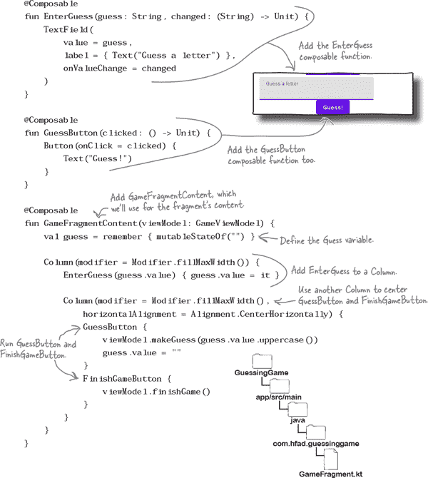

# 第十九章：将 Compose 与视图集成：*完美的和谐*


**当事物协同工作时，你会得到最好的结果。**

到目前为止，你已经学会了如何使用视图或可组合项构建 UI。但如果你想同时使用 **两者** 呢？在本章中，你将了解如何通过 **向基于视图的 UI 添加可组合项** 来 **兼顾两者** 的最佳实践。你将探索使 **可组合项与视图模型协同工作** 的技术。你甚至会了解到如何使它们响应 *LiveData* 更新。通过本章的学习，你将掌握使用可组合项与视图的所有技能，甚至可以 **完全迁移到 Compose UI**。

# 你可以将可组合项添加到基于视图的 UI 中

在上一章中，你学习了如何通过构建全新的温度转换器应用程序来实现 Compose UI。你没有向布局文件中添加视图，而是通过在活动的 Kotlin 代码中调用可组合项来创建 UI。

然而，有时你可能希望在同一个 UI 中同时使用视图 *和* 可组合项。这可能是因为你希望使用仅作为视图或可组合项提供的组件，或者你希望将应用的部分迁移到 Compose 中。

令人兴奋的消息是，你可以将可组合项添加到在布局文件中定义的 UI 中。我们将向你展示如何通过将我们之前在本书中创建的猜词游戏应用迁移到 Compose 来实现这一点。

## 重新审视猜词游戏应用

你应该记得，猜词游戏应用允许用户猜测哪些字母包含在秘密单词中。如果她猜对所有字母，则赢得游戏；如果耗尽生命，则输掉游戏。

目前游戏的外观如下：


在我们开始用可组合项替换应用的视图之前，让我们快速回顾一下应用的构造。

# 猜词游戏应用的结构

猜词游戏应用使用两个片段作为其 UI：`GameFragment` 和 `ResultFragment`。

`GameFragment` 是应用的主屏幕，用户通过它与游戏进行交互。它显示信息，例如剩余生命和用户的任何错误猜测，并允许用户进行猜测。它还包括一个按钮，用户点击它可以立即结束游戏，而不再进行任何猜测。

`ResultFragment` 游戏结束时显示，向用户展示她是否赢得游戏以及秘密单词。

应用还包括两个视图模型——`GameViewModel` 和 `ResultViewModel`——它们保存应用的游戏逻辑和数据，并在应用旋转时维护其状态。`GameFragment` 使用 `GameViewModel`，而 `ResultFragment` 使用 `ResultViewModel`：


让我们来看看我们将更新应用程序的步骤。

# 我们将要做的事情

我们将分两个主要步骤用可组合项替换猜词游戏应用的视图：

1.  **用可组合项替换 ResultFragment 的视图。**

    我们将向应用的 *build.gradle* 文件中添加 Compose 库，并且向 `ResultFragment` 的布局中添加组合物以复制当前的视图。当我们满意组合物的表现时，将从其 UI 中删除视图。

    

1.  **用组合物替换 GameFragment 的视图。**

    然后我们会对 `GameFragment` 进行类似的操作。我们将向其布局中添加组合物以重现其当前的视图，并且当我们确信它们按我们想要的方式工作时，我们将从其 UI 中删除视图。

    

让我们首先将 Compose 库添加到应用的 *build.gradle* 文件中。


# 更新项目的 build.gradle 文件…


我们首先需要在项目的 *build.gradle* 文件中添加一个新变量，以指定我们将使用的 Compose 版本。打开文件 *GuessingGame/build.gradle*，在 `buildscript` 部分添加以下行（加粗部分）：


## …并且也更新应用的 build.gradle 文件

在应用的 *build.gradle* 文件中，我们需要添加一堆 Compose 选项和库，并确保最低 SDK 版本是 21。打开文件 *GuessingGame/app/build.gradle*，在适当的部分添加以下行（加粗部分）：


完成这些更改后，点击“立即同步”选项。

# 我们将用组合物替换 `ResultFragment` 的视图


现在我们已经更新了 *build.gradle* 文件以包含 Compose，我们可以开始用组合物替换应用的视图。我们将从 `ResultFragment` 开始，因为这是最简单的片段。

正如你可能记得的那样，`ResultFragment` 的布局包括一个 `TextView` 来显示游戏的结果，以及一个 `Button` 让用户开始新游戏。它看起来像这样：


我们可以通过使用 `Text` 组合物而不是 `TextView`，以及使用 `Button` 组合物而不是 `Button` 视图来用组合物替换这些视图。这是新 UI 的样子：

我们将逐步构建新的 UI，所以一开始，`ResultFragment` 将同时使用视图和组合物。让我们先找出如何将组合物添加到布局文件中。

# 一个 ComposeView 允许你将组合物添加到布局中

如果你想向基于 `View` 的 UI 添加组合物，可以通过向布局文件添加一个 `**ComposeView**` 元素来实现。这是一种可以显示组合物的视图类型，代码如下：


你可以将 `ComposeView` 理解为一种视图类型，用作在 Kotlin 代码中向 UI 添加任何组合物的占位符。当应用运行时，它会显示布局的视图，并填充 `ComposeView` 中的组合物。

> **ComposeView 是一个作为组合物占位符的视图。它让你在基于 View 的 UI 中使用 Compose。**

## 我们将向 fragment_result.xml 添加一个 ComposeView

我们希望向 `ResultFragment` 的 UI 添加 `Text` 和 `Button` 可组合项，因此我们需要在其布局文件中添加一个 `ComposeView`。

这是 *fragment_result.xml* 的更新代码；请更新文件以包括下面的更改（用粗体标记）：


现在我们已经添加了 `ComposeView`，让我们向其添加一些可组合项。

# 使用 Kotlin 代码添加组件


一旦布局包含 `ComposeView`，您可以在片段的 `onCreateView()` 方法中使用如下代码向其添加可组合项：


该代码在布局的 `ComposeView` 上调用 `setContent()`，告诉它需要包含哪些可组合项。然后将其应用于片段的膨胀布局。例如，如果您想向 `ResultFragment` 的布局添加一个 `Text` 可组合项，您可以使用以下代码：


运行此代码将在布局的 `ComposeView` 中显示 `Text` 可组合项，如下所示：


# 为片段内容添加一个可组合函数


现在您已经学会了如何将可组合项添加到 `ComposeView`，让我们使用已添加到 *fragment_result.xml* 的可组合项来复制其现有视图。

我们将在 *ResultFragment.kt* 中添加一个名为 `ResultFragmentContent` 的新可组合函数，用于片段的 UI。我们将从 `setContent()` 中调用它，以便任何添加到其中的可组合项在显示 `ResultFragment` 时运行。

这是新代码的样子；我们将在 *ResultFragment.kt* 中添加它，距离前几页：


# 重现开始新游戏按钮

现在我们已经将 `ResultFragmentContent` 可组合函数添加到 *ResultFragment.kt* 中，我们可以使用它来向 UI 添加可组合项。我们将首先添加一个按钮。


`ResultFragment` 当前包含一个名为“开始新游戏”的按钮 `View`，点击时使用以下 `OnClickListener` 导航到 `GameFragment`：


我们可以通过创建一个名为 `NewGameButton` 的新可组合函数在 `ResultFragmentContent` 中重现 Compose 中的按钮。我们将为 `NewGameButton` 添加一个 lambda 参数，以便 `ResultFragmentContent` 在其被点击时告诉它要做什么。

这是新代码的样子；我们将在 *ResultFragment.kt* 中添加它，距离前几页：


按钮已经设置好了。布局的文本呢？

# 重现 ResultFragment 的 TextView

正如您可能记得的那样，`ResultFragment` 在其布局中使用 `TextView` 来显示游戏的结果。它使用以下代码定义：


不再使用 `TextView` 显示文本，我们可以定义一个新的 `ResultText` 可组合函数，用 `Text` 可组合项显示文本。我们将向 `ResultText` 添加一个 `String` 参数，以便 `ResultFragmentContent` 将文本传递给它。

这是新代码；我们将在下一页上将其添加到*ResultFragment.kt*中：


这是我们需要用组合重现所有`ResultFragment`视图的所有代码。让我们看看代码是什么样子的。

# ResultFragment.kt 的更新代码

这是*ResultFragment.kt*的更新代码；请更新文件以包含以下更改（用粗体标出）：


让我们来试驾这个应用程序。

#  试驾

当我们运行应用程序时，将显示`GameFragment`。当我们点击其“完成游戏”按钮时，它将导航到`ResultFragment`。

`ResultFragment`显示了原始视图和我们刚刚添加的组合视图。`Text`组合显示了正确的文本，而`Button`组合在点击时导航到`GameFragment`。


我们添加到`ResultFragment`的组合视图的工作方式正是我们想要的，因此我们接下来要做的就是移除视图。

# 我们需要移除 ResultFragment 的视图...

您可以通过以下几种方式之一移除片段或活动的视图：

1.  **通过从布局文件中移除您不需要的任何视图**

    如果 UI 包含混合视图和组合，则此方法非常有用。

1.  **通过删除整个布局文件**

    如果 UI**仅**包含组合，则可以删除布局文件，并在活动或片段的 Kotlin 代码中删除对其的任何引用。

在猜谜游戏应用程序中，我们使用组合重现了`ResultFragment`的所有视图，因此我们不再需要任何原始视图。这意味着我们可以删除其布局文件*fragment_result.xml*，以便 UI 仅包含组合。

## ...并更新 ResultFragment.kt

在删除布局文件之前，我们首先需要从*ResultFragment.kt*中删除对其视图的任何引用，并停止使用视图绑定。

###### 注意

视图绑定为您的活动和片段代码提供了一种更容易访问布局文件视图的方式。由于我们正在删除 ResultFragment 的布局文件，因此它不再需要使用视图绑定。

我们还需要调整片段的`onCreateView()`方法，以便不再膨胀布局文件，而是将组合添加到片段的 UI 中。

正如您在第十八章中学到的，您可以通过简单调用其`onCreate()`方法中的`setContent()`来对*活动*执行此操作，如下所示：


然而，当您处理片段时，您需要采用稍微不同的方法。要找出这是什么以及为什么，请让我们重新审视片段的`onCreateView()`方法。

# `onCreateView()`返回 UI 的根视图

如您所知，当活动需要显示片段的 UI 时，片段的`onCreateView()`方法会被调用。

当使用布局文件定义 UI 时，`onCreateView()`方法中的代码会将布局膨胀为视图层次结构，并返回根视图。根视图会添加到活动的布局中，从而显示片段的 UI。

但如果没有布局文件怎么办？

## 为 Compose UI 返回一个 ComposeView

如果片段的 UI 仅由组件组成且没有布局文件，**`**onCreateView()**`** 方法仍必须返回一个**`**View?**`**，否则代码无法编译**。

通过使方法返回一个 `ComposeView`，该方法包含所有 UI 的组件，来处理此问题。下面是这段代码的样子：


当活动需要显示片段的 UI 时，它像以前一样调用片段的 `onCreateView()` 方法。该方法返回一个 `ComposeView`，其中包含片段的组件，然后活动显示这些组件。

这就是你完成 *ResultFragment.kt* 代码所需知道的所有内容。接下来的几页我们会展示完整的代码。

# ResultFragment.kt 的完整代码

*ResultFragment.kt* 的完整代码如下；请更新文件以包含以下更改（用粗体标出）：


## 我们可以删除 fragment_result.xml

现在 `ResultFragment` 不再使用其布局文件，我们将从导航图中删除对 *fragment_result.xml* 的任何引用，并删除布局文件。

首先，打开 *app/src/main/res/navigation* 文件夹中的 *nav_graph.xml*，并从 `ResultFragment` 部分中移除对 `"@layout/fragment_result"` 的引用，就像这样：


然后在资源管理器中右键单击 *fragment_result.xml*，选择“重构”，然后选择“安全删除”选项。点击“确定”按钮并选择重构选项，文件就会被删除。

让我们看看运行应用程序时会发生什么。

# 应用程序运行时会发生什么


应用程序运行时会发生以下事情：

1.  **MainActivity 启动并在其布局中显示 GameFragment。**

    

1.  **当用户点击完成游戏按钮，或者赢得或输掉游戏时，应用程序导航到 ResultFragment 并调用其 onCreateView() 方法。**

    

1.  **onCreateView() 方法创建一个 ComposeView。**

    

1.  **onCreateView() 方法将 ComposeView 的内容设置为 ResultFragmentContent。**

    

1.  **当 ResultFragmentContent 运行时，它会调用 ResultText 和 NewGameButton 组件。**

    组件添加到 `ComposeView` 中。

    

1.  **onCreateView() 方法将 ComposeView 返回给 MainActivity。**

    

1.  **MainActivity 在其布局中显示 ComposeView。**

    `ComposeView` 的组件显示在设备上。

    

让我们来测试一下这个应用程序。

#  测试驾驶

当我们运行应用程序并点击 `GameFragment` 的“完成游戏”按钮时，它会像以前一样导航到 `ResultFragment`。但这次，UI 只由组件组成。


这就是我们让`ResultFragment`使用 Compose UI 所需的一切。在我们开始`GameFragment`之前，先试一试下一页上的练习。

# 池谜题


你的**任务**是从池中取出代码片段，并将其放入下面代码中的空白行中。你不能多次使用同一片段，并且不需要使用所有片段。你的**目标**是为名为`MusicFragment`的片段编写代码，该片段没有布局文件，并使用名为`MusicFragmentContent`的组合函数进行其 UI 显示。需要将名为`MusicTheme`的主题应用到 UI 中，包括任何表面。

```
class MusicFragment : Fragment() {
    override fun onCreateView(
        inflater: LayoutInflater, container: ViewGroup?, savedInstanceState: Bundle?
    ): View? {
        return ............................................................
            ...............................................................
                 ..........................................................
                    .......................................................
                        MusicFragmentContent()
                    }
                }
            }
        }
    }
}
```


###### 注意

**注意：池中的每个物品只能使用一次！**

 **答案请参阅“Pool Puzzle Solution”。**

# 接下来我们将让`GameFragment`也使用组合部件


现在我们已经让`ResultFragment`使用组合部件而不是视图，我们可以对`GameFragment`做类似的事情。

正如你可能记得的那样，`GameFragment`的布局包括`TextView`、`Button`和一个`EditText`，让用户进行猜谜游戏。这是其外观的提醒：


在接下来的几页中，我们将用组合部件替换这些视图。完成后，新的 UI 将如下所示：


与之前一样，我们将首先向`GameFragment`的 UI 添加新的组合部件，这意味着我们需要在其布局中添加一个`ComposeView`。我们将在下一页展示此代码。

# 我们将向 fragment_game.xml 添加一个 ComposeView


这是将`ComposeView`添加到`GameFragment`的布局中的代码；更新文件*fragment_game.xml*以包含以下更改（用粗体标出）：


现在我们已经更新了布局文件，让我们开始向其添加组合部件。

# 为 GameFragment 的内容添加一个组合函数


就像我们在*ResultFragment.kt*中所做的那样，我们将向*GameFragment.kt*添加一个新的组合函数，用于片段的 UI。我们将命名该函数为`GameFragmentContent`，并从`setContent()`中调用它，以便我们添加到其中的任何组合部件在显示`GameFragment`时运行。

这是新代码的样子；我们将在几页后将其添加到*GameFragment.kt*中：


# 复制完成游戏按钮

正如我们在`ResultFragment`中所做的那样，我们将向`GameFragmentContent`的组合函数添加组合部件，以便它们显示在`GameFragment`的 UI 中。我们将从复制完成游戏按钮开始。

结束游戏按钮在片段布局中的定义如下所示：


正如你所见，当按钮被点击时，它会调用`GameViewModel`的`finishGame()`方法。

我们可以通过创建一个名为`FinishGameButton`的新组合函数来在 Compose 中复制这个功能，我们将从`GameFragmentContent`运行它。这是新代码的样子；我们将在接下来的*GameFragment.kt*几页上添加它：


# 复制带有 TextField 的 EditText

接下来我们将复制的视图是允许用户输入字母的`EditText`。我们将创建一个名为`EnterGuess`的新组合函数，它使用一个`TextField`，并接受两个参数：一个用于用户猜测的`String`，以及一个指定值更改时应发生的操作的 lambda 函数。


我们将从`GameFragmentContent`运行`EnterGuess`函数，以便将其添加到片段的 UI 中。我们还将在`GameFragmentContent`中添加一个名为`guess`的`MutableState`对象，我们将用它来管理`TextField`的状态。


这是新代码的样子；我们将它添加到稍后的*GameFragment.kt*页面上：


# 复制猜测按钮

现在我们在 UI 中添加了一个允许用户输入字母的`TextField`，我们将添加一个`Button`组合项，将字母传递给视图模型的`makeGuess()`方法。


我们将使用一个名为`GuessButton`的新组合函数添加`Button`，我们将从`GameFragmentContent`运行。这是新代码的样子；我们将在接下来的*GameFragment.kt*页面上添加它：


我们现在已经用组合项复制了`GameFragment`的三个视图。在我们处理剩余部分之前，让我们更新*GameFragment.kt*并进行测试。

# 对于 GameFragment.kt 的更新代码

到目前为止*GameFragment.kt*的代码；更新文件以包括以下更改（用**粗体**表示）：



让我们来测试一下这个应用程序。

#  测试驱动

当我们运行应用程序时，显示`GameFragment`。它包括所有原始视图，以及三个额外的组合项，让我们可以猜测和完成游戏。

当我们使用`EnterGuess`和`GuessButton`组合项猜测秘密单词中包含的字母时，应用程序会注册每次猜测。如果我们猜对了，该字母将被添加到秘密单词显示中；如果我们猜错了，剩余生命次数将被更新，并且该字母将被添加到错误猜测列表中。


现在我们知道了我们添加的三个组合项有效的方法，让我们来处理剩下的部分。

# 我们将在 Text 组合中显示错误的猜测

我们将复制的下一个视图是一个使用 LiveData 来显示用户错误猜测的`TextView`。每次用户猜错时，它会将其添加到视图模型的`incorrectGuesses`属性中，而`TextView`则通过更新其显示的文本来响应。

这是`TextView`的代码的提醒：


我们可以用`Text`可组合项替换`TextView`，以便显示相同的文本，但如何确保在`incorrectGuesses`属性值更改时更新文本？

## 使用`observeAsState()`响应`LiveData`

正如您在第十八章中学到的那样，当依赖于`State`或`MutableState`对象的可组合项获得新值时，它们会被重新组合。然而，对于`LiveData`对象，却不会发生这种情况——比如视图模型的`incorrectGuesses`属性。如果尝试在可组合项中使用`LiveData`对象的值，当其值更改时不会重新绘制；它将继续使用对象的初始值，因此不会保持最新状态。

如果您想让可组合项响应`LiveData`更新，可以使用`**observeAsState()**`函数实现。此函数返回`LiveData`对象的`State`版本，因此任何依赖于它的可组合项在其值更改时都会重新组合。

您可以使用以下代码使用`observeAsState()`函数：


这定义了一个变量（其类型为`State`），该变量观察视图模型的`incorrectGuesses LiveData`属性。这意味着当其值更改时，可组合项可以做出响应。

让我们通过在 Compose 中复制`GameFragment`的错误猜测`TextView`来将其付诸实践。

# 创建一个名为`IncorrectGuessesText`的可组合函数

要复制错误猜测的`TextView`，我们将定义一个名为`IncorrectGuessesText`的新可组合函数。该函数将接受一个`GameViewModel`参数，观察其`incorrectGuesses`属性，并使用`Text`可组合项在 UI 中显示其值。每次属性的值更新时，`Text`将重新组合并显示更新的文本。

这就是`IncorrectGuessesText`函数的样子：


如您所见，上述代码中的`Text`可组合项使用了一个名为`stringResource()`的函数来设置其文本。该函数允许您在可组合项中使用字符串资源，并向其传递参数。

## 从`GameFragmentContent`中运行`IncorrectGuessesText`

就像我们创建的其他可组合函数一样，通过从`GameFragmentContent`可组合函数运行`IncorrectGuessesText`，我们将它添加到`GameFragment`的 UI 中。新代码如下所示：


我们将在稍后的几页更新*GameFragment.kt*。首先，请尝试通过以下练习来组合剩余两个可组合项的代码。

# 组合磁铁


有人使用冰箱磁铁创建了两个新的可组合函数（名为`SecretWordDisplay`和`LivesLeftText`），用来复制`GameFragment`的两个剩余视图。不幸的是，当有人释放厨房的海怪时，其中一些磁铁掉落了。您能够重新组合代码吗？

`SecretWordDisplay`函数需要显示来自`GameViewModel`的`secretWordDisplay LiveData<String>`属性。`LivesLeftText`函数需要显示`lives_left String`资源，并传递给`GameViewModel`的`livesLeft LiveData<Int>`属性。这两个函数都需要能够响应实时数据更新。

```
@Composable
fun SecretWordDisplay(viewModel: GameViewModel) {

    val display = viewModel.secretWordDisplay..............................

    display..............................{

        Text(.......................................)
    }
}

@Composable
fun LivesLeftText(viewModel: GameViewModel) {..............................

    val livesLeft = viewModel.livesLeft

    livesLeft..............................{

        Text(.....................................................................)

    }
}
```


# 组合磁铁解决方案


有人使用冰箱磁铁创建了两个新的可组合函数（名为`SecretWordDisplay`和`LivesLeftText`），复制了`GameFragment`的两个剩余视图。不幸的是，当有人释放厨房大章鱼时，一些磁铁掉了下来。你能把代码拼回去吗？

`SecretWordDisplay`函数需要显示来自`GameViewModel`的`secretWordDisplay LiveData<String>`属性。`LivesLeftText`函数需要显示`lives_left String`资源，并传递给`GameViewModel`的`livesLeft LiveData<Int>`属性。这两个函数都需要能够响应实时数据更新。


# GameFragment.kt 的更新代码

现在你知道如何用可组合部分重现所有`GameFragment`的视图了，让我们将它们添加到*GameFragment.kt*中。更新文件以包含下面显示的所有更改（**粗体部分**）。


让我们来测试一下这个应用程序。

#  测试驾驶

当我们运行应用程序时，`GameFragment`包括所有原始视图及其 Compose 等效部分。

当我们尝试猜测秘密单词包含的字母时，`SecretWordDisplay`、`LivesLeftText`和`IncorrectGuessesText`中的文本可组合部分会自动更新。


确保现在所有`GameFragment`的可组合部分都按我们的意愿工作。剩下的就是删除片段的视图。

# 从 GameFragment.kt 中删除视图

就像我们处理`ResultFragment`一样，我们将通过删除其布局文件来删除`GameFragment`的视图。但在此之前，我们需要从*GameFragment.kt*中移除对视图的任何引用。由于不再需要数据绑定，我们也将停止使用它。

这是文件的完整代码；更新*GameFragment.kt*以包含下面显示的所有更改（**粗体部分**）：


这些都是我们需要对*GameFragment.kt*进行的更改，以便它不再填充其布局或引用任何视图。

由于该片段不再需要有布局文件，我们可以在从导航图中删除引用之后立即删除它。我们将在下一页上执行此操作。

# 删除 fragment_game.xml

导航图包括对布局文件*fragment_game.xml*的引用。在删除布局文件之前，我们需要移除这个引用。

打开*app/src/main/res/navigation*文件夹中的*nav_graph.xml*，并从`GameFragment`部分中删除引用`"@layout/fragment_game"`的行，如下所示：


然后在资源管理器中右键单击*fragment_game.xml*，选择重构，然后选择安全删除选项。 单击“确定”按钮并选择重构选项后，文件将被删除。

## 我们还可以关闭数据绑定

我们还可以对猜谜游戏应用程序进行最后一次更改，即禁用数据绑定。 您可能还记得，最初我们启用了数据绑定，以便*fragment_game.xml*和*fragment_result.xml*中的视图可以与每个片段的视图模型交互。 现在我们已经删除了布局文件，因此不再需要数据绑定。

要关闭数据绑定，请打开文件*GuessingGame/app/build.gradle*，并从`buildFeatures`部分中删除数据绑定行，如下所示：


完成后，点击“立即同步”选项，将更改与项目的其余部分同步。

让我们对应用程序进行最后一次测试。

#  测试驾驶

运行应用程序时，显示`GameFragment`。 这次，它的用户界面仅由可组合项组成。 它们的功能正是我们想要的。


恭喜！ 您现在已经学会如何向现有的基于`View`的 UI 添加可组合项，甚至用仅使用 Compose 的 UI 替换您的 UI。

我们认为 Compose 的未来一片光明，您可以在附录中了解更多信息。与此同时，为什么不尝试将可组合项添加到您在本书中构建的其他一些应用程序中呢？

# 池谜题解


您的**任务**是从池中获取代码片段，并将它们放入下面代码中的空白行中。 您不能多次使用相同的代码片段，并且不需要使用所有的片段。 您的**目标**是编写一个名为`MusicFragment`的片段代码，该片段没有布局文件，并使用名为`MusicFragmentContent`的可组合函数来构建其用户界面。 UI 还需要应用名为`MusicTheme`的主题，包括任何表面。


# 您的 Android 工具箱


**您已掌握第十九章，现在还添加了将 Jetpack Compose 集成到您的工具箱中。**


# 离开城市


# 在 Androidville 的这段时间真是太棒了

**我们很难过看到您离开**，但没有什么比学到的东西付诸实践更好了。 本书的尾声还有一些宝贵的信息和一个便捷的索引供您学习，然后就是将所有这些新想法付诸实践的时候了。 一路顺风！
